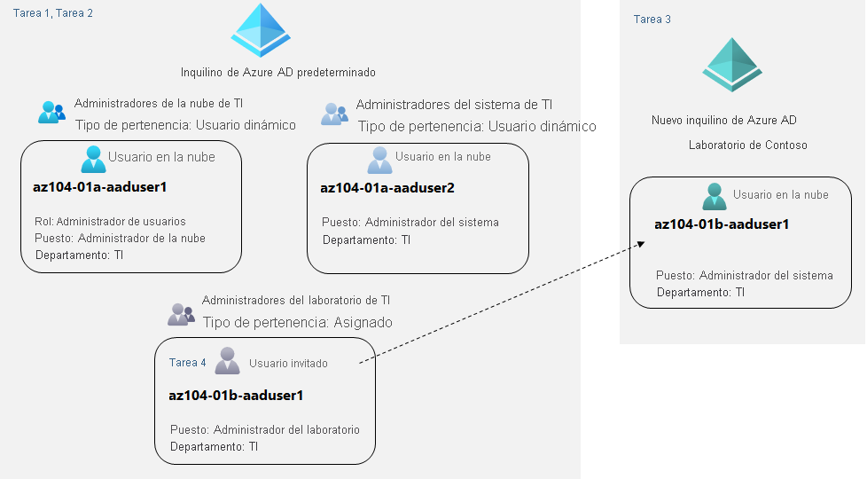

---
lab:
  title: "Laboratorio\_01: Administración de identidades de Azure\_Active Directory"
  module: Administer Identity
---

# Laboratorio 01: Administración de identidades de Azure Active Directory

# Manual de laboratorio para alumnos

## Escenario del laboratorio

Para permitir que los usuarios de Contoso se autentiquen mediante Azure AD, se le ha encargado el aprovisionamiento de usuarios y cuentas de grupo. La pertenencia a los grupos debe actualizarse automáticamente en función de los puestos de trabajo del usuario. También debe crear un inquilino de prueba de Azure AD con una cuenta de usuario de prueba y conceder permisos limitados a esa cuenta para los recursos de la suscripción de Azure de Contoso.

**Nota:** Hay disponible una **[simulación de laboratorio interactiva](https://mslabs.cloudguides.com/guides/AZ-104%20Exam%20Guide%20-%20Microsoft%20Azure%20Administrator%20Exercise%201)** que le permite realizar sus propias selecciones a su entera discreción. Es posible que encuentre pequeñas diferencias entre la simulación interactiva y el laboratorio hospedado, pero las ideas y los conceptos básicos que se muestran son los mismos.

## Objetivos

En este laboratorio, aprenderá a:

+ Tarea 1: Creación y configuración de usuarios de Azure AD
+ Tarea 2: Creación de grupos de Azure AD con pertenencia asignada y dinámica
+ Tarea 3: Creación de un inquilino de Azure Active Directory (AD) (opcional: problema del entorno de laboratorio)
+ Tarea 4: Administración de usuarios invitados de Azure AD (opcional: problema del entorno de laboratorio)

## Tiempo estimado: 30 minutos

## Diagrama de la arquitectura

### Instrucciones

## Ejercicio 1

## Tarea 1: Creación y configuración de usuarios de Azure AD

En esta tarea, creará y configurará usuarios de Azure AD.

>**Nota**: Si ha usado previamente la licencia de prueba para Azure AD Premium en este inquilino de Azure AD, necesitará un nuevo inquilino de Azure AD y realizar la tarea 2 después de la tarea 3 en ese nuevo inquilino de Azure AD.

1. Inicie sesión en [Azure Portal](https://portal.azure.com).

1. En Azure Portal, busque y seleccione **Azure Active Directory**.

1. En la hoja Azure Active Directory, desplácese hacia abajo hasta la sección **Administrar**, haga clic en **Configuración de usuario** y revise las opciones de configuración disponibles.

1. En la hoja Azure Active Directory, en la sección **Administrar**, haga clic en **Usuarios** y, a continuación, haga clic en la cuenta de usuario cuya configuración de **Perfil** se debe mostrar. 

1. Haga clic en **Editar propiedades** y, en la pestaña **Configuración**, establezca **Ubicación de uso** en **Estados Unidos** y haga clic en **Guardar** para aplicar el cambio.

    >**Nota**: Esto es necesario para asignar una licencia de Azure AD Premium P2 a su cuenta de usuario más adelante en este laboratorio.

1. Vuelva a la hoja **Usuarios: Todos los usuarios** y, a continuación, haga clic en **+ Nuevo usuario**.

1. Cree un nuevo usuario con las siguientes opciones de configuración (deje las demás con sus valores predeterminados):

    | Configuración | Value |
    | --- | --- |
    | Nombre principal de usuario | **az104-01a-aaduser1** |
    | Nombre para mostrar | **az104-01a-aaduser1** |
    | Generar automáticamente la contraseña | sin seleccionar |
    | Contraseña inicial | **Proporcione una contraseña segura** |
    | Puesto (pestaña Propiedades) | **Administrador de la nube** |
    | Departamento (pestaña Propiedades) | **TI** |
    | Ubicación de uso (pestaña Propiedades) | **Estados Unidos** |

    >**Nota**: **Copie en el Portapapeles** el **Nombre principal del usuario** completo (nombre de usuario más dominio). Lo necesitará más adelante en esta tarea.

1. En la lista de usuarios, haga clic en la cuenta de usuario recién creada para mostrar su hoja.

1. Revise las opciones disponibles en la sección **Administrar** y tenga en cuenta que puede identificar los roles de Azure AD asignados a la cuenta de usuario, así como los permisos de la cuenta de usuario para los recursos de Azure.

1. En la sección **Administrar**, haga clic en **Roles asignados** y, a continuación, haga clic en el botón **+ Agregar asignación** y asigne el rol **Administrador de usuarios** a **az104-01a-aaduser1**.

    >**Nota**: También tiene la opción de asignar roles de Azure AD al aprovisionar un nuevo usuario.

1. Abra una ventana **InPrivate** del explorador e inicie sesión en [Azure Portal](https://portal.azure.com) con la cuenta de usuario recién creada. Cuando se le pida que actualice la contraseña, cámbiela por una contraseña segura de su elección. 

    >**Nota**: En lugar de escribir el nombre de usuario (incluido el nombre de dominio), puede pegar el contenido del Portapapeles.

1. En la ventana **InPrivate** del explorador, en Azure Portal, busque y seleccione **Azure Active Directory**.

    >**Nota**: Aunque esta cuenta de usuario puede acceder al inquilino de Azure Active Directory, no tiene acceso a los recursos de Azure. Esto es lo esperado, ya que este acceso tendría que concederse explícitamente mediante el control de acceso basado en roles de Azure. 

1. En la ventana **InPrivate** del explorador, en la hoja Azure AD, desplácese hacia abajo hasta la sección **Administrar**, haga clic en **Configuración de usuario** y tenga en cuenta que no tiene permisos para modificar ninguna opción de configuración.

1. En la ventana **InPrivate** del explorador, en la hoja Azure AD, en la sección **Administrar**, haga clic en **Usuarios** y, a continuación, haga clic en **+ Nuevo usuario**.

1. Cree un nuevo usuario con las siguientes opciones de configuración (deje las demás con sus valores predeterminados):

    | Configuración | Value |
    | --- | --- |
    | Nombre principal de usuario | **az104-01a-aaduser2** |
    | Nombre para mostrar | **az104-01a-aaduser2** |
    | Generar automáticamente la contraseña | sin seleccionar  |
    | Contraseña inicial | **Proporcione una contraseña segura** |
    | Puesto | **Administrador del sistema** |
    | department | **TI** |
    | Ubicación de uso | **Estados Unidos** |
    
1. Cierre la sesión como usuario az104-01a-aaduser1 desde Azure Portal y cierre la ventana InPrivate del explorador.

## Tarea 2: Creación de grupos de Azure AD con pertenencia asignada y dinámica

En esta tarea, creará grupos de Azure Active Directory con pertenencia asignada y dinámica.

1. De nuevo en Azure Portal en el que ha iniciado sesión con su **cuenta de usuario**, vuelva a la hoja **Información general** del inquilino de Azure AD y, en la sección **Administrar**, haga clic en **Licencias**.

    >**Nota**: Las licencias de Azure AD Premium P1 o P2 son necesarias para implementar grupos dinámicos.

1. En la sección **Administrar**, haga clic en **Todos los productos**.

1. Haga clic en **+ Probar o comprar** y active la evaluación gratuita de Azure AD Premium P2.

1. Actualice la ventana del explorador para comprobar que la activación se ha realizado correctamente. 

    >**Nota**: Las licencias pueden tardar hasta 10 minutos en activarse. Siga actualizando la página hasta que aparezca. No continúe hasta que se hayan activado las licencias.

1. En la hoja **Licencias: Todos los productos**, seleccione la entrada **Microsoft Entra ID P2** y asigne todas las opciones de licencia a su cuenta de usuario y a las dos cuentas de usuario recién creadas.

1. En Azure Portal, vuelva a la hoja del inquilino de Azure AD y haga clic en **Grupos**.

1. Use el botón **+ Nuevo grupo** para crear un nuevo grupo con la siguiente configuración:

    | Configuración | Valor |
    | --- | --- |
    | Tipo de grupo | **Seguridad** |
    | Nombre del grupo | **Administradores de la nube de TI** |
    | Descripción del grupo | **Administradores de la nube de TI de Contoso** |
    | Tipo de pertenencia | **Usuario dinámico** |

    >**Nota**: Si la lista desplegable **Tipo de pertenencia** está atenuada, espere unos minutos y actualice la página del explorador.

1. Haga clic en **Agregar una consulta dinámica**.

1. En la pestaña **Configurar reglas** de la hoja **Reglas de pertenencia dinámica**, cree una nueva regla con la siguiente sintaxis:

    | Configuración | Valor |
    | --- | --- |
    | Propiedad | **jobTitle** |
    | Operador | **Es igual a** |
    | Value | **Administrador de la nube** |

1. Para guardar la regla, haga clic en **+Agregar expresión** y en **Guardar**. De nuevo en la hoja **Nuevo grupo**, haga clic en **Crear**. 

1. De nuevo en la hoja **Grupos: Todos los grupos** del inquilino de Azure AD, haga clic en el botón **+ Nuevo grupo** y cree un grupo con la siguiente configuración:

    | Configuración | Valor |
    | --- | --- |
    | Tipo de grupo | **Seguridad** |
    | Nombre del grupo | **Administradores del sistema de TI** |
    | Descripción del grupo | **Administradores del sistema de TI de Contoso** |
    | Tipo de pertenencia | **Usuario dinámico** |

1. Haga clic en **Agregar una consulta dinámica**.

1. En la pestaña **Configurar reglas** de la hoja **Reglas de pertenencia dinámica**, cree una nueva regla con la siguiente sintaxis:

    | Configuración | Valor |
    | --- | --- |
    | Propiedad | **jobTitle** |
    | Operador | **Es igual a** |
    | Value | **Administrador del sistema** |

1. Para guardar la regla, haga clic en **+Agregar expresión** y en **Guardar**. De nuevo en la hoja **Nuevo grupo**, haga clic en **Crear**. 

1. De nuevo en la hoja **Grupos: Todos los grupos** del inquilino de Azure AD, haga clic en el botón **+ Nuevo grupo** y cree un grupo con la siguiente configuración:

    | Configuración | Valor |
    | --- | --- |
    | Tipo de grupo | **Seguridad** |
    | Nombre del grupo | **Administradores del laboratorio de TI** |
    | Descripción del grupo | **Administradores del laboratorio de TI de Contoso** |
    | Tipo de pertenencia | **Asignado** |
    
1. Haga clic en **No hay miembros seleccionados**.

1. En la hoja **Agregar miembros**, busque y seleccione los grupos **Administradores de la nube de TI** y **Administradores del sistema de TI** y, de nuevo en la hoja **Nuevo grupo**, haga clic en **Crear**.

1. De nuevo en la hoja **Grupos: Todos los grupos**, haga clic en la entrada que representa el grupo **Administradores de la nube de TI** y, a continuación, muestre su hoja **Miembros**. Compruebe que **az104-01a-aaduser1** aparece en la lista de miembros del grupo.

    >**Nota**: Es posible que experimente retrasos con las actualizaciones de los grupos de pertenencia dinámica. Para acelerar la actualización, vaya a la hoja del grupo, muestre su hoja **Reglas de pertenencia dinámica**, **edite** la regla que aparece en el cuadro de texto **Sintaxis de regla** agregando un espacio en blanco al final y **guarde** el cambio.

1. Vuelva a la hoja **Grupos: Todos los grupos**, haga clic en la entrada que representa el grupo **Administradores del sistema de TI** y, a continuación, muestre su hoja **Miembros**. Compruebe que **az104-01a-aaduser2** aparece en la lista de miembros del grupo.

## Tarea 3: Creación de un inquilino de Azure Active Directory (AD) (opcional: problema del entorno de laboratorio)

En esta tarea, creará un nuevo inquilino de Azure AD.
    
1. En Azure Portal, busque y seleccione **Azure Active Directory**.

    >**Nota**: Hay un problema conocido con la comprobación de Captcha en el entorno de laboratorio. Si recibe el error **Error de creación. Demasiadas solicitudes, inténtelo de nuevo más tarde**, haga lo siguiente: 
    - Intente la creación unas cuantas veces. 
    - Compruebe la sección **Administrar inquilino** para asegurarse de que el inquilino no se creó en segundo plano.  
    - Abra una nueva ventana **InPrivate** y use Azure Portal para intentar crear el inquilino desde allí. 
     Plantee el problema al instructor y, luego, use la **[simulación de laboratorio interactiva](https://mslabs.cloudguides.com/guides/AZ-104%20Exam%20Guide%20-%20Microsoft%20Azure%20Administrator%20Exercise%201)** para ver los pasos.  
    - Puede probar esta tarea más adelante, pero la creación de un inquilino no es necesaria en otros laboratorios. 

1. Haga clic en **Administrar inquilinos**. En la siguiente pantalla, haga clic en **+ Crear** y especifique la siguiente configuración:

    | Configuración | Value |
    | --- | --- |
    | Tipo de directorio | **Azure Active Directory** |
    
1. Haga clic en **Siguiente:Configuración**.

    | Configuración | Valor |
    | --- | --- |
    | Nombre de la organización | **Laboratorio de Contoso** |
    | Nombre de dominio inicial | cualquier nombre DNS válido compuesto de letras minúsculas y dígitos, y que empiece por una letra | 
    | País/región | **Estados Unidos** |

   > **Nota**: El **Nombre de dominio inicial** no debe ser un nombre legítimo que coincida potencialmente con el de su organización o de otra. La marca de comprobación verde del cuadro de texto **Nombre de dominio inicial** indicará que el nombre de dominio que ha escrito es válido y único.

1. Haga clic en **Revisar y crear** y, a continuación, en **Crear**.

1. Muestre la hoja del inquilino de Azure AD recién creado mediante el vínculo **Click here to navigate to your new tenant: Contoso Lab** (Haga clic aquí para ir al nuevo inquilino: Contoso Lab) o el botón **Directorio + suscripción** (directamente a la derecha del botón de Cloud Shell) de la barra de herramientas de Azure Portal.

## Tarea 4: Administración de usuarios invitados de Azure AD

En esta tarea, creará usuarios invitados de Azure AD y les concederá acceso a los recursos de una suscripción de Azure.

1. En la instancia de Azure Portal que muestra el inquilino de Azure AD del Laboratorio de Contoso, en la sección **Administrar**, haga clic en **Usuarios** y, a continuación, en **+ Nuevo usuario**.

1. Cree un nuevo usuario con las siguientes opciones de configuración (deje las demás con sus valores predeterminados):

    | Configuración | Value |
    | --- | --- |
    | Nombre principal de usuario | **az104-01b-aaduser1** |
    | Nombre para mostrar | **az104-01b-aaduser1** |
    | Generar automáticamente la contraseña | sin seleccionar  |
    | Contraseña inicial | **Proporcione una contraseña segura** |
    | Puesto | **Administrador del sistema** |
    | department | **TI** |

1. Haga clic en el perfil recién creado.

    >**Nota**: **Copie en el Portapapeles** el **Nombre principal del usuario** completo (nombre de usuario más dominio). Lo necesitará más adelante en esta tarea.

1. Vuelva al primer inquilino que creó anteriormente. Para ello, utilice el botón **Directorio + suscripción** (directamente a la derecha del botón de Cloud Shell) de la barra de herramientas de Azure Portal.

1. Vuelva al panel **Usuarios: Todos los usuarios** y, después, haga clic en **+ Invitar a un usuario externo**.

1. Invite un nuevo usuario invitado con las siguientes opciones de configuración (deje las demás con sus valores predeterminados):

    | Configuración | Value |
    | --- | --- |
    | Email | el nombre principal de usuario que copió anteriormente en esta tarea |
    | Nombre para mostrar (pestaña Propiedades)  | **az104-01b-aaduser1** |
    | Puesto (pestaña Propiedades) | **Administrador del laboratorio** |
    | Departamento (pestaña Propiedades) | **TI** |
    | Ubicación de uso (pestaña Propiedades) | **Estados Unidos** |

1. Haga clic en **Invitar**. 

1. De nuevo en la hoja **Usuarios: Todos los usuarios**, haga clic en la entrada que representa la cuenta de usuario invitado recién creada.

1. En la hoja **az104-01b-aaduser1: Perfil**, haga clic en **Grupos**.

1. Haga clic en **+ Agregar pertenencia** y agregue la cuenta de usuario invitado al grupo **Administradores del laboratorio de TI**.

## Tarea 5: Limpieza de recursos

> **Nota**: No olvide quitar los recursos de Azure recién creados que ya no use. La eliminación de los recursos sin usar garantiza que no se generarán costes inesperados. Aunque, en este caso, no hay cargos adicionales asociados a los inquilinos de Azure Active Directory y sus objetos, es posible que quiera considerar la posibilidad de quitar las cuentas de usuario, las cuentas de grupo y el inquilino de Azure Active Directory que creó en este laboratorio.

 > **Nota:** No se preocupe si los recursos del laboratorio no se pueden quitar inmediatamente. A veces, los recursos tienen dependencias y se tarda más tiempo en eliminarlos. Supervisar el uso de los recursos es una tarea habitual del administrador, así que solo tiene que revisar periódicamente los recursos en el portal para ver cómo va la limpieza. 

1. En **Azure Portal**, busque **Azure Active Directory** en la barra de búsqueda. En **Azure Active Directory** en **Administrar**, seleccione **Licencias**. Una vez en **Licencias**, en **Administrar**, seleccione **Todos los productos** y, a continuación, seleccione el elemento **Azure Active Directory Premium P2** en la lista. Para continuar, seleccione **Usuarios con licencia**. Seleccione las cuentas de usuario **az104-01a-aaduser1** y **az104-01a-aaduser2** a las que asignó licencias en este laboratorio, haga clic en **Quitar licencia** y, cuando se le pida confirmación, haga clic en **Sí**.

1. En Azure Portal, vaya a la hoja **Usuarios: Todos los usuarios**, haga clic en la entrada que representa la cuenta de usuario invitado **az104-01b-aaduser1**, en la hoja **az104-01b-aaduser1: Perfil** haga clic en **Eliminar** y, cuando se le pida confirmación, haga clic en **Aceptar**.

1. Repita la misma secuencia de pasos para eliminar las cuentas de usuario restantes que creó en este laboratorio.

1. Vaya a la hoja **Grupos - Todos los grupos**, seleccione los grupos que creó en este laboratorio, haga clic en **Eliminar** y, cuando se le pida confirmación, haga clic en **Aceptar**.

1. En Azure Portal, muestra la hoja del inquilino de Azure AD del Laboratorio de Contoso mediante el botón **Directorio + suscripción** (directamente a la derecha del botón de Cloud Shell) de la barra de herramientas de Azure Portal.

1. Vaya a la hoja **Usuarios: Todos los usuarios**, haga clic en la entrada que representa la cuenta de usuario **az104-01b-aaduser1**, en la hoja **az104-01b-aaduser1: Perfil** haga clic en **Eliminar** y, cuando se le pida confirmación, haga clic en **Aceptar**.

1. Vaya a la hoja **Contoso Lab - Información general** del inquilino Contoso Lab de Azure AD, haga clic en **Administrar inquilinos** y, en la siguiente pantalla, seleccione la casilla situada junto a **Contoso Lab**. Haga clic en **Eliminar**. En la hoja **¿Quiere eliminar el inquilino “Contoso Lab”?** , haga clic en el vínculo **Obtener permiso para eliminar los recursos de Azure**. En la hoja **Propiedades** de Azure Active Directory, establezca **Administración del acceso para los recursos de Azure** en **Sí** y haga clic en **Guardar**.

1. Vuelva a la hoja **Eliminar inquilino “Contoso Lab”** , seleccione **Actualizar** y haga clic en **Eliminar**.

> **Nota**: Si un inquilino tiene una licencia de prueba, tendría que esperar a que esta expirara para poder eliminar el inquilino. Esto no supondría ningún coste adicional.

#### Revisar

En este laboratorio, ha:

- Creado y configurado usuarios de Azure AD
- Creado grupos de Azure AD con pertenencia asignada y dinámica
- Creado un inquilino de Azure Active Directory (AD)
- Administrado usuarios invitados en Azure AD 
