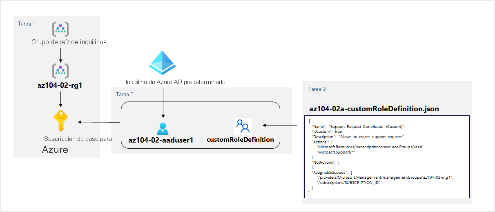

---
lab:
  title: '02a: Administrar suscripciones y RBAC'
  module: Administer Governance and Compliance
---

# <a name="lab-02a---manage-subscriptions-and-rbac"></a>Laboratorio 02a: Administrar suscripciones y RBAC
# <a name="student-lab-manual"></a>Manual de laboratorio para alumnos

## <a name="lab-requirements"></a>Requisitos del laboratorio

This lab requires permissions to create Azure Active Directory (Azure AD) users, create custom Azure Role Based Access Control (RBAC) roles, and assign these roles to Azure AD users. Not all lab hosters may provide this capability. Ask your instructor for the availability of this lab.

## <a name="lab-scenario"></a>Escenario del laboratorio

Para mejorar la administración de recursos de Azure en Contoso, se le ha encargado implementar la funcionalidad siguiente:

- crear un grupo de administración que incluya todas las suscripciones de Azure de Contoso;

- granting permissions to submit support requests for all subscriptions in the management group to a designated Azure Active Directory user. That user's permissions should be limited only to: 

    - crear solicitud de soporte técnico;
    - ver grupos de recursos. 

## <a name="objectives"></a>Objetivos

En este laboratorio, aprenderá a:

+ Tarea 1: Implementar grupos de administración
+ Tarea 2: Crear roles RBAC personalizados 
+ Tarea 3: Asignar roles RBAC


## <a name="estimated-timing-30-minutes"></a>Tiempo estimado: 30 minutos

## <a name="architecture-diagram"></a>Diagrama de la arquitectura




## <a name="instructions"></a>Instrucciones

### <a name="exercise-1"></a>Ejercicio 1

#### <a name="task-1-implement-management-groups"></a>Tarea 1: Implementar grupos de administración

En esta tarea, creará y configurará grupos de administración. 

1. Inicie sesión en [**Azure Portal**](http://portal.azure.com).

1. Busque y seleccione **Grupos de administración** para ir a la hoja **Grupos de administración**.

1. Review the messages at the top of the <bpt id="p1">**</bpt>Management groups<ept id="p1">**</ept> blade. If you are seeing the message stating <bpt id="p1">**</bpt>You are registered as a directory admin but do not have the necessary permissions to access the root management group<ept id="p1">**</ept>, perfom the following sequence of steps:

    1. En Azure Portal, busque y seleccione **Azure Active Directory**.
    
    1.  En la hoja que muestra las propiedades del inquilino de Azure Active Directory, en la sección **Administrar** del menú vertical, seleccione **Propiedades**.
    
    1.  En la hoja **Propiedades** de su inquilino de Azure Active Directory, en la sección **Administración de acceso para los recursos de Azure**, seleccione **Sí** y, a continuación, seleccione **Guardar**.
    
    1.  Vuelva a la hoja **Grupos de administración** y seleccione **Actualizar**.

1. En la hoja **Grupos de administración**, haga clic en **+ Crear**.

    >**Nota**: Si no ha creado anteriormente grupos de administración, seleccione **Empezar a usar grupos de administración**.

1. Cree un grupo de administración con la siguiente configuración:

    | Configuración | Value |
    | --- | --- |
    | Id. de grupo de administración | **az104-02-mg1** |
    | Nombre para mostrar del grupo de administración | **az104-02-mg1** |

1. En la lista de grupos de administración, haga clic en la entrada que representa el grupo de administración recién creado.

1. En la hoja **az104-02-mg1**, haga clic en **Suscripciones**. 

1. En la hoja **az104-02-mg1 \| Suscripciones**, haga clic en **+ Agregar**, en la hoja **Agregar suscripción**, en la lista desplegable **Suscripción**, seleccione la suscripción que está usando en este laboratorio y haga clic en **Guardar**.

    ><bpt id="p1">**</bpt>Note<ept id="p1">**</ept>: On the <bpt id="p2">**</bpt>az104-02-mg1 <ph id="ph1">\|</ph> Subscriptions<ept id="p2">**</ept> blade, copy the ID of your Azure subscription into Clipboard. You will need it in the next task.

#### <a name="task-2-create-custom-rbac-roles"></a>Tarea 2: Crear roles RBAC personalizados

En esta tarea, creará una definición de un rol RBAC personalizado.

1. En el equipo de laboratorio, abra el archivo **\\Allfiles\\Labs\\02\\az104-02a-customRoleDefinition.json** en el Bloc de notas y revise el contenido:

   ```json
   {
      "Name": "Support Request Contributor (Custom)",
      "IsCustom": true,
      "Description": "Allows to create support requests",
      "Actions": [
          "Microsoft.Resources/subscriptions/resourceGroups/read",
          "Microsoft.Support/*"
      ],
      "NotActions": [
      ],
      "AssignableScopes": [
          "/providers/Microsoft.Management/managementGroups/az104-02-mg1",
          "/subscriptions/SUBSCRIPTION_ID"
      ]
   }
   ```
    > **Nota:** Si no está seguro de dónde se almacenan los archivos en el entorno de laboratorio local, pregunte al instructor.

1. Reemplace el marcador de posición `SUBSCRIPTION_ID` del archivo JSON por el identificador de la suscripción que copió en el Portapapeles y guarde el cambio.

1. Haga clic en el icono de la barra de herramientas inmediatamente a la derecha del cuadro de texto de búsqueda en Azure Portal para abrir el panel de **Cloud Shell**.

1. Si se le pide que seleccione **Bash** o **PowerShell**, seleccione **PowerShell**. 

    >**Nota**: Si es la primera vez que inicia **Cloud Shell** y aparece el mensaje **No tiene ningún almacenamiento montado**, seleccione la suscripción que utiliza en este laboratorio y haga clic en **Crear almacenamiento**. 

1. En la barra de herramientas del panel de Cloud Shell, haga clic en el icono **Cargar/Descargar archivos**, haga clic en **Cargar** en el menú desplegable y cargue el archivo **\\Allfiles\\Labs\\02\\az104-02a-customRoleDefinition.json** en el directorio principal de Cloud Shell.

1. En el panel de Cloud Shell, ejecute lo siguiente para crear la definición de rol personalizado:

   ```powershell
   New-AzRoleDefinition -InputFile $HOME/az104-02a-customRoleDefinition.json
   ```

1. Cierre el panel de Cloud Shell.

#### <a name="task-3-assign-rbac-roles"></a>Tarea 3: Asignar roles RBAC

En esta tarea, creará un usuario de Azure Active Directory, asignará a ese usuario el rol RBAC que creó en la tarea anterior, y comprobará que el usuario puede realizar la tarea especificada en la definición del rol RBAC.

1. En Azure Portal, busque y seleccione **Azure Active Directory**, en la hoja Azure Active Directory, haga clic en **Usuarios** y, a continuación, haga clic en **+ Nuevo usuario**.

1. Cree un nuevo usuario con las siguientes opciones de configuración (deje las demás con sus valores predeterminados):

    | Configuración | Valor |
    | --- | --- |
    | Nombre de usuario | **az104-02-aaduser1**|
    | Name | **az104-02-aaduser1**|
    | Permitirme crear la contraseña | enabled |
    | Contraseña inicial | **Proporcione una contraseña segura** |

    ><bpt id="p1">**</bpt>Note<ept id="p1">**</ept>: <bpt id="p2">**</bpt>Copy to clipboard<ept id="p2">**</ept> the full <bpt id="p3">**</bpt>User name<ept id="p3">**</ept>. You will need it later in this lab.

1. En Azure Portal, vuelva al grupo de administración **az104-02-mg1** y muestre sus **detalles**.

1. Este laboratorio requiere permisos para crear usuarios de Azure Active Directory (Azure AD), crear roles personalizados de control de acceso basado en roles (RBAC) de Azure y asignar estos roles a usuarios de Azure AD. 

    >**Nota**: Si el rol personalizado no está visible, puede tardar hasta 10 minutos en aparecer después de su creación.

1. Puede que no todos los hospedadores de laboratorio proporcionen esta funcionalidad.

1. Pregunte al instructor acerca de la disponibilidad de este laboratorio.

    >**Nota**: En lugar de escribir el nombre de usuario, puede pegar el contenido del Portapapeles.

1. En la ventana del explorador **InPrivate**, en Azure Portal, busque y seleccione **Grupos de recursos** para comprobar que el usuario az104-02-aaduser1 puede ver todos los grupos de recursos.

1. En la ventana del explorador **InPrivate**, en Azure Portal, busque y seleccione **Todos los recursos** para comprobar que el usuario az104-02-aaduser1 no puede ver ningún recurso.

1. En la ventana del explorador **InPrivate**, en Azure Portal, busque y seleccione **Ayuda y soporte técnico** y, luego, haga clic en **Crear solicitud de soporte técnico**. 

1. In the <bpt id="p1">**</bpt>InPrivate<ept id="p1">**</ept> browser window, on the <bpt id="p2">**</bpt>Problem Desription/Summary<ept id="p2">**</ept> tab of the <bpt id="p3">**</bpt>Help + support - New support request<ept id="p3">**</ept> blade, type <bpt id="p4">**</bpt>Service and subscription limits<ept id="p4">**</ept> in the Summary field and select the <bpt id="p5">**</bpt>Service and subscription limits (quotas)<ept id="p5">**</ept> issue type. Note that the subscription you are using in this lab is listed in the <bpt id="p1">**</bpt>Subscription<ept id="p1">**</ept> drop-down list.

    >**Nota**: La presencia de la suscripción que está usando en este laboratorio en la lista desplegable **Suscripción** indica que la cuenta que está usando tiene los permisos necesarios para crear la solicitud de soporte técnico específica de la suscripción.

    >**Nota**: Si no ve la opción **Límites de servicio y suscripción (cuotas)** , cierre sesión en Azure Portal y vuelva a iniciar sesión.

1. Do not continue with creating the support request. Instead, sign out as the az104-02-aaduser1 user from the Azure portal and close the InPrivate browser window.

#### <a name="task-4-clean-up-resources"></a>Tarea 4: Limpieza de recursos

   ><bpt id="p1">**</bpt>Note<ept id="p1">**</ept>: Remember to remove any newly created Azure resources that you no longer use. Removing unused resources ensures you will not see unexpected charges, although, resources created in this lab do not incur extra cost.

   ><bpt id="p1">**</bpt>Note<ept id="p1">**</ept>: Don't worry if the lab resources cannot be immediately removed. Sometimes resources have dependencies and take a longer time to delete. It is a common Administrator task to monitor resource usage, so just periodically review your resources in the Portal to see how the cleanup is going.

1. En Azure Portal, busque y seleccione **Azure Active Directory**, en la hoja Azure Active Directory, haga clic en **Usuarios**.

1. En la hoja **Usuarios: Todos los usuarios**, haga clic en **az104-02-aaduser1**.

1. En la hoja **az104-02-aaduser1: Perfil**, copie el valor del atributo **Id. de objeto**.

1. En Azure Portal, inicie una sesión de **PowerShell** en **Cloud Shell**.

1. En el panel de Cloud Shell, ejecute lo siguiente para quitar la asignación de la definición de rol personalizado (reemplace el marcador de posición `[object_ID]` por el valor del atributo **Id. de objeto** de la cuenta de usuario **az104-02-aaduser1** de Azure Active Directory que copió anteriormente en esta tarea):

   ```powershell
   
   $scope = (Get-AzRoleDefinition -Name 'Support Request Contributor (Custom)').AssignableScopes[0]

   Remove-AzRoleAssignment -ObjectId '[object_ID]' -RoleDefinitionName 'Support Request Contributor (Custom)' -Scope $scope
   ```

1. En el panel de Cloud Shell, ejecute lo siguiente para quitar la definición de rol personalizado:

   ```powershell
   Remove-AzRoleDefinition -Name 'Support Request Contributor (Custom)' -Force
   ```

1. En Azure Portal, vuelva a la hoja **Usuarios: Todos los usuarios** de **Azure Active Directory**y elimine la cuenta de usuario **az104-02-aaduser1**.

1. En Azure Portal, vuelva a la hoja **Grupos de administración**. 

1. En la hoja **Grupos de administración**, seleccione el icono de **puntos suspensivos** situado junto a la suscripción en el grupo de administración **az104-02-mg1** y seleccione **Mover** para mover la suscripción al **grupo de administración raíz del inquilino**.

   >**Nota**: Es probable que el grupo de administración de destino sea el **grupo de administración raíz del inquilino**, a menos que haya creado una jerarquía personalizada de grupos de administración antes de ejecutar este laboratorio.
   
1. Seleccione **Actualizar** para comprobar que la suscripción se ha movido correctamente al **grupo de administración raíz del inquilino**.

1. Vuelva a la hoja **Grupos de administración**, haga clic en el icono de **puntos suspensivos** situado a la derecha del grupo de administración **az104-02-mg1** y haga clic en **Eliminar**.
  >conceder permisos para enviar las solicitudes de soporte técnico para todas las suscripciones del grupo de administración a un usuario designado de Azure Active Directory.

#### <a name="review"></a>Revisar

En este laboratorio, ha:

- Implementado grupos de administración
- Creado roles RBAC personalizados 
- Asignado roles RBAC
