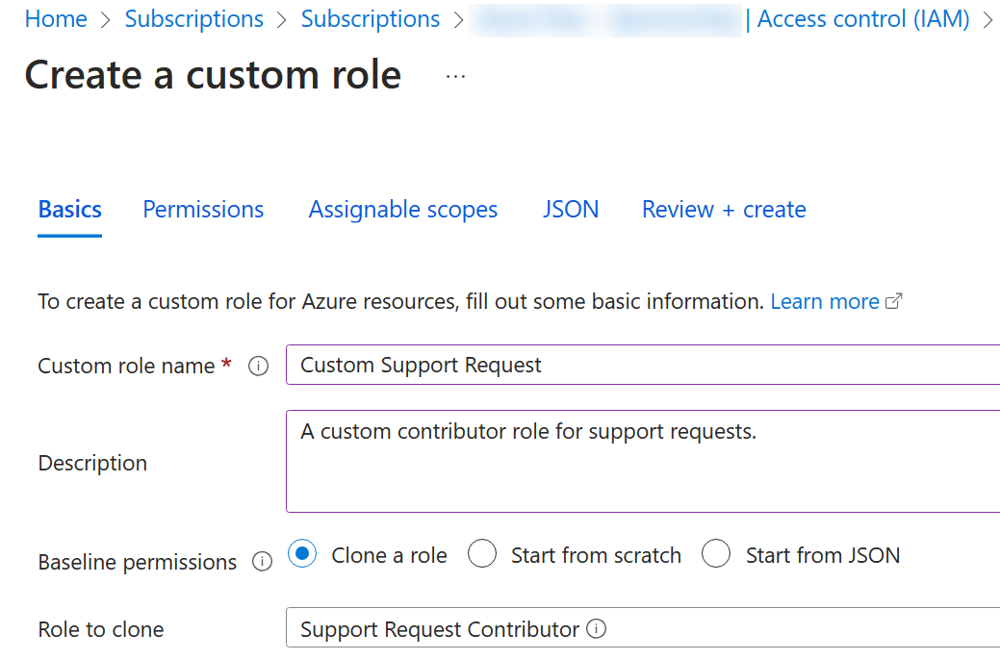

---
lab:
  title: 'Laboratorio 02a: Administración de suscripciones y RBAC'
  module: Administer Governance and Compliance
---

# Laboratorio 02a: Administrar suscripciones y RBAC

## Introducción al laboratorio

En este laboratorio, obtendrá información sobre el control de acceso basado en roles. Obtendrá información sobre cómo usar los permisos y ámbitos para controlar qué acciones pueden realizar las identidades y cuáles no. También aprenderá a facilitar la administración de suscripciones mediante grupos de administración. 

Para este laboratorio se necesita una suscripción de Azure. El tipo de suscripción puede afectar a la disponibilidad de las características de este laboratorio. Es posible cambiar la región, pero los pasos se describen para **Este de EE. UU.** 

## Tiempo estimado: 30 minutos

## Escenario del laboratorio

Para simplificar la administración de recursos de Azure en su organización, se le ha encargado la implementación de la siguiente funcionalidad:

- Creación de un grupo de administración que incluya todas las suscripciones de Azure.

- Concesión de permisos para enviar solicitudes de soporte técnico para todas las suscripciones del grupo de administración. Los permisos deberían estar limitados solo a: 

    - Crear y administrar máquinas virtuales
    - Creación de vales de solicitud de soporte técnico (no incluya agregar proveedores de Azure)

## Diagrama de arquitectura

## Aptitudes de trabajo

+ Tarea 1: Implementar grupos de administración.
+ Tarea 2: Revisar y asignar un rol integrado de Azure.
+ Tarea 3: Crear roles RBAC personalizados.
+ Tarea 4: Supervisar la asignación de roles con el registro de actividades.

## Tarea 1: Implementar grupos de administración

En esta tarea, creará y configurará grupos de administración. Los grupos de administración se usan para organizar y segmentar lógicamente las suscripciones. Permiten asignar y heredar RBAC y Azure Policy a otros grupos de administración y suscripciones. Por ejemplo, si su organización cuenta con un equipo de asistencia dedicado a Europa, puede organizar las suscripciones europeas en un grupo de administración para proporcionar al personal de asistencia acceso a dichas suscripciones (sin proporcionar acceso individual a todas las suscripciones). En nuestro escenario, todos los miembros del departamento de soporte técnico tendrán que crear una solicitud de soporte técnico para todas las suscripciones. 

1. Inicie sesión en **Azure Portal** - `https://portal.azure.com`.

1. Busque y seleccione `Microsoft Entra ID`.

1. En la hoja **Administrar**, seleccione **Propiedades**.

1. Revise el área de **Administración de recursos de Azure**. Observe o lea que puede administrar el acceso a todas las suscripciones y grupos de administración de Azure en el inquilino.
   
1. Busque y seleccione **Grupos de administración**.

1. En la hoja **Grupos de administración**, haga clic en **+ Crear**.

1. Cree un grupo de administración con la siguiente configuración. Seleccione **Enviar** cuando haya terminado. 

    | Configuración | Value |
    | --- | --- |
    | Id. de grupo de administración | `az104-mg1` (debe ser único en el directorio) |
    | Nombre para mostrar del grupo de administración | `az104-mg1` |

1. **Actualice** la página del grupo de administración para asegurarse de que se muestra el nuevo grupo de administración. Esta operación puede tardar unos minutos. 

   >**Nota:** ¿Se ha fijado en el grupo de administración raíz? Este grupo de administración raíz está integrado en la jerarquía para contener todos los grupos de administración y suscripciones. Este grupo de administración raíz permite la aplicación de directivas globales y de asignaciones de roles de Azure a nivel de directorio. Tras crear un grupo de administración, deberá agregar las suscripciones que deban estar incluidas en el grupo. 

## Tarea 2: Revisar y asignar un rol de Azure integrado

En esta tarea, revisará los roles integrados y asignará el rol Colaborador de máquina virtual a un miembro del departamento de soporte técnico. Azure proporciona un gran número de [roles integrados](https://learn.microsoft.com/azure/role-based-access-control/built-in-roles). 

1. Seleccione el grupo de administración **az104-mg1**.

1. Seleccione la hoja **Control de acceso (IAM)** y después la pestaña **Roles**.

1. Desplácese por las definiciones de roles integrados que están disponibles. **Vea** un rol para obtener información detallada sobre los **Permisos**, **JSON** y **Asignaciones**. Usará a menudo *propietario*, *colaborador* y *lector*. 

1. Seleccione **+ Agregar**, en la lista desplegable, seleccione **Agregar asignación de rol**. 

1. En la hoja **Agregar asignación de rol**, busque y seleccione **Colaborador de máquinas virtuales**. El rol de colaborador de la máquina virtual le permite administrar máquinas virtuales, pero no acceder a su sistema operativo ni administrar la red virtual ni la cuenta de almacenamiento a la que estén conectadas. Este es un buen rol para el departamento de soporte técnico. Seleccione **Siguiente**.

    >**¿Sabía que...?** Azure proporcionaba originalmente solo el modelo de implementación **Clásico**. Se ha sustituido por el modelo de implementación de **Azure Resource Manager**. Como procedimiento recomendado, no use recursos clásicos. 

1. En la pestaña **Miembros**, **Seleccione Miembros**.

    >**Nota:** El siguiente paso asigna el rol al grupo **helpdesk**. Si no dispone de un grupo de departamento de soporte, tómese un minuto para crearlo.

1. Busque y seleccione el grupo `helpdesk`. Haga clic en **Seleccionar**. 

1. Haga clic en **Revisar y asignar** dos veces para crear la asignación de roles.

1. Continúe en la hoja **Control de acceso (IAM)**. En la pestaña **Asignaciones de roles**, confirme que el grupo **helpdesk** tiene el rol de **Colaborador de máquinas virtuales**. 

    >**Nota:** Como procedimiento recomendado, asigne siempre roles a grupos que no son individuos. 

    >**¿Sabía que...?** Es posible que esta asignación no le conceda privilegios adicionales. Si ya tiene el rol Propietario, ese rol incluye todos los permisos asociados al rol Colaborador de máquina virtual.
    
## Tarea 3: Crear un rol de RBAC personalizado

En esta tarea, creará un rol de RBAC personalizado. Los roles personalizados son una parte fundamental de la implementación del principio de privilegios mínimos para un entorno. Los roles integrados pueden tener demasiados permisos para su escenario. También crearemos un nuevo rol y quitaremos los permisos que no sean necesarios. ¿Tiene un plan para administrar permisos superpuestos?

1. Continúe trabajando en el grupo de administración. Ve a la hoja **Control de acceso (IAM)**.

1. Selecciona **+ Agregar**, en el menú desplegable y selecciona **Agregar rol personalizado**.

1. En la pestaña Aspectos básicos termine la configuración.

    | Configuración | Valor |
    | --- | --- |
    | Nombre de rol personalizado | `Custom Support Request` |
    | Descripción | `A custom contributor role for support requests.` |

1. Para **Permisos de línea de base**, seleccione **Clonar un rol**. En el menú desplegable **Rol a clonar**, seleccione **Colaborador de solicitud de soporte técnico**.

    

1. Seleccione **Siguiente** para desplazarse a la pestaña **Permisos** y después seleccione **+Excluir permisos**.

1. En el campo de búsqueda del proveedor de recursos, escriba `.Support` y seleccione **Microsoft.Support**.

1. En la lista de permisos, coloque una casilla junto a **Otros: Registra el proveedor de recursos compatibles** y después seleccione **Agregar**. El rol debería actualizarse para incluir este permiso como *NotAction*.

    >**Nota:** Un proveedor de recursos de Azure es un conjunto de operaciones de REST que habilitan la funcionalidad de un servicio específico de Azure. No queremos que el departamento de soporte técnico pueda tener esta capacidad, por lo que se está eliminando del rol clonado. 

1. En la pestaña **Ámbitos asignables**, asegúrese de que su grupo de administración aparece en la lista y después haga clic en **Siguiente**.

1. Revise el JSON para *Actions*, *NotActions* y *AssignableScopes* personalizados en el rol. 

1. Seleccione **Revisar y crear** y, luego, **Crear**.

    >**Nota:** En este punto, ha creado un rol personalizado y lo ha asignado al grupo de administración.  

## Tarea 4: Supervisar la asignación de roles con el registro de actividades

En esta tarea, verá el registro de actividades para determinar si alguien ha creado un nuevo rol. 

1. En el portal, busque el recurso **az104-mg1** y seleccione **Registro de actividad**. El registro de actividad proporciona información sobre los eventos del nivel de suscripción. 

1. Revise las actividades para las asignaciones de roles. El registro de actividad se puede filtrar para operaciones específicas. 

    

## Limpieza de los recursos

Si utilizas **tu propia suscripción**, dedica un minuto a eliminar los recursos del laboratorio. De esta forma estarás seguro de que los recursos se liberan y de que se minimiza el coste. La forma más fácil de eliminar los recursos de laboratorio es eliminar el grupo de recursos del laboratorio. 

+ En Azure Portal, selecciona el grupo de recursos, selecciona **Eliminar el grupo de recursos**, **Escribir el nombre del grupo de recursos** y, después, haz clic en **Eliminar**.
+ Mediante Azure PowerShell, `Remove-AzResourceGroup -Name resourceGroupName`.
+ Mediante la CLI, `az group delete --name resourceGroupName`.
  
## Ampliar el aprendizaje con Copilot

Copilot puede ayudarte a aprender a usar las herramientas de scripting de Azure. Copilot también puede ayudar en áreas no cubiertas en el laboratorio o donde necesitas más información. Abre un explorador Edge y elige Copilot (superior derecha) o ve a *copilot.microsoft.com*. Dedique unos minutos a probar estas indicaciones.
+ Cree dos tablas que resalte comandos importantes de PowerShell y la CLI para obtener información sobre las suscripciones de la organización en Azure y explicar cada comando en la columna “Explicación”. 
+ ¿Cuál es el formato del archivo JSON RBAC de Azure?
+ ¿Cuáles son los pasos básicos para crear un rol RBAC de Azure personalizado?
+ ¿Cuál es la diferencia entre los roles RBAC de Azure y los roles de Microsoft Entra ID?

## Más información con el aprendizaje autodirigido

+ [Protección de los recursos de Azure con el control de acceso basado en roles de Azure (Azure RBAC)](https://learn.microsoft.com/training/modules/secure-azure-resources-with-rbac/). Uso de RBAC de Azure para administrar el acceso a los recursos en Azure.

## Puntos clave

Enhorabuena por completar el laboratorio. Estas son las principales conclusiones de este laboratorio. 

+ Los grupos de administración se usan para organizar lógicamente las suscripciones.
+ El grupo de administración raíz integrado incluye todos los grupos de administración y suscripciones.
+ Azure tiene muchos roles integrados. Puede asignar estos roles para controlar el acceso a los recursos.
+ Puede crear nuevos roles o personalizar los roles existentes.
+ Los roles se definen en un archivo con formato JSON e incluyen *Actions*, *NotActions* y *AssignableScopes*.
+ Puede usar el registro de actividad para supervisar las asignaciones de roles.

