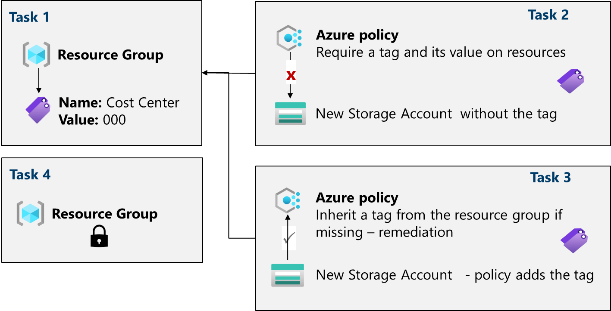

---
lab:
  title: "Laboratorio\_02b: Administración de la gobernanza mediante Azure Policy"
  module: Administer Governance and Compliance
---

# Laboratorio 02b: Administración de la gobernanza mediante Azure Policy

## Introducción del laboratorio

En este laboratorio, aprenderá a implementar los planes de gobernanza de la organización. Obtendrá información sobre cómo las directivas de Azure pueden garantizar que las decisiones operativas se apliquen en toda la organización. Aprenderá a usar el etiquetado de recursos para mejorar los informes. 

Para este laboratorio se necesita una suscripción de Azure. El tipo de suscripción puede afectar a la disponibilidad de las características de este laboratorio. Es posible cambiar la región, pero los pasos se describen para **Este de EE. UU.** 

## Tiempo estimado: 30 minutos

## Escenario del laboratorio

La superficie en la nube de la organización ha crecido considerablemente en el último año. Durante una auditoría reciente, ha descubierto un número considerable de recursos sin un propietario, proyecto o centro de coste definido. Para mejorar la administración de recursos de Azure en la organización, se le ha encargado implementar la funcionalidad siguiente:

- aplicar etiquetas de recursos para adjuntar metadatos importantes a los recursos de Azure

- aplicar el uso de etiquetas de recursos para nuevos recursos mediante directivas de Azure

- actualizar los recursos existentes con etiquetas de recursos

- usar bloqueos de recursos para proteger los recursos

## Simulaciones interactivas de laboratorio

Hay simulaciones de laboratorio interactivas que le podrían resultar útiles para este tema. La simulación le permite hacer clic en un escenario similar a su propio ritmo. Hay ciertas diferencias entre la simulación interactiva y este laboratorio, pero muchos de los conceptos básicos son los mismos. No se necesita una suscripción de Azure. 

+ [Administración de bloqueos de recursos](https://mslearn.cloudguides.com/en-us/guides/AZ-900%20Exam%20Guide%20-%20Azure%20Fundamentals%20Exercise%2015). Agregue un bloqueo de recursos y pruébelo para confirmarlo.
  
+ [Crear una directiva de Azure](https://mslearn.cloudguides.com/en-us/guides/AZ-900%20Exam%20Guide%20-%20Azure%20Fundamentals%20Exercise%2017). Cree una directiva de Azure que restrinja los recursos de ubicación que se pueden ubicar. Cree un recurso y asegúrese de que se aplica la directiva. 

+ [Administración de la gobernanza mediante la directiva de Azure](https://mslabs.cloudguides.com/guides/AZ-104%20Exam%20Guide%20-%20Microsoft%20Azure%20Administrator%20Exercise%203). Cree y asigne etiquetas mediante Azure Portal. Cree una directiva de Azure que requiera etiquetado. Corrija los recursos no conformes.

## Diagrama de la arquitectura

## Aptitudes de trabajo

+ Tarea 1: crear y asignar etiquetas a través de Azure Portal.
+ Tarea 2: Exigir el etiquetado mediante una instancia de Azure Policy.
+ Tarea 3: Aplicar el etiquetado mediante una instancia de Azure Policy.
+ Tarea 4: Configurar y probar los bloqueos de recursos. 

## Tarea 1: Asignar etiquetas a través de Azure Portal

En esta tarea, creará y asignará una etiqueta a un grupo de recursos de Azure a través de Azure Portal. Las etiquetas son un componente fundamental de una estrategia de gobernanza como se describe en el Marco de buena arquitectura de Microsoft y Cloud Adoption Framework. Las etiquetas pueden permitirle identificar rápidamente los propietarios de recursos, las fechas de expiración, los contactos de grupo y otros pares de nombre y valor que la organización considera importantes. Para esta tarea, asigne una etiqueta que identifique el rol de recurso ("Infra" para "Infraestructura").

1. Inicie sesión en **Azure Portal** - `https://portal.azure.com`.
      
1. Busque y seleccione `Resource groups`.

1. En Grupos de recursos, seleccione **+ Crear**.

    | Configuración | Value |
    | --- | --- |
    | Nombre de suscripción | su suscripción |
    | Nombre del grupo de recursos | `az104-rg2` |
    | Ubicación | **Este de EE. UU.** |

    >**Nota:** Para cada laboratorio de este curso, creará un grupo de recursos. Esto le permite localizar y administrar rápidamente los recursos del laboratorio. 

1. Seleccione **Siguiente: Etiquetas** y cree una etiqueta.

    | Configuración | Value |
    | --- | --- |
    | NOMBRE | `Cost Center` |
    | Valor | `000` |

1. Seleccione **Revisar y crear** y, luego, **Crear**.

## Tarea 2: Exigir el etiquetado mediante una instancia de Azure Policy

En esta tarea, asignará la directiva integrada *Requerir una etiqueta y su valor en los recursos* al grupo de recursos y evaluará el resultado. Se puede usar Azure Policy para aplicar la configuración y, en este caso, la gobernanza, a los recursos de Azure. 

1. En Azure Portal, busque y seleccione `Policy`. 

1. En el panel **Creación**, seleccione **Definiciones**. Tómese un momento para examinar la lista de [definiciones de directivas integradas](https://learn.microsoft.com/azure/governance/policy/samples/built-in-policies) que están disponibles para usar. Observe que también puede buscar una definición.

    

1. Haga clic en la entrada que representa la directiva integrada **Requerir una etiqueta y su valor en los recursos**. Dedique un minuto a revisar la definición. 

1. En la hoja de la definición de la directiva integrada **Requerir una etiqueta y su valor en los recursos**, haga clic en **Asignar**.

1. Para especificar el **Ámbito**, haga clic en el botón de puntos suspensivos y seleccione los valores siguientes. Haga clic en **Seleccionar** cuando haya terminado. 

    | Configuración | Valor |
    | --- | --- |
    | Suscripción | *su suscripción* |
    | Grupo de recursos | **az104-rg2** |

    >**Nota**: Puede asignar directivas en el nivel de grupo de administración, de suscripción o de grupo de recursos. También tiene la opción de especificar exclusiones, como suscripciones, grupos de recursos o recursos individuales. En este escenario, el objetivo es la etiqueta en todos los recursos del grupo de recursos.

1. Para configurar las propiedades de nivel **Básico** de la asignación, configure las siguientes opciones (deje las demás con los valores predeterminados):

    | Configuración | Value |
    | --- | --- |
    | Nombre de asignación | `Require Cost Center tag with Default value`|
    | Descripción | `Require Cost Center tag with default value for all resources in the resource group`|
    | Aplicación de directivas | habilitado |

    >**Nota**: El **Nombre de asignación** se rellena automáticamente con el nombre de directiva seleccionado, pero puede cambiarlo. El campo **Description** (Descripción) es opcional. Observe que puede deshabilitar la directiva en cualquier momento. 

1. Haga clic en **Siguiente** dos veces y establezca **Parámetros** en los valores siguientes:

    | Configuración | Value |
    | --- | --- |
    | Nombre de etiqueta | `Cost Center` |
    | Valor de etiqueta | `000` |

1. Haga clic en **Siguiente** y revise la pestaña **Corrección**. Deje desactivada la casilla **Crear una identidad administrada**. 

1. Haga clic en **Revisar + crear** y, después, en **Crear**.

    >**Nota**: Ahora, para comprobar que la nueva asignación de directivas está en vigor, intentará crear otra cuenta de Azure Storage en el grupo de recursos. Creará la cuenta de almacenamiento sin agregar la etiqueta necesaria. 
    
    >**Nota**: La directiva puede tardar entre 5 y 10 minutos en surtir efecto.

1. En el portal, busque y seleccione `Storage Account`y seleccione **+ Crear**. 

1. En la pestaña **Aspectos básicos** del panel **Crear cuenta de almacenamiento**, complete la configuración.

    | Configuración | Value |
    | --- | --- |
    | Resource group | **az104-rg2** |
    | Nombre de la cuenta de almacenamiento | *cualquier combinación globalmente única de entre 3 y 24 letras minúsculas y dígitos, empezando por una letra* |

1. Seleccione **Revisar** y, después, haga clic en **Crear**.

1. Debería recibir un mensaje de **error de validación**. Vea el mensaje para identificar el motivo del error. Compruebe si el mensaje de error indica que la directiva no ha permitido la implementación de recursos. 

     

>**Nota**: Al hacer clic en la pestaña **Error sin procesar**, puede encontrar más detalles sobre el error, incluido el nombre de la definición de rol **Require Cost Center tag with Default value** (Requerir etiqueta Centro de coste con el valor Predeterminado). El error en la implementación se debe a que la cuenta de almacenamiento que ha intentado crear no tenía una etiqueta denominada **Centro de coste** con su valor establecido en **Predeterminado**.

## Tarea 3: Aplicar el etiquetado a través de una instancia de Azure Policy

En esta tarea, se usará la nueva definición de directiva para corregir los recursos no compatibles. En este escenario, hará que los recursos secundarios de un grupo de recursos hereden la etiqueta **Centro de coste** que se ha definido en el grupo de recursos.

1. En Azure Portal, busque y seleccione `Policy`. 

1. En la sección **Creación**, haga clic en **Asignaciones**. 

1. En la lista de asignaciones, haga clic en el icono de puntos suspensivos de la fila que representa la asignación de directiva etiqueta **Require Cost Center tag with Default value** (Requerir etiqueta Centro de coste con el valor Predeterminado) y use el elemento de menú **Eliminar asignación** para eliminar la asignación.

1. Haga clic en **Asignar directiva** y, para especificar el **Ámbito**, haga clic en el botón de puntos suspensivos y seleccione los valores siguientes:

    | Configuración | Valor |
    | --- | --- |
    | Subscription | su suscripción de Azure |
    | Grupo de recursos | `az104-rg2` |

1. Para especificar la **Definición de directiva**, haga clic en el botón de puntos suspensivos y busque y seleccione `Inherit a tag from the resource group if missing`.

1. Seleccione **Agregar** y, después, configure las propiedades **básicas** restantes de la asignación.

    | Configuración | Value |
    | --- | --- |
    | Nombre de asignación | `Inherit the Cost Center tag and its value 000 from the resource group if missing` |
    | Descripción | `Inherit the Cost Center tag and its value 000 from the resource group if missing` |
    | Aplicación de directivas | habilitado |

1. Haga clic en **Siguiente** dos veces y establezca **Parámetros** en los valores siguientes:

    | Configuración | Value |
    | --- | --- |
    | Nombre de etiqueta | `Cost Center` |

1. Haga clic en **Siguiente** y, en la pestaña **Corrección**, configure las siguientes opciones (deje las demás con los valores predeterminados):

    | Configuración | Value |
    | --- | --- |
    | Crear una tarea de corrección | enabled |
    | Directiva que se debe corregir | **Heredar una etiqueta del grupo de recursos si falta** |

    >**Nota**: La definición de esta directiva incluye el efecto **Modify**. Por tanto, se necesita una identidad administrada. 

     

1. Haga clic en **Revisar + crear** y, después, en **Crear**.

    >**Nota**: Para comprobar que la asignación de la nueva directiva está en vigor, creará otra cuenta de almacenamiento de Azure en el mismo grupo de recursos sin agregar explícitamente la etiqueta necesaria. 
    
    >**Nota**: La directiva puede tardar entre 5 y 10 minutos en surtir efecto.

1. Busque y seleccione `Storage Account`, y haga clic en **+ Crear**. 

1. En la pestaña **Aspectos básicos** de la hoja **Crear cuenta de almacenamiento**, compruebe que usa el grupo de recursos al que se aplicó la directiva y especifique las opciones siguientes (deje las demás en sus valores predeterminados). A continuación, haga clic en **Revisar**:

    | Configuración | Valor |
    | --- | --- |
    | Nombre de la cuenta de almacenamiento | *cualquier combinación globalmente única de entre 3 y 24 letras minúsculas y dígitos, empezando por una letra* |

1. Compruebe que esta vez se haya superado la validación y haga clic en **Crear**.

1. Una vez que se aprovisione la nueva cuenta de almacenamiento, haga clic en **Ir al recurso**.

1. En el panel **Etiquetas**, tenga en cuenta que la etiqueta **Centro de coste** con el valor **000** se ha asignado automáticamente al recurso.

    >**¿Sabía que...?** Si busca y selecciona **Etiquetas** en el portal, puede ver los recursos con una etiqueta específica. 

## Tarea 4: Configurar y probar los bloqueos de recursos

En esta tarea, configurará y probará un bloqueo de recursos. Los bloqueos impiden las eliminaciones o modificaciones de un recurso. 

1. Busque y seleccione el grupo de recursos.
   
1. En el panel **Configuración**, seleccione **Bloqueos**.

1. Seleccione **Agregar** y complete la información del bloqueo de recursos. Cuando termine, seleccione **Aceptar**. 

    | Configuración | Valor |
    | --- | --- |
    | Nombre del bloqueo | `rg-lock` |
    | Tipo de bloqueo | **delete** (observe la selección de solo lectura) |
    
1. Vaya al panel **Información general** del grupo de recursos y seleccione **Eliminar grupo de recursos**.

1. En el cuadro de texto **Escribir nombre del grupo de recursos para confirmar la eliminación**, proporcione el nombre del grupo de recursos, `az104-rg2`. Observe que puede copiar y pegar el nombre del grupo de recursos. 

1. Observe la advertencia: La eliminación de este grupo de recursos y sus recursos dependientes es una acción permanente y no se puede deshacer. Seleccione **Eliminar**.

1. Debe recibir una notificación de denegación de la eliminación. 

     

    >**Nota:** Tendrá que quitar el bloqueo si tiene previsto eliminar el grupo de recursos. 
    
## Limpieza de los recursos

Si utiliza **su propia suscripción**, dedique un minuto a eliminar los recursos del laboratorio. De esta forma estará seguro de que los recursos se liberan y de que se minimiza el costo. La forma más fácil de eliminar los recursos de laboratorio es eliminar el grupo de recursos del laboratorio. 

+ En Azure Portal, seleccione el grupo de recursos, seleccione **Eliminar el grupo de recursos**, **Escribir el nombre del grupo de recursos** y, después, haga clic en **Eliminar**.
+ Mediante Azure PowerShell, `Remove-AzResourceGroup -Name resourceGroupName`.
+ Mediante la CLI, `az group delete --name resourceGroupName`.

## Ampliar el aprendizaje con Copilot
Copilot puede ayudarle a aprender a usar las herramientas de scripting de Azure. Copilot también puede ayudar en áreas no cubiertas en el laboratorio o donde necesita más información. Abra un explorador Edge y elija Copilot (superior derecha) o vaya a *copilot.microsoft.com*. Dedique unos minutos a probar estas indicaciones.
+ ¿Cuáles son los comandos de Azure PowerShell y la CLI para agregar y eliminar bloqueos de recursos en un grupo de recursos?
+ Se han tabulado las diferencias entre Azure Policy y Azure RBAC e incluido ejemplos.
+ ¿Cuáles son los pasos para aplicar la directiva de Azure y corregir los recursos que no son compatibles?
+ ¿Cómo puedo obtener un informe de los recursos de Azure con etiquetas específicas?

## Más información con el aprendizaje autodirigido

+ [Diseño de una estrategia de gobernanza empresarial](https://learn.microsoft.com/training/modules/enterprise-governance/). Use RBAC y Azure Policy para limitar el acceso a las soluciones de Azure y determinar qué método es adecuado para los objetivos de seguridad.

## Puntos clave

Enhorabuena por completar el laboratorio. Estas son las principales conclusiones de este laboratorio. 

+ Las etiquetas de Azure son metadatos que constan de un par clave-valor. Las etiquetas describen un recurso determinado en el entorno. En concreto, el etiquetado en Azure permite etiquetar los recursos de una manera lógica.
+ Azure Policy establece las convenciones de los recursos. Las definiciones de directivas describen las condiciones de cumplimiento de los recursos y qué sucederá si se cumple una condición. Una condición compara un campo o un valor de propiedad de recurso con un valor requerido. Hay muchas definiciones de directiva integradas y puede personalizar las directivas. 
+ La característica de tarea de corrección de Azure Policy se usa para incorporar recursos al cumplimiento en función de una definición y asignación. Los recursos que no son compatibles con una asignación de definición modify o deployIfNotExist, se pueden incorporar al cumplimiento mediante una tarea de corrección.
+ Puede configurar un bloqueo de recursos en una suscripción, un grupo de recursos o un recurso. El bloqueo puede proteger un recurso de eliminaciones y modificaciones accidentales del usuario. El bloqueo invalida los permisos que el usuario pueda tener.
+ Azure Policy es un procedimiento de seguridad previo a la implementación. RBAC y los bloqueos de recursos son procedimientos de seguridad posteriores a la implementación.

