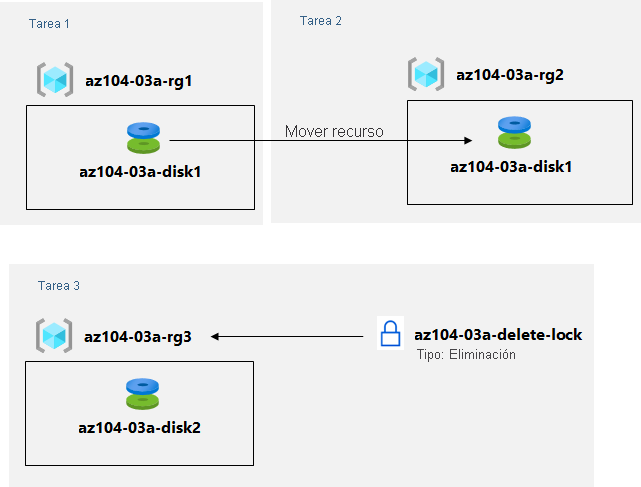

---
lab:
  title: "Laboratorio\_03a: Administración de recursos de Azure con Azure Portal"
  module: Administer Azure Resources
---

# Laboratorio 03a: Administración de recursos de Azure con Azure Portal
# Manual de laboratorio para alumnos

## Escenario del laboratorio

Tiene que explorar las funcionalidades básicas de administración de Azure asociadas con el aprovisionamiento de recursos y su organización en función de los grupos de recursos, incluido el movimiento de recursos entre grupos de recursos. También quiere explorar las opciones para proteger los recursos de disco frente a la eliminación accidental, a la vez que se permita modificar las características de rendimiento y tamaño.

**Nota:** Hay disponible una **[simulación de laboratorio interactiva](https://mslabs.cloudguides.com/guides/AZ-104%20Exam%20Guide%20-%20Microsoft%20Azure%20Administrator%20Exercise%204)** que le permite realizar sus propias selecciones a su entera discreción. Es posible que encuentre pequeñas diferencias entre la simulación interactiva y el laboratorio hospedado, pero las ideas y los conceptos básicos que se muestran son los mismos. 

## Objetivos

En este laboratorio, aprenderemos a:

+ Tarea 1: Crear grupos de recursos e implementar recursos en ellos
+ Tarea 2: Mover recursos entre grupos de recursos
+ Tarea 3: Implementar y probar los bloqueos de recursos

## Tiempo estimado: 20 minutos

## Diagrama de la arquitectura

### Instrucciones

## Ejercicio 1

## Tarea 1: Crear grupos de recursos e implementar recursos en ellos

En esta tarea, usará Azure Portal para crear grupos de recursos y crear un disco en el grupo de recursos.

1. Inicie sesión en [**Azure Portal**](http://portal.azure.com).

1. En Azure Portal, busque y seleccione **Discos**, haga clic en **+ Crear** y especifique los siguientes valores:

    |Configuración|Value|
    |---|---|
    |Suscripción| Nombre de la suscripción de Azure donde creó el grupo de recursos |
    |Grupo de recursos| Nombre de un nuevo grupo de recursos **az104-03a-rg1** |
    |Nombre del disco| **az104-03a-disk1** |
    |Region| **(EE. UU.) Este de EE. UU.** |
    |Zona de disponibilidad| **No se requiere redundancia de la infraestructura** |
    |Tipo de origen| **None** |

    >**Nota**: Al crear un recurso, tiene la opción de crear un grupo de recursos o usar uno existente.

1. Cambie el tipo y tamaño de disco a **HDD estándar** y **32 GiB**, respectivamente.

1. Haga clic en **Revisar + crear** y, después, en **Crear**.

    >**Nota**: Espere hasta que se cree el disco. Debería tardar menos de un minuto.

## Tarea 2: Mover recursos entre grupos de recursos 

En esta tarea, moveremos el recurso de disco que creó en la tarea anterior a un nuevo grupo de recursos. 

1. Busque y seleccione **Grupos de recursos**. 

1. En la hoja **Grupos de  recursos**, haga clic en la entrada que representa el grupo de recursos **az104-03a-rg1** que creó en la tarea anterior.

1. En la hoja **Información general** del grupo de recursos, en la lista de recursos del grupo de recursos, seleccione la entrada que representa el disco recién creado, haga clic en **Mover** en la barra de herramientas y, en la lista desplegable, seleccione **Mover a otro grupo de recursos**.

    >**Nota**: Este método permite mover varios recursos al mismo tiempo. 

1. Debajo del cuadro de texto **Grupo de recursos**, haga clic en **Crear nuevo** y luego **az104-03a-rg2** en el cuadro de texto. En la pestaña Revisión, seleccione la casilla **Comprendo que las herramientas y los scripts asociados con recursos movidos no funcionarán hasta que los actualice para que usen nuevos identificadores de recursos** y haga clic en **Mover**.

    >**Nota**: No espere a que se complete el movimiento, sino que avance a la siguiente tarea. Esto puede tardar unos 10 minutos. Para saber si la operación se completó, supervise las entradas del registro de actividad del grupo de recursos de origen o de destino. Vuelva a visitar este paso una vez que complete la siguiente tarea.

## Tarea 3: Implementar bloqueos de recursos

En esta tarea, aplicará un bloqueo de recursos a un grupo de recursos de Azure que contenga un recurso de disco.

1. En Azure Portal, busque y seleccione **Discos**, haga clic en **+ Crear** y especifique los siguientes valores:

    |Configuración|Value|
    |---|---|
    |Suscripción| Nombre de la suscripción que está usando en este laboratorio |
    |Grupo de recursos| Haga clic en **Crear nuevo** grupo de recursos y asígnele el nombre **az104-03a-rg3** |
    |Nombre del disco| **az104-03a-disk2** |
    |Region| Nombre de la región de Azure donde creó los otros grupos de recursos en este laboratorio |
    |Zona de disponibilidad| **No se requiere redundancia de la infraestructura** |
    |Tipo de origen| **None** |

1. Establezca el tipo y tamaño de disco a **HDD estándar** y **32 GiB**, respectivamente.

1. Haga clic en **Revisar + crear** y, después, en **Crear**.

1. Haga clic en **Ir al recurso**.

1. En la página Información general del disco, haga clic en el nombre del grupo de recursos, **az104-03a-rg3**.

1. En la hoja del grupo de recursos **az104-03a-rg3**, haga clic en **Bloqueos** y luego en **+ Agregar** y configure las opciones siguientes:

    |Configuración|Valor|
    |---|---|
    |Nombre del bloqueo| **az104-03a-delete-lock** |
    |Tipo de bloqueo| **Eliminar** |
    
1. Haga clic en **Aceptar**    

1. En la hoja del grupo de recursos **az104-03a-rg3**, haga clic en **Información general**, en la lista de recursos del grupo de recursos, seleccione la entrada que representa el disco que creó anteriormente en esta tarea y haga clic en **Eliminar** en la barra de herramientas. 

1. Cuando se le pregunte **¿Quiere eliminar todos los recursos seleccionados?** , en el cuadro de texto **Confirmar eliminación**, escriba **sí** y haga clic en **Eliminar**.

1. Debería ver un mensaje de error que notifica el error de la operación de eliminación. 

    >**Nota**: Como indica el mensaje de error, esto es esperable debido al bloqueo de eliminación aplicado a nivel del grupo de recursos.

1. Vuelva a la lista de recursos del grupo de recursos **az104-03a-rg3** y haga clic en la entrada que representa el recurso **az104-03a-disk2**. 

1. En la hoja **az104-03a-disk2**, en la sección **Configuración**, haga clic en **Tamaño y rendimiento**, establezca el tipo y tamaño de disco en **SSD prémium** y **64 GiB**,respectivamente, y haga clic en **Guardar** para aplicar el cambio. Compruebe que el cambio se realizó correctamente.

    >**Nota**: Esto es lo esperado, ya que el bloqueo a nivel de grupo de recursos solo se aplica a las operaciones de eliminación. 

## Limpieza de recursos

   >**Nota**: No elimine los recursos que implementó en este laboratorio. Los va a usar en el siguiente laboratorio de este módulo. Quite solo el bloqueo de recursos que creó en este laboratorio.

1. Vaya a la hoja del grupo de recursos **az104-03a-rg3**, muestre su hoja **Bloqueos** y quite el bloqueo **az104-03a-delete-lock** haciendo clic en el vínculo **Eliminar** en el lado derecho de la entrada de bloqueo **Eliminar**.

## Revisar

En este laboratorio, ha:

- Creado grupos de recursos e implementado recursos en ellos
- Movido recursos entre grupos de recursos
- Implementado y probado bloqueos de recursos
