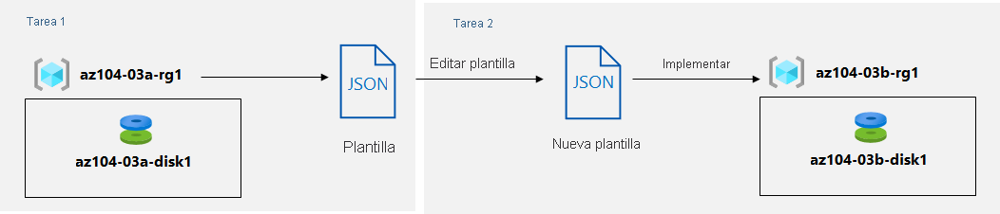

---
lab:
  title: "Laboratorio\_03b: Administración de recursos de Azure mediante plantillas de ARM"
  module: Administer Azure Resources
---

# Laboratorio 03b: Administración de recursos de Azure mediante plantillas de ARM
# Manual de laboratorio para alumnos

## Escenario del laboratorio
Ahora que ha explorado las funcionalidades básicas de administración de Azure asociadas con el aprovisionamiento de recursos y su organización en función de los grupos de recursos mediante Azure Portal, debe llevar a cabo la tarea equivalente mediante plantillas de Azure Resource Manager.

**Nota:** Hay disponible una **[simulación de laboratorio interactiva](https://mslabs.cloudguides.com/guides/AZ-104%20Exam%20Guide%20-%20Microsoft%20Azure%20Administrator%20Exercise%205)** que le permite realizar sus propias selecciones a su entera discreción. Es posible que encuentre pequeñas diferencias entre la simulación interactiva y el laboratorio hospedado, pero las ideas y los conceptos básicos que se muestran son los mismos. 

## Objetivos

En este laboratorio, aprenderá a:

+ Tarea 1: Revisar una plantilla de ARM para la implementación de un disco administrado de Azure
+ Tarea 2: Crear un disco administrado de Azure mediante una plantilla de ARM
+ Tarea 3: Revisar la implementación del disco administrado basada en la plantilla de ARM

## Tiempo estimado: 20 minutos

## Diagrama de la arquitectura



### Instrucciones

## Ejercicio 1

## Tarea 1: Revisar una plantilla de ARM para la implementación de un disco administrado de Azure

1. Inicie sesión en [**Azure Portal**](http://portal.azure.com).

1. En Azure Portal, busque y seleccione **Grupos de recursos**. 

1. En la lista de grupos de recursos, haga clic en **az104-03a-rg1**.

1. En la hoja del grupo de recursos **az104-03a-rg1**, en la sección **Configuración**, haga clic en **Implementaciones**.

1. En la hoja **az104-03a-rg1 - Implementaciones**, haga clic en la primera entrada de la lista de implementaciones.

1. En la hoja **Microsoft.ManagedDisk-* XXXXXXXXX* \| Información general**, haga clic en **Plantilla**.

    >**Nota:** Revise el contenido de la plantilla y tenga en cuenta que tiene la opción **descargarla** en el equipo local, **agregarla a la biblioteca** o **implementarla** de nuevo.

1. Haga clic en **Descargar** y guarde el archivo comprimido que contiene los archivos de parámetros y plantilla en la carpeta **Descargas** del equipo de laboratorio.

1. En la hoja **Microsoft.ManagedDisk-* XXXXXXXXX* \| Plantilla**, haga clic en **Entradas**.

1. Anote el valor del parámetro **ubicación**. Lo necesitará en la próxima tarea.

1. Extraiga el contenido del archivo descargado en la carpeta **Descargas** del equipo de laboratorio.

    >**Nota:** Estos archivos también están disponibles como **\\Allfiles\\Labs\\03\\az104-03b-md-template.json** y **\\Allfiles\\Labs\\03\\az104-03b-md-parameters.json**.
    
1. Cierre todas las ventanas del **Explorador de archivos**.

## Tarea 2: Crear un disco administrado de Azure mediante una plantilla de ARM

1. En Azure Portal, busque y seleccione **Implementar una plantilla personalizada**.

1. En la hoja **Implementación personalizada**, haga clic en **Cree su propia plantilla en el editor**.

1. En la hoja **Editar plantilla**, haga clic en **Cargar archivo** y cargue el archivo **template.json** que descargó en la tarea anterior.

1. En el panel del editor, quite las líneas siguientes:

   ```json
   "sourceResourceId": {
       "type": "String"
   },
   ```

   ```json
   "hyperVGeneration": {
       "defaultValue": "V1",
       "type": "String"
   },      
   ```

    >**Nota**: Estos parámetros se quitan porque no son aplicables a la implementación actual. En concreto, los parámetros sourceResourceId, sourceUri, osType y hyperVGeneration son aplicables a la creación de un disco de Azure a partir de un archivo VHD existente.

1. **Guarde** los cambios.

1. De nuevo en la hoja **Implementación personalizada**, haga clic en **Editar parámetros**. 

1. En la hoja **Editar parámetros**, haga clic en **Cargar archivo** y cargue el archivo **parameters.json** que descargó en la tarea anterior, y haga clic en **Guardar** los cambios.

1. De nuevo en la hoja **Implementación personalizada**, configure las opciones siguientes:

    | Configuración | Value |
    | --- |--- |
    | Subscription | *Nombre de la suscripción de Azure que está usando en este laboratorio* |
    | Grupo de recursos | Nombre de un **nuevo** grupo de recursos **az104-03b-rg1** |
    | Region | Nombre de cualquier región de Azure disponible en la suscripción que está usando en este laboratorio |
    | Nombre del disco | **az104-03b-disk1** |
    | Location | Valor del parámetro de ubicación que anotó en la tarea anterior |
    | SKU | **Standard_LRS** |
    | Tamaño del disco en GB | **32** |
    | Create Option (Opción de creación) | **empty** |
    | Disk Encryption Set Type (Tipo de conjunto de cifrado de disco) | **EncryptionAtRestWithPlatformKey** |
    | Modo de autenticación de acceso a datos | None |
    | Directiva de acceso a la red | **AllowAll** |
    | Acceso de red pública | Disabled |

1. Seleccione **Revisar y crear** y, luego, **Crear**.

1. Compruebe que la implementación se haya completado correctamente.

## Tarea 3: Revisar la implementación del disco administrado basada en la plantilla de ARM

1. En Azure Portal, busque y seleccione **Grupos de recursos**. 

1. En la lista de grupos de recursos, haga clic en **az104-03b-rg1**.

1. En la hoja del grupo de recursos **az104-03b-rg1**, en la sección **Configuración**, haga clic en **Implementaciones**.

1. En la hoja **az104-03b-rg1 - Implementaciones**, haga clic en la primera entrada de la lista de implementaciones y revise el contenido de las hojas **Entrada** y **Plantilla**.

## Limpieza de recursos

   >**Nota**: No elimine los recursos que implementó en este laboratorio. Hará referencia a ellos en el siguiente laboratorio de este módulo.

## Revisar

En este laboratorio, ha:

- Revisado una plantilla de ARM para la implementación de un disco administrado de Azure
- Creado un disco administrado de Azure mediante una plantilla de ARM
- Revisado la implementación del disco administrado basada en la plantilla de ARM
