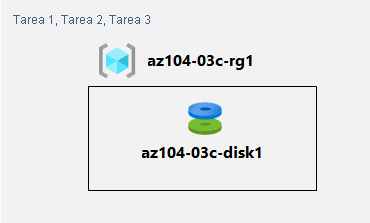

---
lab:
  title: "Laboratorio\_03c: Administración de recursos de Azure mediante Azure PowerShell (opcional)"
  module: Administer Azure Resources
---

# Laboratorio 03c: Administración de recursos de Azure mediante Azure PowerShell
# Manual de laboratorio para alumnos

## Escenario del laboratorio

Ahora que ha explorado las funcionalidades básicas de administración de Azure asociadas con el aprovisionamiento de recursos y su organización en función de los grupos de recursos mediante Azure Portal y plantillas de Azure Resource Manager, debe llevar a cabo la tarea equivalente mediante Azure PowerShell. Para evitar la instalación de módulos de Azure PowerShell, aprovechará el entorno de PowerShell disponible en Azure Cloud Shell.

**Nota:** Hay disponible una **[simulación de laboratorio interactiva](https://mslabs.cloudguides.com/guides/AZ-104%20Exam%20Guide%20-%20Microsoft%20Azure%20Administrator%20Exercise%206)** que le permite realizar sus propias selecciones a su entera discreción. Es posible que encuentre pequeñas diferencias entre la simulación interactiva y el laboratorio hospedado, pero las ideas y los conceptos básicos que se muestran son los mismos. 

## Objetivos

En este laboratorio, aprenderá a:

+ Tarea 1: Iniciar una sesión de PowerShell en Azure Cloud Shell
+ Tarea 2: Crear un grupo de recursos y un disco administrado de Azure mediante Azure PowerShell
+ Tarea 3: Configurar el disco administrado mediante Azure PowerShell

## Tiempo estimado: 20 minutos

## Diagrama de la arquitectura



### Instrucciones

> **Nota:** Cree siempre su propia contraseña segura para cualquier máquina virtual o cuenta de usuario que cree. Si no es usted quien crea la máquina virtual, use la opción **Restablecer contraseña** en el portal para actualizar la contraseña. 

## Ejercicio 1

## Tarea 1: Iniciar una sesión de PowerShell en Azure Cloud Shell

En esta tarea, abrirá una sesión de PowerShell en Cloud Shell. 

1. Haga clic en el icono de la esquina superior derecha de Azure Portal para abrir **Azure Cloud Shell**.

1. Si se le pide que seleccione **Bash** o **PowerShell**, seleccione **PowerShell**. 

    >**Nota**: Si es la primera vez que inicia **Cloud Shell** y aparece el mensaje **No tiene ningún almacenamiento montado**, seleccione la suscripción que utiliza en este laboratorio y haga clic en **Crear almacenamiento**. 

1. Si se le solicite, haga clic en **Crear almacenamiento** y espere hasta que aparezca Azure Cloud Shell. 

1. Asegúrese de que **PowerShell** aparezca en el menú desplegable superior izquierdo del panel de Cloud Shell.

## Tarea 2: Crear un grupo de recursos y un disco administrado de Azure mediante Azure PowerShell

En esta tarea, creará un grupo de recursos y un disco administrado de Azure mediante una sesión de Azure PowerShell dentro de Cloud Shell.

1. Para crear un grupo de recursos en la misma región de Azure que el grupo de recursos **az104-03b-rg1** que creó en el laboratorio anterior, desde la sesión de PowerShell en Cloud Shell, ejecute lo siguiente:

   ```powershell
   $location = (Get-AzResourceGroup -Name az104-03b-rg1).Location

   $rgName = 'az104-03c-rg1'

   New-AzResourceGroup -Name $rgName -Location $location
   ```
1. Para recuperar las propiedades del grupo de recursos recién creado, ejecute lo siguiente:

   ```powershell
   Get-AzResourceGroup -Name $rgName
   ```
1. Para crear un nuevo disco administrado con las mismas características que las que creó en los laboratorios anteriores de este módulo, ejecute lo siguiente:

   ```powershell
   $diskConfig = New-AzDiskConfig `
    -Location $location `
    -CreateOption Empty `
    -DiskSizeGB 32 `
    -SkuName Standard_LRS

   $diskName = 'az104-03c-disk1'

   New-AzDisk `
    -ResourceGroupName $rgName `
    -DiskName $diskName `
    -Disk $diskConfig
   ```

1. Para recuperar las propiedades del disco recién creado, ejecute lo siguiente:

   ```powershell
   Get-AzDisk -ResourceGroupName $rgName -Name $diskName
   ```

## Tarea 3: Configurar el disco administrado mediante Azure PowerShell

En esta tarea, administrará la configuración del disco administrado de Azure mediante una sesión de Azure PowerShell en Cloud Shell. 

1. Para aumentar el tamaño del disco administrado de Azure a **64 GB**, desde la sesión de PowerShell en Cloud Shell, ejecute lo siguiente:

   ```powershell
   New-AzDiskUpdateConfig -DiskSizeGB 64 | Update-AzDisk -ResourceGroupName $rgName -DiskName $diskName
   ```

1. Para comprobar que el cambio ha surtido efecto, ejecute lo siguiente:

   ```powershell
   Get-AzDisk -ResourceGroupName $rgName -Name $diskName
   ```

1. Para comprobar la SKU actual como **Standard_LRS**, ejecute lo siguiente:

   ```powershell
   (Get-AzDisk -ResourceGroupName $rgName -Name $diskName).Sku
   ```

1. Para cambiar la SKU de rendimiento del disco a **Premium_LRS**, desde la sesión de PowerShell en Cloud Shell, ejecute lo siguiente:

   ```powershell
   New-AzDiskUpdateConfig -SkuName Premium_LRS | Update-AzDisk -ResourceGroupName $rgName -DiskName $diskName
   ```

1. Para comprobar que el cambio ha surtido efecto, ejecute lo siguiente:

   ```powershell
   (Get-AzDisk -ResourceGroupName $rgName -Name $diskName).Sku
   ```

## Limpieza de recursos

   >**Nota**: No elimine los recursos que implementó en este laboratorio. Hará referencia a ellos en el siguiente laboratorio de este módulo.

## Revisar

En este laboratorio, ha:

- Iniciado una sesión de PowerShell en Azure Cloud Shell
- Creado un grupo de recursos y un disco administrado de Azure mediante Azure PowerShell
- Configurado el disco administrado mediante Azure PowerShell
