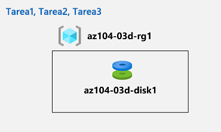

---
lab:
  title: 'Lab 03d: Manage Azure resources by Using Azure CLI (opcional)'
  module: Administer Azure Resources
---

# Laboratorio 03d: Administración de recursos de Azure mediante la CLI de Azure
# Manual de laboratorio para alumnos

## Escenario del laboratorio

Ahora que ha explorado las funcionalidades básicas de administración de Azure asociadas con el aprovisionamiento de recursos y su organización en función de los grupos de recursos mediante Azure Portal, las plantillas de Azure Resource Manager y Azure PowerShell, debe llevar a cabo la tarea equivalente mediante la CLI de Azure. Para evitar la instalación de la CLI de Azure, aprovechará el entorno de Bash disponible en Azure Cloud Shell.

**Nota:** Hay disponible una **[simulación de laboratorio interactiva](https://mslabs.cloudguides.com/guides/AZ-104%20Exam%20Guide%20-%20Microsoft%20Azure%20Administrator%20Exercise%207)** que le permite realizar sus propias selecciones a su entera discreción. Es posible que encuentre pequeñas diferencias entre la simulación interactiva y el laboratorio hospedado, pero las ideas y los conceptos básicos que se muestran son los mismos. 

## Objetivos

En este laboratorio, aprenderá a:

+ Tarea 1: Iniciar una sesión de Bash en Azure Cloud Shell
+ Tarea 2: Crear un grupo de recursos y un disco administrado de Azure mediante la CLI de Azure
+ Tarea 3: Configurar el disco administrado mediante la CLI de Azure

## Tiempo estimado: 20 minutos

## Diagrama de la arquitectura



### Instrucciones

## Ejercicio 1

## Tarea 1: Iniciar una sesión de Bash en Azure Cloud Shell

En esta tarea, abrirá una sesión de Bash en Cloud Shell. 

1. Haga clic en el icono de la esquina superior derecha de Azure Portal para abrir **Azure Cloud Shell**.

1. Si se le pide que seleccione **Bash** o **PowerShell**, seleccione **Bash**. 

    >**Nota**: Si es la primera vez que inicia **Cloud Shell** y aparece el mensaje **No tiene ningún almacenamiento montado**, seleccione la suscripción que utiliza en este laboratorio y haga clic en **Crear almacenamiento**. 

1. Si se le solicite, haga clic en **Crear almacenamiento** y espere hasta que aparezca Azure Cloud Shell. 

1. Asegúrese de que **Bash** aparezca en el menú desplegable superior izquierdo del panel de Cloud Shell.

## Tarea 2: Crear un grupo de recursos y un disco administrado de Azure mediante la CLI de Azure

En esta tarea, creará un grupo de recursos y un disco administrado de Azure mediante una sesión de la CLI de Azure dentro de Cloud Shell.

1. Para crear un grupo de recursos en la misma región de Azure que el grupo de recursos **az104-03c-rg1** que creó en el laboratorio anterior, desde la sesión de Bash en Cloud Shell, ejecute lo siguiente:

   ```sh
   LOCATION=$(az group show --name 'az104-03c-rg1' --query location --out tsv)

   RGNAME='az104-03d-rg1'

   az group create --name $RGNAME --location $LOCATION
   ```
1. Para recuperar las propiedades del grupo de recursos recién creado, ejecute lo siguiente:

   ```sh
   az group show --name $RGNAME
   ```
1. Para crear un nuevo disco administrado con las mismas características que las que creó en los laboratorios anteriores de este módulo, desde la sesión de Bash dentro de Cloud Shell, ejecute lo siguiente:

   ```sh
   DISKNAME='az104-03d-disk1'

   az disk create \
   --resource-group $RGNAME \
   --name $DISKNAME \
   --sku 'Standard_LRS' \
   --size-gb 32
   ```
    >**Nota**: Al usar la sintaxis de varias líneas, asegúrese de que cada línea termine con barra diagonal inversa (`\`) sin espacios finales, y de que no haya espacios iniciales al principio de cada línea.

1. Para recuperar las propiedades del disco recién creado, ejecute lo siguiente:

   ```sh
   az disk show --resource-group $RGNAME --name $DISKNAME
   ```

## Tarea 3: Configurar el disco administrado mediante la CLI de Azure

En esta tarea, administrará la configuración del disco administrado de Azure mediante una sesión de la CLI de Azure en Cloud Shell. 

1. Para aumentar el tamaño del disco administrado de Azure a **64 GB**, desde la sesión de Bash en Cloud Shell, ejecute lo siguiente:

   ```sh
   az disk update --resource-group $RGNAME --name $DISKNAME --size-gb 64
   ```

1. Para comprobar que el cambio ha surtido efecto, ejecute lo siguiente:

   ```sh
   az disk show --resource-group $RGNAME --name $DISKNAME --query diskSizeGB
   ```

1. Para cambiar la SKU de rendimiento del disco a **Premium_LRS**, desde la sesión de Bash en Cloud Shell, ejecute lo siguiente:

   ```sh
   az disk update --resource-group $RGNAME --name $DISKNAME --sku 'Premium_LRS'
   ```

1. Para comprobar que el cambio ha surtido efecto, ejecute lo siguiente:

   ```sh
   az disk show --resource-group $RGNAME --name $DISKNAME --query sku
   ```

## Limpieza de recursos

 > **Nota**: No olvide quitar los recursos de Azure recién creados que ya no use. La eliminación de los recursos sin usar garantiza que no verá cargos inesperados.

 > **Nota:** No se preocupe si los recursos del laboratorio no se pueden quitar inmediatamente. A veces, los recursos tienen dependencias y se tarda más tiempo en eliminarlos. Supervisar el uso de los recursos es una tarea habitual del administrador, así que solo tiene que revisar periódicamente los recursos en el portal para ver cómo va la limpieza. 

1. En Azure Portal, abra la sesión de shell de **Bash** en el panel **Cloud Shell**.

1. Ejecute el comando siguiente para enumerar todos los grupos de recursos que se han creado en los laboratorios de este módulo:

   ```sh
   az group list --query "[?starts_with(name,'az104-03')].name" --output tsv
   ```

1. Ejecute el comando siguiente para eliminar todos los grupos de recursos que ha creado en los laboratorios de este módulo:

   ```sh
   az group list --query "[?starts_with(name,'az104-03')].[name]" --output tsv | xargs -L1 bash -c 'az group delete --name $0 --no-wait --yes'
   ```

    >**Nota**: El comando se ejecuta de forma asincrónica (según determina el parámetro --nowait). Aunque podrá ejecutar otro comando de la CLI de Azure inmediatamente después en la misma sesión de Bash, los grupos de recursos tardarán unos minutos en quitarse.

## Revisar

En este laboratorio, ha:

- Iniciado una sesión de Bash en Azure Cloud Shell
- Creado un grupo de recursos y un disco administrado de Azure mediante la CLI de Azure
- Configurado el disco administrado mediante la CLI de Azure
