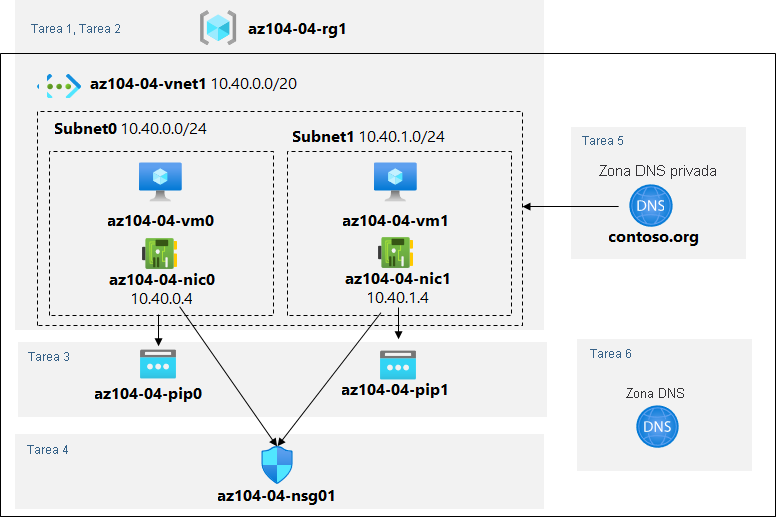

---
lab:
  title: '04: Implementación de redes virtuales'
  module: Administer Virtual Networking
---

# <a name="lab-04---implement-virtual-networking"></a>Laboratorio 04: Implementación de redes virtuales

# <a name="student-lab-manual"></a>Manual de laboratorio para alumnos

## <a name="lab-scenario"></a>Escenario del laboratorio

Debe explorar las funcionalidades de red virtual de Azure. Para empezar, tiene previsto crear una red virtual en Azure que hospedará un par de máquinas virtuales de Azure. Dado que tiene previsto implementar la segmentación basada en red, las implementará en diferentes subredes de la red virtual. También quiere asegurarse de que sus direcciones IP públicas y privadas no cambiarán con el tiempo. Para cumplir los requisitos de seguridad de Contoso, debe proteger los puntos de conexión públicos de las máquinas virtuales de Azure accesibles desde Internet. Por último, debe implementar la resolución de nombres DNS para las máquinas virtuales de Azure tanto dentro de la red virtual como desde Internet.

                **Nota:** Hay disponible una **[simulación de laboratorio interactiva](https://mslabs.cloudguides.com/guides/AZ-104%20Exam%20Guide%20-%20Microsoft%20Azure%20Administrator%20Exercise%208)** que le permite realizar sus propias selecciones a su entera discreción. Es posible que encuentre pequeñas diferencias entre la simulación interactiva y el laboratorio hospedado, pero las ideas y los conceptos básicos que se muestran son los mismos. 

## <a name="objectives"></a>Objetivos

En este laboratorio, aprenderá a:

+ Tarea 1: Creación y configuración de una red virtual
+ Tarea 2: Implementación de máquinas virtuales en la red virtual
+ Tarea 3: Configuración de direcciones IP privadas y públicas de máquinas virtuales de Azure
+ Tarea 4: Configuración de grupos de seguridad de red
+ Tarea 5: Configuración de Azure DNS para la resolución de nombres internos
+ Tarea 6: Configuración de Azure DNS para la resolución de nombres externos

## <a name="estimated-timing-40-minutes"></a>Tiempo estimado: 40 minutos

## <a name="architecture-diagram"></a>Diagrama de la arquitectura



## <a name="instructions"></a>Instrucciones

### <a name="exercise-1"></a>Ejercicio 1

#### <a name="task-1-create-and-configure-a-virtual-network"></a>Tarea 1: Creación y configuración de una red virtual

En esta tarea, creará una red virtual con varias subredes mediante Azure Portal.

1. Inicie sesión en [Azure Portal](https://portal.azure.com).

1. En Azure Portal, busque y seleccione **Redes virtuales** y, en la hoja **Redes virtuales**, haga clic en **+ Crear**.

1. Cree una red virtual con las siguientes opciones de configuración (deje las demás con los valores predeterminados):

    | Configuración | Valor |
    | --- | --- |
    | Subscription | nombre de la suscripción de Azure que usará en este laboratorio |
    | Grupo de recursos | nombre de un **nuevo** grupo de recursos **az104-04-rg1** |
    | Name | **az104-04-vnet1** |
    | Region | nombre de cualquier región de Azure disponible en la suscripción que usará en este laboratorio |

1. Haga clic en **Siguiente: Direcciones IP** y elimine el **espacio de direcciones IPv4** existente. En el cuadro de texto **Espacio de direcciones IPv4**, escriba **10.40.0.0/20**.

1. Haga clic en **+ Agregar subred**, escriba los valores siguientes y, a continuación, haga clic en **Agregar**.

    | Configuración | Value |
    | --- | --- |
    | Nombre de subred | **subnet0** |
    | Intervalo de direcciones de subred | **10.40.0.0/24** |

1. Acepte los valores predeterminados y haga clic en **Revisar y crear**. Deje que se procese la validación y haga clic en **Crear** de nuevo para enviar la implementación.

    >**Nota:** Espere a que se aprovisione la red virtual. Debería tardar menos de un minuto.

1. Haga clic en **Ir al recurso**.

1. En la hoja de la red virtual **az104-04-vnet1**, haga clic en **Subredes** y luego en **+ Subred**.

1. Cree una subred con las siguientes opciones de configuración (deje las demás con los valores predeterminados):

    | Configuración | Valor |
    | --- | --- |
    | Nombre | **subnet1** |
    | Intervalo de direcciones (bloque CIDR) | **10.40.1.0/24** |
    | Grupo de seguridad de red | **None** |
    | Tabla de rutas | **None** |

1. Haga clic en **Guardar**

#### <a name="task-2-deploy-virtual-machines-into-the-virtual-network"></a>Tarea 2: Implementación de máquinas virtuales en la red virtual

En esta tarea, implementará máquinas virtuales de Azure en diferentes subredes de la red virtual mediante una plantilla de ARM.

1. Haga clic en el icono de la esquina superior derecha de Azure Portal para abrir **Azure Cloud Shell**.

1. Si se le pide que seleccione **Bash** o **PowerShell**, seleccione **PowerShell**.

    >**Nota**: Si es la primera vez que inicia **Cloud Shell** y aparece el mensaje **No tiene ningún almacenamiento montado**, seleccione la suscripción que utiliza en este laboratorio y haga clic en **Crear almacenamiento**.

1. En la barra de herramientas del panel de Cloud Shell, haga clic en el icono **Cargar/Descargar archivos**, haga clic en **Cargar** en el menú desplegable y cargue los archivos **\\Allfiles\\Labs\\04\\az104-04-vm-loop-template.json** y **\\Allfiles\\Labs\\04\\az104-04-vm-loop-parameters.json** en el directorio principal de Cloud Shell.

    >**Nota**: Es posible que tenga que cargar cada archivo por separado.

1. Edite el archivo de parámetros y cambie la contraseña. Si necesita ayuda para editar el archivo en el shell, pida ayuda al instructor. Como procedimiento recomendado, los secretos, como las contraseñas, deben almacenarse de una forma más segura en el almacén de claves. 

1. En el panel de Cloud Shell, ejecute lo siguiente para implementar las dos máquinas virtuales con los archivos de parámetros y plantilla:

   ```powershell
   $rgName = 'az104-04-rg1'

   New-AzResourceGroupDeployment `
      -ResourceGroupName $rgName `
      -TemplateFile $HOME/az104-04-vms-loop-template.json `
      -TemplateParameterFile $HOME/az104-04-vms-loop-parameters.json
   ```

    >**Nota**: Este método de implementación de plantillas de ARM usa Azure PowerShell. Puede realizar la misma tarea ejecutando el comando equivalente de la CLI de Azure **az deployment create** (para más información, consulte [Implementación de recursos con plantillas de Resource Manager y la CLI de Azure](https://docs.microsoft.com/en-us/azure/azure-resource-manager/templates/deploy-cli).

    >**Nota**: Espere a que la implementación se complete antes de continuar con la tarea siguiente. Este proceso tardará alrededor de 2 minutos.

    >**Nota**: Si tiene un error que indica que el tamaño de la máquina virtual no está disponible, pida al instructor ayuda y pruebe estos pasos:
    > 1. Haga clic en el botón `{}` de CloudShell, seleccione **az104-04-vms-loop-parameters.json** en la barra de la izquierda y anote el valor del parámetro `vmSize`.
    > 1. Compruebe la ubicación en la que se implementa el grupo de recursos “az104-04-rg1”. Puede ejecutar `az group show -n az104-04-rg1 --query location` en CloudShell para obtenerlo.
    > 1. Ejecute `az vm list-skus --location <Replace with your location> -o table --query "[? contains(name,'Standard_D2s')].name"` en CloudShell. Si no hay SKU enumeradas (es decir, no hay resultados), no puede implementar ninguna máquina virtual D2S en esa región. Tendrá que buscar una región que le permita implementar máquinas virtuales D2S. Una vez que haya elegido una ubicación adecuada, elimine el grupo de recursos AZ104-04-rg1 y reinicie el laboratorio.
    > 1. Reemplace el valor del parámetro `vmSize` por uno de los valores devueltos por el comando que acaba de ejecutar.
    > 1. Ahora vuelva a ejecutar el comando `New-AzResourceGroupDeployment` para implementar de nuevo las plantillas. Puede presionar el botón de flecha arriba varias veces para ver el último comando ejecutado.

1. Cierre el panel de Cloud Shell.

#### <a name="task-3-configure-private-and-public-ip-addresses-of-azure-vms"></a>Tarea 3: Configuración de direcciones IP privadas y públicas de máquinas virtuales de Azure

En esta tarea, configurará la asignación estática de direcciones IP públicas y privadas asignadas a interfaces de red de máquinas virtuales de Azure.

   >**Nota**: Las direcciones IP privadas y públicas se asignan realmente a las interfaces de red, que, a su vez, están conectadas a máquinas virtuales de Azure; sin embargo, es bastante común hacer referencia a direcciones IP asignadas a máquinas virtuales de Azure en su lugar.

1. En Azure Portal, busque y seleccione **Grupos de recursos** y, en la hoja **Grupos de recursos**, haga clic en **az104-04-rg1**.

1. En la hoja del grupo de recursos **az104-04-rg1**, en la lista de sus recursos, haga clic en **az104-04-vnet1**.

1. En la hoja de la red virtual **az104-04-vnet1**, revise la sección **Dispositivos conectados** y compruebe que hay dos interfaces de red **az104-04-nic0** y **az104-04-nic1** conectadas a la red virtual.

1. Haga clic en **az104-04-nic0** y, en la hoja de **az104-04-nic0**, haga clic en **Configuraciones de IP**.

    >**Nota**: Compruebe que **ipconfig1** está configurado actualmente con una dirección IP privada dinámica.

1. En la lista de configuraciones de IP, haga clic en **ipconfig1**.

1. En la hoja de **ipconfig1**, en la sección **Configuración de dirección IP pública**, seleccione **Asociar**, haga clic en **+ Crear nuevo**, especifique los siguientes valores y haga clic en **Aceptar**:

    | Configuración | Valor |
    | --- | --- |
    | Nombre | **az104-04-pip0** |
    | SKU | **Estándar** |

1. En la hoja de **ipconfig1**, establezca **Asignación** en **Estática**, y deje el valor predeterminado de **Dirección IP** establecido en **10.40.0.4**.

1. De nuevo en la hoja de **ipconfig1**, guarde los cambios. Asegúrese de esperar a que se complete la operación de guardado antes de continuar con el paso siguiente.

1. Vuelva a la hoja de **az104-04-vnet1**.

1. Haga clic en **az104-04-nic1** y, en la hoja de **az104-04-nic1**, haga clic en **Configuraciones de IP**.

    >**Nota**: Compruebe que **ipconfig1** está configurado actualmente con una dirección IP privada dinámica.

1. En la lista de configuraciones de IP, haga clic en **ipconfig1**.

1. En la hoja de **ipconfig1**, en la sección **Configuración de dirección IP pública**, seleccione **Asociar**, haga clic en **+ Crear nuevo**, especifique los siguientes valores y haga clic en **Aceptar**:

    | Configuración | Valor |
    | --- | --- |
    | Nombre | **az104-04-pip1** |
    | SKU | **Estándar** |

1. En la hoja de **ipconfig1**, establezca **Asignación** en **Estática**, y deje el valor predeterminado de **Dirección IP** establecido en **10.40.1.4**.

1. De nuevo en la hoja de **ipconfig1**, guarde los cambios.

1. Vuelva a la hoja del grupo de recursos **az104-04-rg1**, en la lista de sus recursos, haga clic en **az104-04-vm0** y, en la hoja de la máquina virtual **az104-04-vm0**, anote la entrada de la dirección IP pública.

1. Vuelva a la hoja del grupo de recursos **az104-04-rg1**, en la lista de sus recursos, haga clic en **az104-04-vm1** y, en la hoja de la máquina virtual **az104-04-vm1**, anote la entrada de la dirección IP pública.

    >**Nota**: Necesitará ambas direcciones IP en la última tarea de este laboratorio.

#### <a name="task-4-configure-network-security-groups"></a>Tarea 4: Configuración de grupos de seguridad de red

En esta tarea, configurará grupos de seguridad de red para permitir la conectividad restringida a las máquinas virtuales de Azure.

1. En Azure Portal, vuelva a la hoja del grupo de recursos **az104-04-rg1** y, en la lista de sus recursos, haga clic en **az104-04-vm0**.

1. En la hoja de información general de **az104-04-vm0**, haga clic en **Conectar**, en el menú desplegable, haga clic en **RDP**, en la hoja **Conectar con RDP**, haga clic en **Descargar archivo RDP** usando la dirección IP pública y siga las indicaciones para iniciar la sesión de Escritorio remoto.

1. Observe que se produce un error en el intento de conexión.

    >**Nota**: Esto es lo esperado, ya que las direcciones IP públicas de la SKU estándar, de forma predeterminada, requieren que las interfaces de red a las que están asignadas estén protegidas por un grupo de seguridad de red. Para permitir las conexiones de Escritorio remoto, creará un grupo de seguridad de red que permita explícitamente el tráfico RDP entrante desde Internet y lo asignará a las interfaces de red de ambas máquinas virtuales.

1. Detenga las máquinas virtuales **az104-04-vm0** y **az104-04-vm1**.

    >**Nota**: esto se lleva a cabo para agilizar la práctica de laboratorio. Si las máquinas virtuales se ejecutan cuando un grupo de seguridad de red está conectado a su interfaz de red, la conexión pueden tardar más de 30 minutos en surtir efecto. Una vez creado y conectado el grupo de seguridad de red, se reiniciarán las máquinas virtuales y la conexión entrará en vigor inmediatamente.

1. En Azure Portal, busque y seleccione **Grupos de seguridad de red** y, en la hoja **Grupos de seguridad de red**, haga clic en **+ Crear**.

1. Cree un grupo de seguridad de red con las siguientes opciones de configuración (deje las demás con los valores predeterminados):

    | Configuración | Valor |
    | --- | --- |
    | Subscription | nombre de la suscripción de Azure que usa en este laboratorio |
    | Grupo de recursos | **az104-04-rg1** |
    | Name | **az104-04-nsg01** |
    | Region | nombre de la región de Azure en la que implementó todos los demás recursos de este laboratorio |

1. Haga clic en **Review and Create** (Revisar y crear). Deje que se procese la validación y haga clic en **Crear** para enviar la implementación.

    >**Nota**: Espere a que la implementación se complete. Este proceso tardará alrededor de 2 minutos.

1. En la hoja de implementación, haga clic en **Ir al recurso** para abrir la hoja del grupo de seguridad de red **az104-04-nsg01**.

1. En la hoja del grupo de seguridad de red **az104-04-nsg01**, en la sección **Configuración**, haga clic en **Reglas de seguridad de entrada**.

1. Agregue una regla de entrada con las siguientes opciones de configuración (deje las demás con los valores predeterminados):

    | Configuración | Valor |
    | --- | --- |
    | Source | **Cualquiera** |
    | Source port ranges | * |
    | Destination | **Cualquiera** |
    | Servicio | **RDP** |
    | Acción | **Permitir** |
    | Priority | **300** |
    | Name | **AllowRDPInBound** |

1. En la hoja del grupo de seguridad de red **az104-04-nsg01**, en la sección **Configuración**, haga clic en **Interfaces de red** y luego en **+ Asociar**.

1. Asocie el grupo de seguridad de red **az104-04-nsg01** a las interfaces de red **az104-04-nic0** y **az104-04-nic1**.

    >**Nota**: Las reglas del grupo de seguridad de red recién creado pueden tardar hasta 5 minutos en aplicarse a la tarjeta de interfaz de red.

1. Inicie las máquinas virtuales **az104-04-vm0** y **az104-04-vm1**.

1. Vuelva a la hoja de la máquina virtual **az104-04-vm0**.

    >**Nota:** En los pasos siguientes, comprobará que puede conectarse correctamente a la máquina virtual de destino.

1. En la hoja de **az104-04-vm0**, haga clic en **Conectar**, haga clic en **RDP**, en la hoja **Conectar con RDP**, haga clic en **Descargar archivo RDP** usando la dirección IP pública y siga las indicaciones para iniciar la sesión de Escritorio remoto.

    >**Nota**: Este paso hace referencia a la conexión mediante Escritorio remoto desde un equipo Windows. En un equipo Mac, puede usar un cliente de Escritorio remoto de Mac App Store y, en un equipo Linux, puede usar un software cliente RDP de código abierto.

    >**Nota**: Puede omitir cualquier aviso de advertencia al conectarse a las máquinas virtuales de destino.

1. Cuando el sistema se lo indique, inicie sesión con el usuario y la contraseña del archivo de parámetros.

    >**Nota**: Deje abierta esta sesión de Escritorio remoto. Lo necesitará en la próxima tarea.

#### <a name="task-5-configure-azure-dns-for-internal-name-resolution"></a>Tarea 5: Configuración de Azure DNS para la resolución de nombres internos

En esta tarea, configurará la resolución de nombres DNS dentro de una red virtual mediante zonas DNS privadas de Azure.

1. En Azure Portal, busque y seleccione **Zonas DNS privadas** y, en la hoja **Zonas DNS privadas**, haga clic en **+ Crear**.

1. Cree una zona DNS privada con las siguientes opciones de configuración (deje las demás con los valores predeterminados):

    | Configuración | Valor |
    | --- | --- |
    | Subscription | nombre de la suscripción de Azure que usa en este laboratorio |
    | Grupo de recursos | **az104-04-rg1** |
    | Name | **contoso.org** |

1. Haga clic en **Review and Create** (Revisar y crear). Deje que se procese la validación y haga clic en **Crear** de nuevo para enviar la implementación.

    >**Nota**: Espere a que se cree la zona DNS privada. Este proceso tardará alrededor de 2 minutos.

1. Haga clic en **Ir al recurso** para abrir la hoja de zona DNS privada de **contoso.org**.

1. En la hoja de zona DNS privada de **contoso.org**, en la sección **Configuración**, haga clic en **Vínculos de la red virtual**.

1. Haga clic en **+ Agregar** para crear una red virtual con las siguientes opciones de configuración (deje las demás con los valores predeterminados):

    | Configuración | Value |
    | --- | --- |
    | Nombre del vínculo | **az104-04-vnet1-link** |
    | Subscription | nombre de la suscripción de Azure que usa en este laboratorio |
    | Virtual network | **az104-04-vnet1** |
    | Habilitación del registro automático | enabled |

1. Haga clic en **Aceptar**.

    >**Nota:** Espere a que se cree el vínculo de red virtual. Debería tardar menos de un minuto.

1. En la hoja de zona DNS privada de **contoso.org**, en la barra lateral, haga clic en **Descripción general**.

1. Compruebe que los registros DNS de **az104-04-vm0** y **az104-04-vm1** aparecen en la lista de conjuntos de registros como **Registrado automáticamente**.

    >**Nota**: Es posible que tenga que esperar unos minutos y actualizar la página si los conjuntos de registros no aparecen en la lista.

1. Cambie a la sesión de Escritorio remoto para **az104-04-vm0**, haga clic con el botón derecho en el botón **Inicio** y, en el menú contextual, haga clic en **Windows PowerShell (Administrador)** .

1. En la ventana de la consola Windows PowerShell, ejecute lo siguiente para probar la resolución interna de nombres en la zona DNS privada recién creada:

   ```powershell
   nslookup az104-04-vm0.contoso.org
   nslookup az104-04-vm1.contoso.org
   ```

1. Compruebe que la salida del comando incluye la dirección IP privada de **az104-04-vm1** (**10.40.1.4**).

#### <a name="task-6-configure-azure-dns-for-external-name-resolution"></a>Tarea 6: Configuración de Azure DNS para la resolución de nombres externos

En esta tarea, configurará la resolución de nombres DNS externos mediante zonas DNS públicas de Azure.

1. En un explorador web, abra una nueva pestaña y vaya a <https://www.godaddy.com/domains/domain-name-search>.

1. Use la búsqueda de nombres de dominio para identificar un nombre de dominio que no esté en uso.

1. En Azure Portal, busque y seleccione **Zonas DNS** y, en la hoja **Zonas DNS**, haga clic en **+ Crear**.

1. Cree una zona DNS con las siguientes opciones de configuración (deje las demás con los valores predeterminados):

    | Configuración | Valor |
    | --- | --- |
    | Subscription | nombre de la suscripción de Azure que usa en este laboratorio |
    | Grupo de recursos | **az104-04-rg1** |
    | Name | nombre de dominio DNS que identificó anteriormente en esta tarea |

1. Haga clic en **Review and Create** (Revisar y crear). Deje que se procese la validación y haga clic en **Crear** de nuevo para enviar la implementación.

    >**Nota**: Espere a que se cree la zona DNS. Este proceso tardará alrededor de 2 minutos.

1. Haga clic en **Ir al recurso** para abrir la hoja de la zona DNS recién creada.

1. En la hoja de zona DNS, haga clic en **+ Conjunto de registros**.

1. Agregue un conjunto de registros con las siguientes opciones de configuración (deje las demás con los valores predeterminados):

    | Configuración | Valor |
    | --- | --- |
    | Nombre | **az104-04-vm0** |
    | Tipo | **A** |
    | Conjunto de registros de alias | **No** |
    | TTL | **1** |
    | Unidad de TTL | **Horas** |
    | Dirección IP | dirección IP pública de **az104-04-vm0** que identificó en el tercer ejercicio de este laboratorio |

1. Haga clic en **Aceptar**

1. En la hoja de zona DNS, haga clic en **+ Conjunto de registros**.

1. Agregue un conjunto de registros con las siguientes opciones de configuración (deje las demás con los valores predeterminados):

    | Configuración | Valor |
    | --- | --- |
    | Nombre | **az104-04-vm1** |
    | Tipo | **A** |
    | Conjunto de registros de alias | **No** |
    | TTL | **1** |
    | Unidad de TTL | **Horas** |
    | Dirección IP | dirección IP pública de **az104-04-vm1** que identificó en el tercer ejercicio de este laboratorio |

1. Haga clic en **Aceptar**

1. En la hoja de zona DNS, anote el nombre de la entrada **Servidor DNS 1**.

1. En Azure Portal, abra la sesión de **PowerShell** en **Cloud Shell**. Para ello, haga clic en el icono de la esquina superior derecha de Azure Portal.

1. En el panel Cloud Shell, ejecute lo siguiente para probar la resolución de nombres externos del conjunto de registros DNS de **az104-04-vm0** en la zona DNS recién creada (reemplace el marcador de posición `[Name server 1]` por el nombre de **Servidor DNS 1** que anotó anteriormente en esta tarea y el marcador de posición `[domain name]` por el nombre del dominio DNS que creó anteriormente en esta tarea):

   ```powershell
   nslookup az104-04-vm0.[domain name] [Name server 1]
   ```

1. Compruebe que la salida del comando incluye la dirección IP pública de **az104-04-vm0**.

1. En el panel Cloud Shell, ejecute lo siguiente para probar la resolución de nombres externos del conjunto de registros DNS de **az104-04-vm1** en la zona DNS recién creada (reemplace el marcador de posición `[Name server 1]` por el nombre de **Servidor DNS 1** que anotó anteriormente en esta tarea y el marcador de posición `[domain name]` por el nombre del dominio DNS que creó anteriormente en esta tarea):

   ```powershell
   nslookup az104-04-vm1.[domain name] [Name server 1]
   ```

1. Compruebe que la salida del comando incluye la dirección IP pública de **az104-04-vm1**.

#### <a name="clean-up-resources"></a>Limpieza de recursos

 > **Nota**: No olvide quitar los recursos de Azure recién creados que ya no use. La eliminación de los recursos sin usar garantiza que no verá cargos inesperados.

 > **Nota:** No se preocupe si los recursos del laboratorio no se pueden quitar inmediatamente. A veces, los recursos tienen dependencias y se tarda más tiempo en eliminarlos. Supervisar el uso de los recursos es una tarea habitual del administrador, así que solo tiene que revisar periódicamente los recursos en el portal para ver cómo va la limpieza. 

1. En Azure Portal, abra la sesión de **PowerShell** en el panel **Cloud Shell**.

1. Ejecute el comando siguiente para enumerar todos los grupos de recursos que se han creado en los laboratorios de este módulo:

   ```powershell
   Get-AzResourceGroup -Name 'az104-04*'
   ```

1. Ejecute el comando siguiente para eliminar todos los grupos de recursos que ha creado en los laboratorios de este módulo:

   ```powershell
   Get-AzResourceGroup -Name 'az104-04*' | Remove-AzResourceGroup -Force -AsJob
   ```

    >**Nota**: El comando se ejecuta de forma asincrónica (según determina el parámetro -AsJob). Aunque podrá ejecutar otro comando de PowerShell inmediatamente después en la misma sesión de PowerShell, los grupos de recursos tardarán unos minutos en eliminarse.

#### <a name="review"></a>Revisar

En este laboratorio, ha:

+ Creado y configurado una red virtual
+ Implementado máquinas virtuales en la red virtual
+ Configurado direcciones IP privadas y públicas de máquinas virtuales de Azure
+ Configurado grupos de seguridad de red
+ Configurado Azure DNS para la resolución de nombres internos
+ Configurado Azure DNS para la resolución de nombres externos
