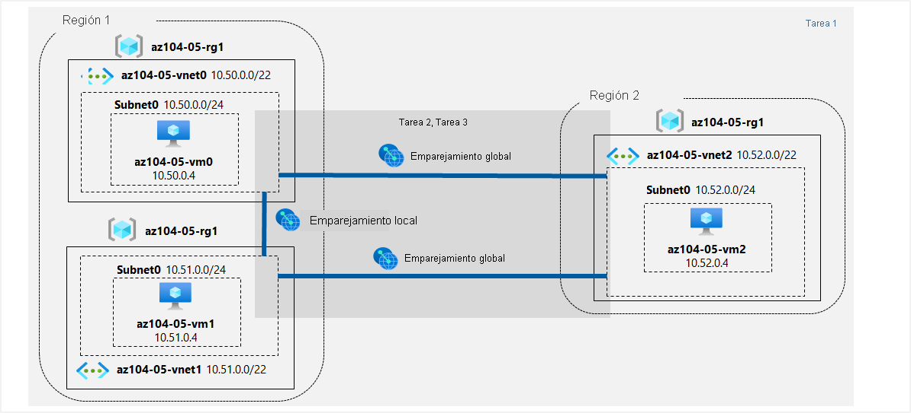

---
lab:
  title: '05: Implementación de la conectividad entre sitios'
  module: Administer Intersite Connectivity
---

# <a name="lab-05---implement-intersite-connectivity"></a>Laboratorio 05: Implementación de la conectividad entre sitios
# <a name="student-lab-manual"></a>Manual de laboratorio para alumnos

## <a name="lab-scenario"></a>Escenario del laboratorio

Contoso has its datacenters in Boston, New York, and Seattle offices connected via a mesh wide-area network links, with full connectivity between them. You need to implement a lab environment that will reflect the topology of the Contoso's on-premises networks and verify its functionality.

## <a name="objectives"></a>Objetivos

En este laboratorio, aprenderá a:

+ Tarea 1: Aprovisionamiento del entorno de laboratorio
+ Tarea 2: Configuración del emparejamiento local y global de red virtual
+ Tarea 3: Prueba de la conectividad entre sitios

## <a name="estimated-timing-30-minutes"></a>Tiempo estimado: 30 minutos

## <a name="architecture-diagram"></a>Diagrama de la arquitectura



### <a name="instructions"></a>Instructions

#### <a name="task-1-provision-the-lab-environment"></a>Tarea 1: Aprovisionamiento del entorno de laboratorio

En esta tarea, implementará tres máquinas virtuales, cada una en una red virtual independiente, con dos de ellas en la misma región de Azure y la tercera en otra región de Azure.

1. Inicie sesión en [Azure Portal](https://portal.azure.com).

1. Haga clic en el icono de la esquina superior derecha de Azure Portal para abrir **Azure Cloud Shell**.

1. Si se le pide que seleccione **Bash** o **PowerShell**, seleccione **PowerShell**.

    >**Nota**: Si es la primera vez que inicia **Cloud Shell** y aparece el mensaje **No tiene ningún almacenamiento montado**, seleccione la suscripción que utiliza en este laboratorio y haga clic en **Crear almacenamiento**.

1. En la barra de herramientas del panel de Cloud Shell, haga clic en el icono **Cargar/Descargar archivos**, haga clic en **Cargar** en el menú desplegable y cargue los archivos **\\Allfiles\\Labs\\05\\az104-05-vnetvm-loop-template.json** y **\\Allfiles\\Labs\\05\\az104-05-vnetvm-loop-parameters.json** en el directorio principal de Cloud Shell.

1. Edit the <bpt id="p1">**</bpt>Parameters<ept id="p1">**</ept> file you just uploaded and change the password. If you need help editing the file in the Shell please ask your instructor for assistance. As a best practice, secrets, like passwords, should be more securely stored in the Key Vault. 

1. From the Cloud Shell pane, run the following to create the resource group that will be hosting the lab environment. The first two virtual networks and a pair of virtual machines will be deployed in [Azure_region_1]. The third virtual network and the third virtual machine will be deployed in the same resource group but another [Azure_region_2]. (replace the [Azure_region_1] and [Azure_region_2] placeholder, including the square brackets, with the names of two different Azure regions where you intend to deploy these Azure virtual machines. An example is $location1 = 'eastus'. You can use Get-AzLocation to list all locations.):

   ```powershell
   $location1 = 'eastus'

   $location2 = 'westus'

   $rgName = 'az104-05-rg1'

   New-AzResourceGroup -Name $rgName -Location $location1
   ```

   ><bpt id="p1">**</bpt>Note<ept id="p1">**</ept>: The regions used above were tested and known to work when this lab was last officially reviewed. If you would prefer to use different locations, or they no longer work, you will need to identify two different regions that Standard D2Sv3 virtual machines can be deployed into.
   >
   >Para identificar las regiones de Azure, desde una sesión de PowerShell en Cloud Shell, ejecute **(Get-AzLocation).Location**
   >
   >Una vez que haya identificado dos regiones que quiera usar, ejecute el comando siguiente en el Cloud Shell para cada región para confirmar que puede implementar máquinas virtuales D2Sv3 estándar
   >
   >```az vm list-skus --location <Replace with your location> -o table --query "[? contains(name,'Standard_D2s')].name" ```
   >
   >If the command returns no results, then you need to choose another region. Once you have identified two suitable regions, you can adjust the regions in the code block above.

1. En el panel de Cloud Shell, ejecute lo siguiente para crear las tres redes virtuales e implementar las máquinas virtuales en ellas mediante los archivos de parámetros y plantilla que cargó:

   ```powershell
   New-AzResourceGroupDeployment `
      -ResourceGroupName $rgName `
      -TemplateFile $HOME/az104-05-vnetvm-loop-template.json `
      -TemplateParameterFile $HOME/az104-05-vnetvm-loop-parameters.json `
      -location1 $location1 `
      -location2 $location2
   ```

    >Contoso tiene sus centros de datos en las oficinas de Boston, Nueva York y Seattle conectadas a través de una malla de vínculos de red de área extensa, con conectividad completa entre ellas.

1. Cierre el panel de Cloud Shell.

#### <a name="task-2-configure-local-and-global-virtual-network-peering"></a>Tarea 2: Configuración del emparejamiento local y global de red virtual

En esta tarea, configurará el emparejamiento local y global entre las redes virtuales que implementó en las tareas anteriores.

1. En Azure Portal, busque y seleccione **Redes virtuales**.

1. Revise las redes virtuales que creó en la tarea anterior y compruebe que las dos primeras se encuentran en la misma región de Azure y la tercera en otra región de Azure.

    >**Nota**: La plantilla que usó para la implementación de las tres redes virtuales asegura que los intervalos de direcciones IP de las tres redes virtuales no se superpongan.

1. En la lista de redes virtuales, haga clic en **az104-05-vnet0**.

1. En la hoja de la máquina virtual **az104-05-vnet0**, en la sección **Configuración**, haga clic en **Emparejamientos** y luego en **+ Agregar**.

1. Agregue un emparejamiento con las siguientes opciones de configuración (deje las demás con los valores predeterminados) y haga clic en **Agregar**:

    | Configuración | Value|
    | --- | --- |
    | Esta red virtual: nombre del vínculo de emparejamiento | **az104-05-vnet0_to_az104-05-vnet1** |
    | Esta red virtual: tráfico a la red virtual remota | **Permitir (predeterminado)** |
    | Esta red virtual: tráfico reenviado desde una red virtual remota | **Bloquear el tráfico que se origina fuera de esta red virtual** |
    | Puerta de enlace de red virtual | **None** |
    | Red virtual remota: nombre del vínculo de emparejamiento | **az104-05-vnet1_to_az104-05-vnet0** |
    | Modelo de implementación de red virtual | **Resource Manager** |
    | Conozco mi Id. de recurso | no seleccionado |
    | Subscription | nombre de la suscripción de Azure que usa en este laboratorio |
    | Virtual network | **az104-05-vnet1** |
    | Tráfico hacia la red virtual remota | **Permitir (predeterminado)** |
    | Tráfico reenviado desde la red virtual remota | **Bloquear el tráfico que se origina fuera de esta red virtual** |
    | Puerta de enlace de red virtual | **None** |

    >**Nota**: Este paso establece dos emparejamientos locales: uno de az104-05-vnet0 a az104-05-vnet1 y el otro de az104-05-vnet1 a az104-05-vnet0.

    >**Nota**: Si se encuentra con un problema de la interfaz de Azure Portal que no muestra las redes virtuales creadas en la tarea anterior, puede configurar el emparejamiento ejecutando los siguientes comandos de PowerShell desde Cloud Shell:
    
   ```powershell
   $rgName = 'az104-05-rg1'

   $vnet0 = Get-AzVirtualNetwork -Name 'az104-05-vnet0' -ResourceGroupName $rgname

   $vnet1 = Get-AzVirtualNetwork -Name 'az104-05-vnet1' -ResourceGroupName $rgname

   Add-AzVirtualNetworkPeering -Name 'az104-05-vnet0_to_az104-05-vnet1' -VirtualNetwork $vnet0 -RemoteVirtualNetworkId $vnet1.Id

   Add-AzVirtualNetworkPeering -Name 'az104-05-vnet1_to_az104-05-vnet0' -VirtualNetwork $vnet1 -RemoteVirtualNetworkId $vnet0.Id
   ``` 

1. En la hoja de la máquina virtual **az104-05-vnet0**, en la sección **Configuración**, haga clic en **Emparejamientos** y luego en **+ Agregar**.

1. Agregue un emparejamiento con las siguientes opciones de configuración (deje las demás con los valores predeterminados) y haga clic en **Agregar**:

    | Configuración | Value|
    | --- | --- |
    | Esta red virtual: nombre del vínculo de emparejamiento | **az104-05-vnet0_to_az104-05-vnet2** |
    | Esta red virtual: tráfico a la red virtual remota | **Permitir (predeterminado)** |
    | Esta red virtual: tráfico reenviado desde una red virtual remota | **Bloquear el tráfico que se origina fuera de esta red virtual** |
    | Puerta de enlace de red virtual | **None** |
    | Red virtual remota: nombre del vínculo de emparejamiento | **az104-05-vnet2_to_az104-05-vnet0** |
    | Modelo de implementación de red virtual | **Resource Manager** |
    | Conozco mi Id. de recurso | no seleccionado |
    | Subscription | nombre de la suscripción de Azure que usa en este laboratorio |
    | Virtual network | **az104-05-vnet2** |
    | Tráfico hacia la red virtual remota | **Permitir (predeterminado)** |
    | Tráfico reenviado desde la red virtual remota | **Bloquear el tráfico que se origina fuera de esta red virtual** |
    | Puerta de enlace de red virtual | **None** |

    >**Nota**: Este paso establece dos emparejamientos globales: uno de az104-05-vnet0 a az104-05-vnet2 y el otro de az104-05-vnet2 a az104-05-vnet0.

    >**Nota**: Si se encuentra con un problema de la interfaz de Azure Portal que no muestra las redes virtuales creadas en la tarea anterior, puede configurar el emparejamiento ejecutando los siguientes comandos de PowerShell desde Cloud Shell:
    
   ```powershell
   $rgName = 'az104-05-rg1'

   $vnet0 = Get-AzVirtualNetwork -Name 'az104-05-vnet0' -ResourceGroupName $rgname

   $vnet2 = Get-AzVirtualNetwork -Name 'az104-05-vnet2' -ResourceGroupName $rgname

   Add-AzVirtualNetworkPeering -Name 'az104-05-vnet0_to_az104-05-vnet2' -VirtualNetwork $vnet0 -RemoteVirtualNetworkId $vnet2.Id

   Add-AzVirtualNetworkPeering -Name 'az104-05-vnet2_to_az104-05-vnet0' -VirtualNetwork $vnet2 -RemoteVirtualNetworkId $vnet0.Id
   ``` 

1. Vuelva a la hoja **Redes virtuales** y, en la lista de redes virtuales, haga clic en **az104-05-vnet1**.

1. En la hoja de la máquina virtual **az104-05-vnet1**, en la sección **Configuración**, haga clic en **Emparejamientos** y luego en **+ Agregar**.

1. Agregue un emparejamiento con las siguientes opciones de configuración (deje las demás con los valores predeterminados) y haga clic en **Agregar**:

    | Configuración | Value|
    | --- | --- |
    | Esta red virtual: nombre del vínculo de emparejamiento | **az104-05-vnet1_to_az104-05-vnet2** |
    | Esta red virtual: tráfico a la red virtual remota | **Permitir (predeterminado)** |
    | Esta red virtual: tráfico reenviado desde una red virtual remota | **Bloquear el tráfico que se origina fuera de esta red virtual** |
    | Puerta de enlace de red virtual | **None** |
    | Red virtual remota: nombre del vínculo de emparejamiento | **az104-05-vnet2_to_az104-05-vnet1** |
    | Modelo de implementación de red virtual | **Resource Manager** |
    | Conozco mi Id. de recurso | no seleccionado |
    | Subscription | nombre de la suscripción de Azure que usa en este laboratorio |
    | Virtual network | **az104-05-vnet2** |
    | Tráfico hacia la red virtual remota | **Permitir (predeterminado)** |
    | Tráfico reenviado desde la red virtual remota | **Bloquear el tráfico que se origina fuera de esta red virtual** |
    | Puerta de enlace de red virtual | **None** |

    >**Nota**: Este paso establece dos emparejamientos globales: uno de az104-05-vnet1 a az104-05-vnet2 y el otro de az104-05-vnet2 a az104-05-vnet1.

    >**Nota**: Si se encuentra con un problema de la interfaz de Azure Portal que no muestra las redes virtuales creadas en la tarea anterior, puede configurar el emparejamiento ejecutando los siguientes comandos de PowerShell desde Cloud Shell:
    
   ```powershell
   $rgName = 'az104-05-rg1'

   $vnet1 = Get-AzVirtualNetwork -Name 'az104-05-vnet1' -ResourceGroupName $rgname

   $vnet2 = Get-AzVirtualNetwork -Name 'az104-05-vnet2' -ResourceGroupName $rgname

   Add-AzVirtualNetworkPeering -Name 'az104-05-vnet1_to_az104-05-vnet2' -VirtualNetwork $vnet1 -RemoteVirtualNetworkId $vnet2.Id

   Add-AzVirtualNetworkPeering -Name 'az104-05-vnet2_to_az104-05-vnet1' -VirtualNetwork $vnet2 -RemoteVirtualNetworkId $vnet1.Id
   ``` 

#### <a name="task-3-test-intersite-connectivity"></a>Tarea 3: Prueba de la conectividad entre sitios

En esta tarea, probará la conectividad entre las máquinas virtuales de las tres redes virtuales que conectó a través del emparejamiento local y global en la tarea anterior.

1. En Azure Portal, busque y seleccione **Máquinas virtuales**.

1. En la lista de máquinas virtuales, haga clic en **az104-05-vm0**.

1. En la hoja **az104-05-vm0**, haga clic en **Conectar**, en el menú desplegable, haga clic en **RDP**, en la hoja **Conectar con RDP**, haga clic en **Descargar archivo RDP** y siga las indicaciones para iniciar la sesión de Escritorio remoto.

    >Debe implementar un entorno de laboratorio que refleje la topología de las redes locales de Contoso y comprobar su funcionalidad.

    >**Nota**: Puede omitir cualquier aviso de advertencia al conectarse a las máquinas virtuales de destino.

1. Cuando el sistema se lo indique, inicie sesión con el nombre de usuario **Student** y la contraseña del archivo de parámetros. 

1. En la sesión de Escritorio remoto para **az104-05-vm0**, haga clic con el botón derecho en el botón **Inicio** y, en el menú contextual, haga clic en **Windows PowerShell (Administrador)** .

1. En la ventana de la consola de Windows PowerShell, ejecute lo siguiente para probar la conectividad a **az104-05-vm1** (que tiene la dirección IP privada **10.51.0.4**) a través del puerto TCP 3389:

   ```powershell
   Test-NetConnection -ComputerName 10.51.0.4 -Port 3389 -InformationLevel 'Detailed'
   ```

    >**Nota**: La prueba usa TCP 3389, ya que el firewall del sistema operativo permite este puerto de forma predeterminada.

1. Examine la salida del comando y compruebe que la conexión se ha realizado correctamente.

1. En la ventana de la consola de Windows PowerShell, ejecute lo siguiente para probar la conectividad a **az104-05-vm2** (que tiene la dirección IP privada **10.52.0.4**):

   ```powershell
   Test-NetConnection -ComputerName 10.52.0.4 -Port 3389 -InformationLevel 'Detailed'
   ```

1. Vuelva a Azure Portal en el equipo del laboratorio y vuelva a la hoja **Máquinas virtuales**.

1. En la lista de máquinas virtuales, haga clic en **az104-05-vm1**.

1. En la hoja **az104-05-vm1**, haga clic en **Conectar**, en el menú desplegable, haga clic en **RDP**, en la hoja **Conectar con RDP**, haga clic en **Descargar archivo RDP** y siga las indicaciones para iniciar la sesión de Escritorio remoto.

    ><bpt id="p1">**</bpt>Note<ept id="p1">**</ept>: This step refers to connecting via Remote Desktop from a Windows computer. On a Mac, you can use Remote Desktop Client from the Mac App Store and on Linux computers you can use an open source RDP client software.

    >**Nota**: Puede omitir cualquier aviso de advertencia al conectarse a las máquinas virtuales de destino.

1. Cuando el sistema se lo indique, inicie sesión con el nombre de usuario **Student** y la contraseña del archivo de parámetros. 

1. En la sesión de Escritorio remoto para **az104-05-vm1**, haga clic con el botón derecho en el botón **Inicio** y, en el menú contextual, haga clic en **Windows PowerShell (Administrador)** .

1. En la ventana de la consola de Windows PowerShell, ejecute lo siguiente para probar la conectividad a **az104-05-vm2** (que tiene la dirección IP privada **10.52.0.4**) a través del puerto TCP 3389:

   ```powershell
   Test-NetConnection -ComputerName 10.52.0.4 -Port 3389 -InformationLevel 'Detailed'
   ```

    >**Nota**: La prueba usa TCP 3389, ya que el firewall del sistema operativo permite este puerto de forma predeterminada.

1. Examine la salida del comando y compruebe que la conexión se ha realizado correctamente.

#### <a name="clean-up-resources"></a>Limpieza de recursos

><bpt id="p1">**</bpt>Note<ept id="p1">**</ept>: Remember to remove any newly created Azure resources that you no longer use. Removing unused resources ensures you will not see unexpected charges.

><bpt id="p1">**</bpt>Note<ept id="p1">**</ept>:  Don't worry if the lab resources cannot be immediately removed. Sometimes resources have dependencies and take a longer time to delete. It is a common Administrator task to monitor resource usage, so just periodically review your resources in the Portal to see how the cleanup is going. 

1. En Azure Portal, abra la sesión de **PowerShell** en el panel **Cloud Shell**.

1. Ejecute el comando siguiente para enumerar todos los grupos de recursos que se han creado en los laboratorios de este módulo:

   ```powershell
   Get-AzResourceGroup -Name 'az104-05*'
   ```

1. Ejecute el comando siguiente para eliminar todos los grupos de recursos que ha creado en los laboratorios de este módulo:

   ```powershell
   Get-AzResourceGroup -Name 'az104-05*' | Remove-AzResourceGroup -Force -AsJob
   ```

    >**Nota**: El comando se ejecuta de forma asincrónica (según determina el parámetro -AsJob). Aunque podrá ejecutar otro comando de PowerShell inmediatamente después en la misma sesión de PowerShell, los grupos de recursos tardarán unos minutos en eliminarse.

#### <a name="review"></a>Revisar

En este laboratorio, ha:

+ Aprovisionado el entorno de laboratorio
+ Configurado el emparejamiento local y global de red virtual
+ Probado la conectividad entre sitios
