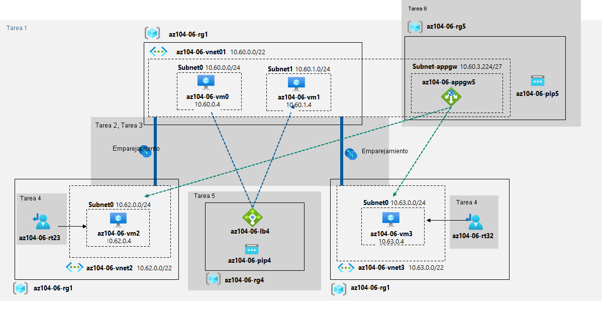

---
lab:
  title: "Laboratorio\_06: Implementación de la administración del tráfico"
  module: Administer Network Traffic Management
---

# Laboratorio 06: Implementación de la administración del tráfico
# Manual de laboratorio para alumnos

## Escenario del laboratorio

Se le ha encargado probar la administración del tráfico de red dirigido a máquinas virtuales de Azure en la topología de red en estrella tipo hub-and-spoke, que Contoso está considerando implementar en su entorno de Azure (en lugar de crear la topología de malla, que probó en el laboratorio anterior). Estas pruebas deben incluir la implementación de conectividad entre radios mediante rutas definidas por el usuario que fuercen el flujo de tráfico a través del centro, así como la distribución del tráfico entre máquinas virtuales mediante equilibradores de carga de nivel 4 y nivel 7. Para ello, tiene previsto usar Azure Load Balancer (nivel 4) y Azure Application Gateway (nivel 7).

                **Nota:** Hay disponible una **[simulación de laboratorio interactiva](https://mslabs.cloudguides.com/guides/AZ-104%20Exam%20Guide%20-%20Microsoft%20Azure%20Administrator%20Exercise%2010)** que le permite realizar sus propias selecciones a su entera discreción. Es posible que encuentre pequeñas diferencias entre la simulación interactiva y el laboratorio hospedado, pero las ideas y los conceptos básicos que se muestran son los mismos. 

>**Nota**: Este laboratorio, de manera predeterminada, requiere un total de 8 vCPU disponibles en la serie Standard_Dsv3 en la región que elija para la implementación, ya que implica la implementación de cuatro VM de Azure de SKU Standard_D2s_v3. Si los alumnos usan cuentas de prueba, con el límite de 4 vCPU, puede usar un tamaño de VM que requiera solo una vCPU (por ejemplo, Standard_B1s).

## Objetivos

En este laboratorio, aprenderá a:

+ Tarea 1: Aprovisionar el entorno de laboratorio
+ Tarea 2: Configurar la topología de red en estrella tipo hub-and-spoke
+ Tarea 3: Probar la transitividad del emparejamiento de redes virtuales
+ Tarea 4: Configurar el enrutamiento en la topología en estrella tipo hub-and-spoke
+ Tarea 5: Implementar Azure Load Balancer
+ Tarea 6: Implementar Azure Application Gateway

## Tiempo estimado: 60 minutos

## Diagrama de la arquitectura




### Instrucciones

## Ejercicio 1

## Tarea 1: Aprovisionar el entorno de laboratorio

En esta tarea, implementará cuatro máquinas virtuales en la misma región de Azure. Las dos primeras residirán en una red virtual de centro, mientras que cada una de las dos restantes residirá en una red virtual de radio independiente.

1. Inicie sesión en [Azure Portal](https://portal.azure.com).

1. Haga clic en el icono de la esquina superior derecha de Azure Portal para abrir **Azure Cloud Shell**.

1. Si se le pide que seleccione **Bash** o **PowerShell**, seleccione **PowerShell**.

    >**Nota**: Si es la primera vez que inicia **Cloud Shell** y aparece el mensaje **No tiene ningún almacenamiento montado**, seleccione la suscripción que utiliza en este laboratorio y haga clic en **Crear almacenamiento**.

1. En la barra de herramientas del panel de Cloud Shell, haga clic en el icono **Cargar/Descargar archivos**, haga clic en **Cargar** en el menú desplegable y cargue los archivos **\\Allfiles\\Labs\\06\\az104-06-vms-loop-template.json** y **\\Allfiles\\Labs\\06\\az104-06-vms-loop-parameters.json** en el directorio principal de Cloud Shell.

1. En el panel de Cloud Shell, ejecute lo siguiente para crear el primer grupo de recursos que hospedará el entorno de laboratorio (reemplace el marcador de posición “[Azure_region]” por el nombre de una región de Azure donde tiene pensado implementar las máquinas virtuales de Azure). Puede usar el cmdlet “(Get-AzLocation).Location” para obtener la lista de regiones:

    ```powershell 
    $location = '[Azure_region]'
    ```
    
    Ahora, el nombre del grupo de recursos:
    ```powershell
    $rgName = 'az104-06-rg1'
    ```
    
    Y, por último, cree el grupo de recursos en la ubicación que desee:
    ```powershell
    New-AzResourceGroup -Name $rgName -Location $location
    ```


1. En el panel de Cloud Shell, ejecute lo siguiente para crear las tres redes virtuales y cuatro VM de Azure en ellas mediante los archivos de parámetros y plantilla que cargó:

    >**Nota**: Se le pedirá que proporcione una contraseña de administrador.

   ```powershell
   New-AzResourceGroupDeployment `
      -ResourceGroupName $rgName `
      -TemplateFile $HOME/az104-06-vms-loop-template.json `
      -TemplateParameterFile $HOME/az104-06-vms-loop-parameters.json
   ```

    >**Nota**: Espere a que la implementación se complete antes de continuar con el paso siguiente. Este proceso tardará alrededor de 5 minutos.

    >**Nota**: Si tiene un error que indica que el tamaño de la máquina virtual no está disponible, pida al instructor ayuda y pruebe estos pasos.
    > 1. Haga clic en el botón `{}` de CloudShell, seleccione **az104-06-vms-loop-parameters.json** en la barra de la izquierda y anote el valor del parámetro `vmSize`.
    > 1. Compruebe la ubicación en la que se implementa el grupo de recursos “az104-06-rg1”. Puede ejecutar `az group show -n az104-06-rg1 --query location` en CloudShell para obtenerlo.
    > 1. Ejecute `az vm list-skus --location <Replace with your location> -o table --query "[? contains(name,'Standard_D2s')].name"` en CloudShell.
    > 1. Reemplace el valor del parámetro `vmSize` por uno de los valores devueltos por el comando que acaba de ejecutar. Si no se devuelve ningún valor, es posible que tenga que elegir otra región en la que realizar la implementación. También puede elegir otro nombre de familia, como "Standard_B1s".
    > 1. Ahora vuelva a ejecutar el comando `New-AzResourceGroupDeployment` para implementar de nuevo las plantillas. Puede presionar el botón de flecha arriba varias veces para ver el último comando ejecutado.

1. En el panel de Cloud Shell, ejecute lo siguiente para instalar la extensión Network Watcher en las VM de Azure implementadas en el paso anterior:

   ```powershell
   $rgName = 'az104-06-rg1'
   $location = (Get-AzResourceGroup -ResourceGroupName $rgName).location
   $vmNames = (Get-AzVM -ResourceGroupName $rgName).Name

   foreach ($vmName in $vmNames) {
     Set-AzVMExtension `
     -ResourceGroupName $rgName `
     -Location $location `
     -VMName $vmName `
     -Name 'networkWatcherAgent' `
     -Publisher 'Microsoft.Azure.NetworkWatcher' `
     -Type 'NetworkWatcherAgentWindows' `
     -TypeHandlerVersion '1.4'
   }
   ```

    >**Nota**: Espere a que la implementación se complete antes de continuar con el paso siguiente. Este proceso tardará alrededor de 5 minutos.


1. Cierre el panel de Cloud Shell.

## Tarea 2: Configurar la topología de red en estrella tipo hub-and-spoke

En esta tarea, configurará el emparejamiento local entre las redes virtuales que implementó en las tareas anteriores para crear una topología de red en estrella tipo hub-and-spoke.

1. En Azure Portal, busque y seleccione **Redes virtuales**.

1. Revise las redes virtuales que creó en la tarea anterior.

    >**Nota**: La plantilla que usó para la implementación de las tres redes virtuales asegura que los intervalos de direcciones IP de las tres redes virtuales no se superpongan.

1. En la lista de redes virtuales, seleccione **az104-06-vnet2**.

1. En la hoja **az104-06-vnet2**, seleccione **Propiedades**. 

1. En la hoja **Az104-06-vnet2 \| Propiedades**, registre el valor de la propiedad **Id. de recurso**.

1. Vuelva a la lista de redes virtuales y seleccione **az104-06-vnet3**.

1. En la hoja **az104-06-vnet3**, seleccione **Propiedades**. 

1. En la hoja **Az104-06-vnet3 \| Propiedades**, registre el valor de la propiedad **Id. de recurso**.

    >**Nota**: Necesitará los valores de la propiedad Id. de recurso para ambas redes virtuales más adelante en esta tarea.

    >**Nota**: Se trata de una solución alternativa que aborda el problema por el que Azure Portal en ocasiones no muestra la red virtual recién aprovisionada al crear emparejamientos de redes virtuales.

1. En la lista de red virtual, haga clic en **az104-06-vnet01**.

1. En la hoja de la máquina virtual **az104-06-vnet01**, en la sección **Configuración**, haga clic en **Emparejamientos** y luego en **+ Agregar**.

1. Agregue un emparejamiento con las siguientes opciones de configuración (deje las demás con los valores predeterminados) y haga clic en **Agregar**:

    | Configuración | Value |
    | --- | --- |
    | Esta red virtual: nombre del vínculo de emparejamiento | **az104-06-vnet01_to_az104-06-vnet2** |
    | Tráfico hacia la red virtual remota | **Permitir (predeterminado)** |
    | Tráfico reenviado desde la red virtual remota | **Bloquear el tráfico que se origina fuera de esta red virtual** |
    | Puerta de enlace de red virtual | **Ninguna (valor predeterminado)** |
    | Red virtual remota: nombre del vínculo de emparejamiento | **az104-06-vnet2_to_az104-06-vnet01** |
    | Modelo de implementación de red virtual | **Resource Manager** |
    | Conozco mi Id. de recurso | enabled |
    | Id. de recurso | El valor del parámetro Id. de recurso de **az104-06-vnet2** que registró anteriormente en esta tarea |
    | Tráfico hacia la red virtual remota | **Permitir (predeterminado)** |
    | Tráfico reenviado desde la red virtual remota | **Permitir (predeterminado)** |
    | Puerta de enlace de red virtual | **Ninguna (valor predeterminado)** |

    >**Nota**: Espere a que se complete la operación.

    >**Nota**: Este paso establece dos emparejamientos locales: uno de az104-06-vnet01 a az104-06-vnet2 y el otro de az104-06-vnet2 a az104-06-vnet01.

    >**Nota**: Es necesario habilitar **Permitir tráfico reenviado** para facilitar el enrutamiento entre redes virtuales de radio, que implementará más adelante en este laboratorio.

1. En la hoja de la máquina virtual **az104-06-vnet01**, en la sección **Configuración**, haga clic en **Emparejamientos** y luego en **+ Agregar**.

1. Agregue un emparejamiento con las siguientes opciones de configuración (deje las demás con los valores predeterminados) y haga clic en **Agregar**:

    | Configuración | Value |
    | --- | --- |
    | Esta red virtual: nombre del vínculo de emparejamiento | **az104-06-vnet01_to_az104-06-vnet3** |
    | Tráfico hacia la red virtual remota | **Permitir (predeterminado)** |
    | Tráfico reenviado desde la red virtual remota | **Bloquear el tráfico que se origina fuera de esta red virtual** |
    | Puerta de enlace de red virtual | **Ninguna (valor predeterminado)** |
    | Red virtual remota: nombre del vínculo de emparejamiento | **az104-06-vnet3_to_az104-06-vnet01** |
    | Modelo de implementación de red virtual | **Resource Manager** |
    | Conozco mi Id. de recurso | enabled |
    | Id. de recurso | El valor del parámetro Id. de recurso de **az104-06-vnet3** que registró anteriormente en esta tarea |
    | Tráfico hacia la red virtual remota | **Permitir (predeterminado)** |
    | Tráfico reenviado desde la red virtual remota | **Permitir (predeterminado)** |
    | Puerta de enlace de red virtual | **Ninguna (valor predeterminado)** |

    >**Nota**: Este paso establece dos emparejamientos locales: uno de az104-06-vnet01 a az104-06-vnet3 y el otro de az104-06-vnet3 a az104-06-vnet01. Esto completa la configuración de la topología en estrella tipo hub-and-spoke (con dos redes virtuales de radio).

    >**Nota**: Es necesario habilitar **Permitir tráfico reenviado** para facilitar el enrutamiento entre redes virtuales de radio, que implementará más adelante en este laboratorio.

## Tarea 3: Probar la transitividad del emparejamiento de redes virtuales

En esta tarea, probará la transitividad del emparejamiento de redes virtuales mediante Network Watcher.

1. En Azure Portal, busque y seleccione **Network Watcher**.

1. En la hoja **Network Watcher**, expanda la lista de regiones de Azure y compruebe que el servicio está habilitado en la región que está usando. 

1. Vaya a la hoja **Network Watcher** y luego a **Solución de problemas de conexión**.

1. En la hoja **Network Watcher - Solución de problemas de conexión**, inicie una comprobación con las siguientes opciones de configuración (deje las demás con los valores predeterminados):

    > **Nota**: El grupo de recursos puede tardar unos minutos en aparecer. Si no desea esperar, pruebe esto: elimine Network Watcher, cree un nuevo Network Watcher e intente solucionar los problemas de conexión otra vez. 

    | Configuración | Valor |
    | --- | --- |
    | Subscription | nombre de la suscripción de Azure que usa en este laboratorio |
    | Resource group | **az104-06-rg1** |
    | Tipo de origen | **Máquina virtual** |
    | Máquina virtual | **az104-06-vm0** |
    | Destination | **Especificar manualmente** |
    | URI, FQDN o IPv4 | **10.62.0.4** |
    | Protocolo | **TCP** |
    | Puerto de destino | **3389** |

    > **Note**: **10.62.0.4** representa la dirección IP privada de **az104-06-vm2**.

1. Haga clic en **Ejecutar pruebas de diagnóstico** y espere hasta que se devuelvan los resultados de la comprobación de conectividad. Compruebe que el estado sea **Correcto**. Revise la ruta de acceso de red y observe que la conexión era directa, sin saltos intermedios entre las VM.

    > **Nota**: Esto es lo esperado, ya que la red virtual del centro se empareja directamente con la primera red virtual de radio.

1. En la hoja **Network Watcher - Solución de problemas de conexión**, inicie una comprobación con las siguientes opciones de configuración (deje las demás con los valores predeterminados):

    | Configuración | Valor |
    | --- | --- |
    | Subscription | nombre de la suscripción de Azure que usa en este laboratorio |
    | Resource group | **az104-06-rg1** |
    | Tipo de origen | **Máquina virtual** |
    | Máquina virtual | **az104-06-vm0** |
    | Destination | **Especificar manualmente** |
    | URI, FQDN o IPv4 | **10.63.0.4** |
    | Protocolo | **TCP** |
    | Puerto de destino | **3389** |

    > **Note**: **10.63.0.4** representa la dirección IP privada de **az104-06-vm3**.

1. Haga clic en **Ejecutar pruebas de diagnóstico** y espere hasta que se devuelvan los resultados de la comprobación de conectividad. Compruebe que el estado sea **Correcto**. Revise la ruta de acceso de red y observe que la conexión era directa, sin saltos intermedios entre las VM.

    > **Nota**: Esto es lo esperado, ya que la red virtual del centro se empareja directamente con la segunda red virtual de radio.

1. En la hoja **Network Watcher - Solución de problemas de conexión**, inicie una comprobación con las siguientes opciones de configuración (deje las demás con los valores predeterminados):

    | Configuración | Valor |
    | --- | --- |
    | Subscription | nombre de la suscripción de Azure que usa en este laboratorio |
    | Resource group | **az104-06-rg1** |
    | Tipo de origen | **Máquina virtual** |
    | Máquina virtual | **az104-06-vm2** |
    | Destination | **Especificar manualmente** |
    | URI, FQDN o IPv4 | **10.63.0.4** |
    | Protocolo | **TCP** |
    | Puerto de destino | **3389** |

1. Haga clic en **Ejecutar pruebas de diagnóstico** y espere hasta que se devuelvan los resultados de la comprobación de conectividad. Fíjese que el estado sea **Error**.

    > **Nota**: Esto es lo esperado, ya que las dos redes virtuales de radio no están emparejadas entre sí (el emparejamiento de redes virtuales no es transitivo).

## Tarea 4: Configurar el enrutamiento en la topología en estrella tipo hub-and-spoke

En esta tarea, configurará y probará el enrutamiento entre las dos redes virtuales de radio tras habilitar el reenvío de IP en la interfaz de red de la máquina virtual **az104-06-vm0**, habilitar el enrutamiento dentro de su sistema operativo, y configurar rutas definidas por el usuario en la red virtual de radio.

1. En Azure Portal, busque y seleccione **Máquinas virtuales**.

1. En la hoja **Máquinas virtuales**, en la lista de máquinas virtuales, haga clic en **az104-06-vm0**.

1. En la hoja de la máquina virtual **az104-06-vm0**, en la sección **Configuración**, haga clic en **Redes**.

1. Haga clic en el vínculo **az104-06-nic0** junto a la etiqueta **Interfaz de red** y, luego, en la hoja de la interfaz de red **az104-06-nic0**, en la sección **Configuración**, haga clic en **Configuraciones de IP**.

1. Establezca **Reenvío IP** en **Habilitado** y guarde el cambio.

   > **Nota**: Esta configuración es necesaria para que **az104-06-vm0** funcione como enrutador, lo que enruta el tráfico entre dos redes virtuales de radio.

   > **Nota**: Ahora debe configurar el sistema operativo de la máquina virtual **az104-06-vm0** para que admita el enrutamiento.

1. En Azure Portal, vuelva a la hoja de la máquina virtual de Azure **az104-06-vm0** y haga clic en **Información general**.

1. En la hoja **az104-06-vm0**, en la sección **Operaciones**, haga clic en **Ejecutar comando** y, en la lista de comandos, haga clic en **RunPowerShellScript**.

1. En la hoja **Ejecutar script de comando**, escriba lo siguiente y haga clic en **Ejecutar** para instalar el rol de acceso remoto a Windows Server.

   ```powershell
   Install-WindowsFeature RemoteAccess -IncludeManagementTools
   ```

   > **Nota**: Espere a que se confirme que el comando se completó correctamente.

1. En la hoja **Ejecutar script de comando**, escriba lo siguiente y haga clic en **Ejecutar** para instalar el servicio de rol Enrutamiento.

   ```powershell
   Install-WindowsFeature -Name Routing -IncludeManagementTools -IncludeAllSubFeature

   Install-WindowsFeature -Name "RSAT-RemoteAccess-Powershell"

   Install-RemoteAccess -VpnType RoutingOnly

   Get-NetAdapter | Set-NetIPInterface -Forwarding Enabled
   ```

   > **Nota**: Espere a que se confirme que el comando se completó correctamente.

   > **Nota**: Ahora debe crear y configurar las rutas definidas por el usuario en las redes virtuales de radio.

1. En Azure Portal, busque y seleccione **Tablas de rutas** y, en la hoja **Tablas de rutas**, haga clic en **+ Crear**.

1. Cree una tabla de rutas con las siguientes opciones de configuración (deje las demás con los valores predeterminados):

    | Configuración | Valor |
    | --- | --- |
    | Subscription | nombre de la suscripción de Azure que usa en este laboratorio |
    | Resource group | **az104-06-rg1** |
    | Location | Nombre de la región de Azure en la que creó las redes virtuales |
    | Name | **az104-06-rt23** |
    | Propagar las rutas de la puerta de enlace | **No** |

1. Haga clic en **Review and Create** (Revisar y crear). Deje que se procese la validación y haga clic en **Crear** para enviar la implementación.

   > **Nota**: Espere a que se cree la tabla de rutas. Este proceso tardará aproximadamente 3 minutos.

1. Haga clic en **Ir al recurso**.

1. En la hoja de la tabla de rutas **az104-06-rt23**, en la sección **Configuración**, haga clic en **Rutas** y luego en **+ Agregar**.

1. Agregue una nueva ruta con la configuración siguiente:

    | Configuración | Value |
    | --- | --- |
    | Nombre de ruta | **az104-06-route-vnet2-to-vnet3** |
    | Destino del prefijo de dirección | **Direcciones IP** |
    | Intervalos de direcciones IP de destino y CIDR | **10.63.0.0/20** |
    | Tipo de próximo salto | **Aplicación virtual** |
    | Siguiente dirección de salto | **10.60.0.4** |

1. Haga clic en **Agregar**.

1. De nuevo en la hoja de la tabla de rutas **az104-06-rt23**, en la sección **Configuración**, haga clic en **Subredes** y luego en **+ Asociar**.

1. Asocie la tabla de rutas **az104-06-rt23** con la subred siguiente:

    | Configuración | Value |
    | --- | --- |
    | Virtual network | **az104-06-vnet2** |
    | Subnet | **subnet0** |

1. Haga clic en **Agregar**.

1. Vuelva a la hoja **Tablas de rutas** y haga clic en **+ Crear**.

1. Cree una tabla de rutas con las siguientes opciones de configuración (deje las demás con los valores predeterminados):

    | Configuración | Valor |
    | --- | --- |
    | Subscription | nombre de la suscripción de Azure que usa en este laboratorio |
    | Resource group | **az104-06-rg1** |
    | Region | Nombre de la región de Azure en la que creó las redes virtuales |
    | Name | **az104-06-rt32** |
    | Propagar las rutas de la puerta de enlace | **No** |

1. Haga clic en Revisar y crear. Deje que se procese la validación y haga clic en Crear para enviar la implementación.

   > **Nota**: Espere a que se cree la tabla de rutas. Este proceso tardará aproximadamente 3 minutos.

1. Haga clic en **Ir al recurso**.

1. En la hoja de la tabla de rutas **az104-06-rt32**, en la sección **Configuración**, haga clic en **Rutas** y luego en **+ Agregar**.

1. Agregue una nueva ruta con la configuración siguiente:

    | Configuración | Value |
    | --- | --- |
    | Nombre de ruta | **az104-06-route-vnet3-to-vnet2** |
    | Destino del prefijo de dirección | **Direcciones IP** |
    | Intervalos de direcciones IP de destino y CIDR | **10.62.0.0/20** |
    | Tipo de próximo salto | **Aplicación virtual** |
    | Siguiente dirección de salto | **10.60.0.4** |

1. Haga clic en **Aceptar**

1. De nuevo en la hoja de la tabla de rutas **az104-06-rt32**, en la sección **Configuración**, haga clic en **Subredes** y luego en **+ Asociar**.

1. Asocie la tabla de rutas **az104-06-rt32** con la subred siguiente:

    | Configuración | Value |
    | --- | --- |
    | Virtual network | **az104-06-vnet3** |
    | Subnet | **subnet0** |

1. Haga clic en **Aceptar**

1. En Azure Portal, vuelva a la hoja **Network Watcher - Solución de problemas de conexión**.

1. En la hoja **Network Watcher - Solución de problemas de conexión**, utilice las siguientes opciones de configuración (deje las demás con los valores predeterminados):

    | Configuración | Valor |
    | --- | --- |
    | Subscription | nombre de la suscripción de Azure que usa en este laboratorio |
    | Resource group | **az104-06-rg1** |
    | Tipo de origen | **Máquina virtual** |
    | Máquina virtual | **az104-06-vm2** |
    | Destination | **Especificar manualmente** |
    | URI, FQDN o IPv4 | **10.63.0.4** |
    | Protocolo | **TCP** |
    | Puerto de destino | **3389** |

1. Haga clic en **Ejecutar pruebas de diagnóstico** y espere hasta que se devuelvan los resultados de la comprobación de conectividad. Compruebe que el estado sea **Correcto**. Revise la ruta de acceso de red y observe que el tráfico se enrutó a través de **10.60.0.4**, asignado al adaptador de red **az104-06-nic0**. Si el estado es **Error**, debe detenerse y reiniciar az104-06-vm0.

    > **Nota**: Esto es lo esperado, ya que el tráfico entre redes virtuales de radio ahora se enruta a través de la máquina virtual ubicada en la red virtual del centro, que funciona como enrutador.

    > **Nota**: Puede usar **Network Watcher** para ver la topología de la red.

## Tarea 5: Implementar Azure Load Balancer

En esta tarea, implementará una instancia de Azure Load Balancer delante de las dos máquinas virtuales de Azure en la red virtual del centro.

1. En Azure Portal, busque y seleccione **Equilibradores de carga** y, en la hoja **Equilibradores de carga**, haga clic en **+ Crear**.

1. Cree un equilibrador de carga con la siguiente configuración (deje las demás opciones con los valores predeterminados) y haga clic en **Siguiente: Configuración de IP de front-end**:

    | Configuración | Valor |
    | --- | --- |
    | Subscription | nombre de la suscripción de Azure que usa en este laboratorio |
    | Resource group | **az104-06-rg4** (si es necesario, puede crearla) |
    | Name | **az104-06-lb4** |
    | Region | Nombre de la región de Azure en la que implementó todos los demás recursos de este laboratorio |
    | SKU  | **Estándar** |
    | Tipo | **Public** |
    | Nivel | **Regional** |
    
1. En la pestaña **Configuración de IP de front-end**, haga clic en **Agregar una configuración de IP de front-end** y use la siguiente configuración.  
     
    | Configuración | Valor |
    | --- | --- |
    | Nombre | **az104-06-fe4** |
    | Tipo de IP | Dirección IP |
    | Dirección IP pública | Seleccione **Crear**. |
    | Equilibrador de carga de puerta de enlace | Ninguno |
    
1. En el elemento emergente **Agregar una dirección IP pública**, utilice la configuración siguiente antes de hacer clic en **Aceptar** y, a continuación, haga clic en **Agregar**. Cuando haya terminado, haga clic en **Siguiente: Grupos de back-end**. 
     
    | Configuración | Valor |
    | --- | --- |
    | Nombre | **az104-06-pip4** |
    | SKU | Estándar |
    | Nivel | Regional |
    | Asignación | estática |
    | Preferencia de enrutamiento | **Microsoft Network** |

1. En la pestaña **Grupos de back-end**, haga clic en **Agregar un grupo de back-end** con las opciones de configuración siguientes (deje las demás con los valores predeterminados). Haga clic en **+ Agregar** (dos veces) y, a continuación, haga clic en **Siguiente: Reglas de entrada**. 

    | Configuración | Valor |
    | --- | --- |
    | Nombre | **az104-06-lb4-be1** |
    | Virtual network | **az104-06-vnet01** |
    | Configuración del grupo de back-end | **NIC** | 
    | Versión de la dirección IP | **IPv4** |
    | Hacer clic en **Agregar** para agregar una máquina virtual |  |
    | az104-06-vm0 | **seleccionar la casilla** |
    | az104-06-vm1 | **seleccionar la casilla** |


1. En la pestaña **Reglas de entrada**, haga clic en **Agregar regla de equilibrio de carga**. Agregue una regla de equilibrio de carga con las opciones de configuración siguientes (deje las demás con los valores predeterminados). Cuando haya terminado, haga clic en **Agregar**.

    | Configuración | Valor |
    | --- | --- |
    | Nombre | **az104-06-lb4-lbrule1** |
    | Versión de la dirección IP | **IPv4** |
    | Dirección IP de front-end | **az104-06-fe4** |
    | Grupo back-end | **az104-06-lb4-be1** |    
    | Protocolo | **TCP** |
    | Port | **80** |
    | Puerto back-end | **80** |
    | Sondeo de mantenimiento | **Crear nuevo** |
    | Nombre | **az104-06-lb4-hp1** |
    | Protocolo | **TCP** |
    | Port | **80** |
    | Intervalo | **5** |
    | Umbral incorrecto | **2** |
    | Cerrar la ventana de creación de un sondeo de estado | **OK (CORRECTO)** | 
    | Persistencia de la sesión | **None** |
    | Tiempo de espera de inactividad (minutos) | **4** |
    | Restablecimiento de TCP | **Deshabilitada** |
    | Dirección IP flotante | **Deshabilitado** |
    | Traducción de direcciones de red de origen (SNAT) de salida | **Recomendado** |

1. Dado que tiene tiempo, revise las demás pestañas y, a continuación, haga clic en **Revisar y crear**. Asegúrese de que no haya errores de validación y, a continuación, haga clic en **Crear**. 

1. Espere a la implementación del equilibrador de carga y haga clic en **Ir al recurso**.  

1. Seleccione **Configuración de IP de front-end** en la página de recursos de Load Balancer. Copie la dirección IP.

1. Abra otra pestaña del explorador y vaya a la dirección IP. Compruebe que en la ventana del explorador se muestre el mensaje **Hola mundo de az104-06-vm0** u **Hola mundo de az104-06-vm1**.

1. Actualice la ventana para comprobar que el mensaje cambia a la otra máquina virtual. Esto muestra la rotación del equilibrador de carga a través de las máquinas virtuales.

    > **Nota**: Es posible que tenga que actualizar más de una vez o abrir una nueva ventana del explorador en modo InPrivate.

## Tarea 6: Implementar Azure Application Gateway

En esta tarea, implementará una instancia de Azure Application Gateway delante de las dos máquinas virtuales de Azure en las redes virtuales de radio.

1. En Azure Portal, busque y seleccione **Redes virtuales**.

1. En la hoja **Redes virtuales**, en la lista de redes virtuales, haga clic en **az104-06-vnet01**.

1. En la hoja de la red virtual **az104-06-vnet01**, en la sección **Configuración**, haga clic en **Subredes** y luego en **+ Subred**.

1. Agregue una subred con las siguientes opciones de configuración (deje las demás con los valores predeterminados):

    | Configuración | Valor |
    | --- | --- |
    | Nombre | **subnet-appgw** |
    | Intervalo de direcciones de subred | **10.60.3.224/27** |

1. Haga clic en **Guardar**

    > **Nota**: Las instancias de Azure Application Gateway, que implementará más adelante en esta tarea, usarán esta subred. Application Gateway requiere una subred dedicada de tamaño /27 o mayor.

1. En Azure Portal, busque y seleccione **Puertas de enlace de aplicaciones** y, en la hoja **Puertas de enlace de aplicaciones**, haga clic en **+ Crear**.

1. En la pestaña **Aspectos básicos**, especifique las opciones de configuración siguientes (deje las demás con los valores predeterminados):

    | Configuración | Valor |
    | --- | --- |
    | Subscription | nombre de la suscripción de Azure que usa en este laboratorio |
    | Resource group | **az104-06-rg5** (crear nuevo) |
    | Nombre de la puerta de enlace de aplicaciones | **az104-06-appgw5** |
    | Region | Nombre de la región de Azure en la que implementó todos los demás recursos de este laboratorio |
    | Nivel | **Standard V2** |
    | Habilitación del escalado automático | **No** |
    | Recuento de instancias | **2** |
    | Zona de disponibilidad | **None** |
    | HTTP2 | **Deshabilitada** |
    | Virtual network | **az104-06-vnet01** |
    | Subnet | **subnet-appgw (10.60.3.224/27)** |

1. Haga clic en **Siguiente: Front-end >** y especifique las opciones de configuración siguientes (deje las demás con los valores predeterminados). Cuando haya terminado, haga clic en **Aceptar**. 

    | Configuración | Value |
    | --- | --- |
    | Tipo de dirección IP de front-end | **Public** |
    | Dirección IP pública| **Agregar nueva** | 
    | Nombre | **az104-06-pip5** |
    | Zona de disponibilidad | **None** |

1. Haga clic en **Siguiente: Back-ends >** y, a continuación, en **Agregar un grupo de back-end**. Especifique las opciones de configuración siguientes (deje las demás con los valores predeterminados). Cuando haya terminado, haga clic en **Agregar**.

    | Configuración | Valor |
    | --- | --- |
    | Nombre | **az104-06-appgw5-be1** |
    | Adición de un grupo de back-end sin destinos | **No** |
    | dirección IP o FQDN | **10.62.0.4** | 
    | dirección IP o FQDN | **10.63.0.4** |

    > **Nota**: Los destinos representan las direcciones IP privadas de las máquinas virtuales en las redes virtuales de radio **az104-06-vm2** y **az104-06-vm3**.

1. Haga clic en **Siguiente: Configuración >** y, a continuación, **en + Agregar una regla de enrutamiento**. Especifique la configuración siguiente:

    | Configuración | Valor |
    | --- | --- |
    | Nombre de la regla | **az104-06-appgw5-rl1** |
    | Priority | **10** |
    | Nombre del cliente de escucha | **az104-06-appgw5-rl1l1** |
    | Dirección IP de front-end | **Public** |
    | Protocolo | **HTTP** |
    | Port | **80** |
    | Tipo de cliente de escucha | **Basic** |
    | Dirección URL de la página de errores | **No** |

1. Cambie a la pestaña **Destinos de back-end** y configure las opciones siguientes (deje las demás con los valores predeterminados). Cuando haya terminado, haga clic en **Agregar** (dos veces).  

    | Configuración | Value |
    | --- | --- |
    | Tipo de destino | **Grupo de back-end** |
    | Destino de back-end | **az104-06-appgw5-be1** |
    | Configuración de back-end | **Agregar nueva** |
    | Nombre de la configuración de back-end | **az104-06-appgw5-http1** |
    | Protocolo de back-end | **HTTP** |
    | Puerto back-end | **80** |
    | Configuración adicional | **tomar los valores predeterminados** |
    | Nombre de host | **tomar los valores predeterminados** |

1. Haga clic en **Siguiente: Etiquetas >** , seguido de **Siguiente: Revisar y crear** y, luego, haga clic en **Crear**.

    > **Nota**: Espere a que se cree la instancia de Application Gateway. Esto puede tardar unos 8 minutos.

1. En Azure Portal, busque y seleccione **Puertas de enlace de aplicaciones** y, en la hoja **Puertas de enlace de aplicaciones**, haga clic en **az104-06-appgw5**.

1. En la hoja de Application Gateway **az104-06-appgw5**, copie el valor de la **Dirección IP pública de front-end**.

1. Abra otra ventana del explorador y vaya a la dirección IP que identificó en el paso anterior.

1. Compruebe que en la ventana del explorador se muestre el mensaje **Hola mundo de az104-06-vm2** u **Hola mundo de az104-06-vm3**.

1. Actualice la ventana para comprobar que el mensaje cambia a la otra máquina virtual. 

    > **Nota**: Es posible que tenga que actualizar más de una vez o abrir una nueva ventana del explorador en modo InPrivate.

    > **Nota**: Tener como destino máquinas virtuales en varias redes virtuales no es una configuración común, pero tiene como fin ilustrar el grado en el que Application Gateway es capaz de dirigirse a máquinas virtuales en varias redes virtuales (así como a puntos de conexión en otras regiones de Azure o, incluso, fuera de Azure), a diferencia de Azure Load Balancer, que equilibra la carga entre las máquinas virtuales de la misma red virtual.

## Limpieza de recursos

>**Nota**: No olvide quitar los recursos de Azure recién creados que ya no use. La eliminación de los recursos sin usar garantiza que no verá cargos inesperados.

>**Nota:** No se preocupe si los recursos del laboratorio no se pueden quitar inmediatamente. A veces, los recursos tienen dependencias y se tarda más tiempo en eliminarlos. Supervisar el uso de los recursos es una tarea habitual del administrador, así que solo tiene que revisar periódicamente los recursos en el portal para ver cómo va la limpieza. 

1. En Azure Portal, abra la sesión de **PowerShell** en el panel **Cloud Shell**.

1. Ejecute el comando siguiente para enumerar todos los grupos de recursos que se han creado en los laboratorios de este módulo:

   ```powershell
   Get-AzResourceGroup -Name 'az104-06*'
   ```

1. Ejecute el comando siguiente para eliminar todos los grupos de recursos que ha creado en los laboratorios de este módulo:

   ```powershell
   Get-AzResourceGroup -Name 'az104-06*' | Remove-AzResourceGroup -Force -AsJob
   ```

    >**Nota**: El comando se ejecuta de forma asincrónica (según determina el parámetro -AsJob). Aunque podrá ejecutar otro comando de PowerShell inmediatamente después en la misma sesión de PowerShell, los grupos de recursos tardarán unos minutos en eliminarse.

## Revisar

En este laboratorio, ha:

+ Aprovisionado el entorno de laboratorio
+ Configurado la topología de red en estrella tipo hub-and-spoke
+ Probado la transitividad del emparejamiento de redes virtuales
+ Configurado el enrutamiento en la topología en estrella tipo hub-and-spoke
+ Implementado Azure Load Balancer
+ Implementado Azure Application Gateway
