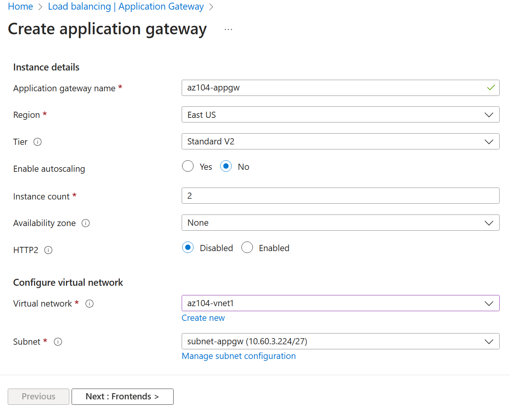

---
lab:
  title: "Laboratorio\_06: Implementación de la administración del tráfico"
  module: Administer Network Traffic Management
---

# Laboratorio 06: Implementación de la administración del tráfico

## Introducción al laboratorio

En este laboratorio, aprenderá a configurar y probar una instancia de Load Balancer pública y una instancia de Application Gateway.

Este laboratorio requiere una suscripción a Azure. El tipo de suscripción puede afectar a la disponibilidad de las características de este laboratorio. Puede cambiar la región, pero para escribir los pasos se ha usado **Este de EE. UU.**

## Tiempo estimado: 50 minutos

## Escenario del laboratorio

La organización tiene un sitio web público. Debe equilibrar la carga de las solicitudes públicas entrantes entre las diferentes máquinas virtuales. También debe proporcionar imágenes y vídeos de diferentes máquinas virtuales. Planea implementar una instancia de Azure Load Balancer y otra de Azure Application Gateway. Todos los recursos se encuentran en la misma región.

## Simulaciones de laboratorio interactivas

Hay simulaciones de laboratorio interactivas que podrían resultar útiles para este tema. La simulación le permite hacer clic en un escenario similar a su propio ritmo. Hay ciertas diferencias entre la simulación interactiva y este laboratorio, pero muchos de los conceptos básicos son los mismos. No se necesita una suscripción de Azure.

+ [Cree y configure Azure Load Balancer](https://mslabs.cloudguides.com/guides/AZ-700%20Lab%20Simulation%20-%20Create%20and%20configure%20an%20Azure%20load%20balancer). Cree una red virtual, servidores back-end, un equilibrador de carga y, después, pruebe este último.
+ [Implemente una instancia de Azure Application Gateway](https://mslabs.cloudguides.com/guides/AZ-700%20Lab%20Simulation%20-%20Deploy%20Azure%20Application%20Gateway). Cree una puerta de enlace de aplicación, cree máquinas virtuales, cree el grupo de back-end y pruebe la puerta de enlace.
+ [Implemente la administración del tráfico](https://mslabs.cloudguides.com/guides/AZ-104%20Exam%20Guide%20-%20Microsoft%20Azure%20Administrator%20Exercise%2010). Implemente una red en estrella tipo hub-and-spoke completa, incluidas las máquinas virtuales, las redes virtuales, el emparejamiento, el equilibrador de carga y la puerta de enlace de aplicaciones.

## Aptitudes de trabajo

+ Tarea 1: Use una plantilla para aprovisionar una infraestructura.
+ Tarea 2: Configurar una instancia de Azure Load Balancer.
+ Tarea 3: Configurar una instancia de Azure Application Gateway.

## Tarea 1: Usar una plantilla para aprovisionar una infraestructura

En esta tarea, usará una plantilla para implementar una red virtual, un grupo de seguridad de red y dos máquinas virtuales.

1. Descargue los archivos de laboratorio **\\Allfiles\\Lab06** (plantilla y parámetros).

1. Inicie sesión en **Azure Portal** - `https://portal.azure.com`.

1. Busque y seleccione `Deploy a custom template`.

1. En la página de implementación personalizada, seleccione **Crear su propia plantilla en el editor**.

1. En la página de edición de la plantilla, seleccione **Cargar archivo**.

1. Busque el archivo **\\Allfiles\\Lab06\\az104-06-vms-template.json**, selecciónelo y, después, seleccione **Abrir**.

1. Seleccione **Guardar**.

1. Seleccione **Editar parámetros** y cargue el archivo **\\Allfiles\\Lab06\\az104-06-vms-parameters.json**.

1. Seleccione **Guardar**.

1. Use la siguiente información para completar los campos de la página de implementación personalizada y deje los demás campos con su valor predeterminado.

    | Configuración       | Valor         |
    | ---           | ---           |
    | Subscription  | su suscripción de Azure |
    | Resource group | `az104-rg6` (si fuera necesario, seleccione **Crear nuevo**) |
    | Contraseña      | Proporcione una contraseña segura |

    >**Nota**: Si recibe un error que indica que el tamaño de la máquina virtual no está disponible, seleccione una SKU que esté disponible en la suscripción y que tenga un mínimo de dos núcleos.

1. Seleccione **Revisar y crear** y, luego, **Crear**.

    >**Nota**: Espere a que se complete la implementación para pasar a la siguiente tarea. La implementación debería durar unos 5 minutos.

    >**Nota**: Examine los recursos que se implementan. Habrá una red virtual con tres subredes y cada una de ellas tendrá una máquina virtual.

## Tarea 2: Configurar una instancia de Azure Load Balancer

En esta tarea, se implementa una instancia de Azure Load Balancer delante de las dos máquinas virtuales de Azure en la red virtual. En Azure, las instancias de Load Balancer proporcionan conectividad de nivel 4 entre recursos, como máquinas virtuales. La configuración de Load Balancer incluye una dirección IP de front-end para aceptar conexiones, un grupo de back-end y reglas que definen la forma en que las conexiones cómo deben atravesar el equilibrador de carga.

## Diagrama de arquitectura: Load Balancer

>**Nota**: Observe que Load Balancer se distribuye entre dos máquinas virtuales de la misma red virtual.

1. En Azure Portal, busque `Load balancers` y selecciónelo, y en la hoja **Equilibradores de carga**, haga clic en **+ Crear**.

1. Cree un equilibrador de carga con los siguientes valores (deje los demás con sus valores predeterminados) y haga clic en **Siguiente: Configuración de IP de front-end**:

    | Configuración | Valor |
    | --- | --- |
    | Subscription | su suscripción de Azure |
    | Resource group | **az104-rg6** |
    | Nombre | `az104-lb` |
    | Region | La **misma** región en que implementó las máquinas virtuales |
    | SKU  | **Estándar** |
    | Tipo | **Public** |
    | Nivel | **Regional** |

     

1. En la pestaña **Configuración de IP de front-end**, haga clic en **Agregar una configuración de IP de front-end** y use la siguiente configuración.  

    | Configuración | Value |
    | --- | --- |
    | Nombre | `az104-fe` |
    | Tipo de IP | Dirección IP |
    | Equilibrador de carga de puerta de enlace | None |
    | Dirección IP pública | Seleccione **Crear nuevo** (use las instrucciones del paso siguiente) |

1. En el elemento emergente **Agregar una dirección IP pública**, utilice la configuración siguiente antes de hacer clic en **Aceptar** y, a continuación, haga clic en **Agregar**. Cuando haya terminado, haga clic en **Siguiente: Grupos de back-end**.

    | Configuración | Value |
    | --- | --- |
    | Nombre | `az104-lbpip` |
    | SKU | Estándar |
    | Nivel | Regional |
    | Asignación | estática |
    | Preferencia de enrutamiento | **Microsoft Network** |

    >**Nota:** La versión Estándar de SKU proporciona una dirección IP estática. Cuando se elimina el recurso se asignan direcciones IP estáticas con el recurso que se crea y publica.  

1. En la pestaña **Grupos de back-end**, haga clic en **Agregar un grupo de back-end** con las opciones de configuración siguientes (deje las demás con los valores predeterminados). Haga clic en **+ Agregar** (dos veces) y, después, en**Siguiente: Reglas de entrada**.

    | Configuración | Value |
    | --- | --- |
    | Nombre | `az104-be` |
    | Virtual network | **az104-06-vnet1** |
    | Configuración del grupo de back-end | **NIC** |
    | Hacer clic en **Agregar** para agregar una máquina virtual |  |
    | az104-06-vm0 | **seleccionar la casilla** |
    | az104-06-vm1 | **seleccionar la casilla** |

1. Dado que tiene tiempo, revise las demás pestañas y, a continuación, haga clic en **Revisar y crear**. Asegúrese de que no haya errores de validación y, a continuación, haga clic en **Crear**.

1. Espere a la implementación del equilibrador de carga y haga clic en **Ir al recurso**.

**Adición de una regla para determinar cómo se distribuye el tráfico entrante**

1. En la hoja **Configuración**, seleccione **Reglas de equilibrio de carga**.

1. Seleccione **+Agregar**. Agregue una regla de equilibrio de carga con las opciones de configuración siguientes (deje las demás con los valores predeterminados).  Cuando configure la regla, use los iconos informativos para obtener información sobre cada configuración. Cuando termine, haga clic en **Guardar**.

    | Configuración | Value |
    | --- | --- |
    | Nombre | `az104-lbrule` |
    | Versión de la dirección IP | **IPv4** |
    | Dirección IP de front-end | **az104-fe** |
    | Grupo back-end | **az104-be** |
    | Protocolo | **TCP** |
    | Puerto | `80` |
    | Puerto back-end | `80` |
    | Sondeo de mantenimiento | **Crear nuevo** |
    | Nombre | `az104-hp` |
    | Protocolo | **TCP** |
    | Puerto | `80` |
    | Intervalo | `5` |
    | Cerrar la ventana de creación de un sondeo de estado | **Guardar** |
    | Persistencia de la sesión | **None** |
    | Tiempo de espera de inactividad (minutos) | `4` |
    | Restablecimiento de TCP | **Deshabilitada** |
    | Dirección IP flotante | **Deshabilitado** |
    | Traducción de direcciones de red de origen (SNAT) de salida | **Recomendado** |

1. Seleccione **Configuración de IP de front-end** en la página de Load Balancer. Copie la dirección IP pública.

1. Abra otra pestaña del explorador y vaya a la dirección IP. Compruebe que en la ventana del explorador se muestre el mensaje **Hola mundo de az104-06-vm0** u **Hola mundo de az104-06-vm1**.

1. Actualice la ventana para comprobar que el mensaje cambia a la otra máquina virtual. Esto muestra la rotación del equilibrador de carga a través de las máquinas virtuales.

    > **Nota**: Es posible que tenga que actualizar más de una vez o abrir una nueva ventana del explorador en modo InPrivate.

## Tarea 3: Configurar una instancia de Azure Application Gateway

En esta tarea, se implementa Azure Application Gateway delante de dos máquinas virtuales de Azure. Una instancia de Application Gateway proporciona equilibrio de carga de nivel 7, Web Application Firewall (WAF), terminación SSL y cifrado de un extremo a otro a los recursos definidos en el grupo de back-end. Application Gateway enruta imágenes a una máquina virtual y vídeos a la otra máquina virtual.

## Diagrama de arquitectura: Application Gateway

>**Nota**: Esta instancia de Application Gateway funciona en la misma red virtual que Load Balancer. Es posible que esto no sea habitual en un entorno de producción.

1. En Azure Portal, busque `Virtual networks` y selecciónelo.

1. En la hoja **Redes virtuales**, en la lista de redes virtuales, haga clic en **az104-06-vnet1**.

1. En la hoja de la red virtual **az104-06-vnet1**, en la sección **Configuración**, haga clic en **Subredes** y luego en **+ Subred**.

1. Agregue una subred con las siguientes opciones (deje las demás con los valores predeterminados).

    | Configuración | Value |
    | --- | --- |
    | Nombre | `subnet-appgw` |
    | Dirección inicial| `10.60.3.224` |
    | Size | `/27` |

1. Haga clic en **Guardar**

    > **Nota**: Azure Application Gateway usará esta subred. Application Gateway requiere una subred dedicada de tamaño /27 o mayor.

1. En Azure Portal, busque `Application gateways` y selecciónelo y, en la hoja **Puertas de enlace de aplicación** y haga clic en **+ Crear**.

1. En la pestaña **Aspectos básicos**, especifique las opciones de configuración siguientes (deje las demás con los valores predeterminados):

    | Configuración | Valor |
    | --- | --- |
    | Subscription | su suscripción de Azure |
    | Resource group | `az104-rg6` |
    | Nombre de la puerta de enlace de aplicaciones | `az104-appgw` |
    | Region | La **misma** región de Azure que usó en la tarea 1 |
    | Nivel | **Standard V2** |
    | Habilitación del escalado automático | **No** |
    | Recuento mínimo de instancias | `2` |
    | Zona de disponibilidad | **1** (predeterminado) |
    | HTTP2 | **Deshabilitada** |
    | Virtual network | **az104-06-vnet1** |
    | Subnet | **subnet-appgw (10.60.3.224/27)** |

    

1. Haga clic en **Siguiente: Front-end >** y especifique las opciones de configuración siguientes (deje las demás con los valores predeterminados). Cuando haya terminado, haga clic en **Aceptar**.

    | Configuración | Value |
    | --- | --- |
    | Tipo de dirección IP de front-end | **Public** |
    | Dirección IP pública| **Agregar nueva** |
    | Nombre | `az104-gwpip` |
    | Zona de disponibilidad | **Ninguno** |

    >**Nota:** Application Gateway puede tener una dirección IP pública y una privada.
 
1. Haga clic en **Siguiente: Back-ends >** y, a continuación, en **Agregar un grupo de back-end**. Especifique las opciones de configuración siguientes (deje las demás con los valores predeterminados). Cuando haya terminado, haga clic en **Agregar**.

    | Configuración | Value |
    | --- | --- |
    | Nombre | `az104-appgwbe` |
    | Adición de un grupo de back-end sin destinos | **No** |
    | Máquina virtual | **az104-06-nic1 (10.60.1.4)** |
    | Máquina virtual | **az104-06-nic2 (10.60.2.4)** |

1. Haga clic en **Agregar un grupo de back-end**. Este es el grupo de back-end para las **imágenes**. Especifique las opciones de configuración siguientes (deje las demás con los valores predeterminados). Cuando haya terminado, haga clic en **Agregar**.

    | Configuración | Value |
    | --- | --- |
    | Nombre | `az104-imagebe` |
    | Adición de un grupo de back-end sin destinos | **No** |
    | Máquina virtual | **az104-06-nic1 (10.60.1.4)** |

1. Haga clic en **Agregar un grupo de back-end**. Este es el grupo de back-end para el **vídeo**. Especifique las opciones de configuración siguientes (deje las demás con los valores predeterminados). Cuando haya terminado, haga clic en **Agregar**.

    | Configuración | Value |
    | --- | --- |
    | Nombre | `az104-videobe` |
    | Adición de un grupo de back-end sin destinos | **No** |
    | Máquina virtual | **az104-06-nic2 (10.60.2.4)** |

1. Seleccione **Siguiente: Configuración >** y luego, **Agregar reglas de enrutamiento**. Complete la información.

    | Configuración | Value |
    | --- | --- |
    | Nombre de la regla | `az104-gwrule` |
    | Prioridad | `10` |
    | Nombre del cliente de escucha | `az104-listener` |
    | Dirección IP de front-end | **Public IPv4** |
    | Protocolo | **HTTP** |
    | Port | `80` |
    | Tipo de cliente de escucha | **Basic** |

1. Vaya a la pestaña **Destinos de back-end**. Seleccione **Agregar** después de completar la información básica.

   | Configuración | Valor |
    | --- | --- |
    | Destino de back-end | `az104-appgwbe` |
    | Configuración de back-end | `az104-http` (crear nuevo) |

   >**Nota:** Dedique un minuto a leer la información sobre la **afinidad basada en cookies** y el **drenaje de conexiones**.

1. En la sección **Enrutamiento basado en ruta de acceso**, seleccione **Agregar varios destinos para crear una regla basada en ruta de acceso**. Creará dos reglas. Haga clic en **Agregar** después de la primera regla y **Agregar** después la segunda regla. 

    **Regla: enrutamiento al back-end de imágenes**

    | Configuración | Valor |
    | --- | --- |
    | Path | `/image/*` |
    | Nombre de destino | `images` |
    | Configuración de back-end | **az104-http** |
    | Destino de back-end | `az104-imagebe` |

    **Regla: enrutamiento al back-end de vídeos**

    | Configuración | Valor |
    | --- | --- |
    | Path | `/video/*` |
    | Nombre de destino | `videos` |
    | Configuración de back-end | **az104-http** |
    | Destino de back-end | `az104-videobe` |

1. Asegúrese de **Guardar** y comprobar los cambios y, a continuación, seleccione **Siguiente: Tags >** (Siguiente: Etiquetas). No es necesario realizar ningún cambio.

1. Seleccione **Siguiente: Revisar y crear** y después en **Crear**.

    > **Nota**: Espere a que se cree la instancia de Application Gateway. Este proceso puede durar entre 5 y10 minutos, aproximadamente. Mientras espera, considere la posibilidad de examinar algunos de los vínculos de entrenamiento autodirigido que hay al final de esta página.

1. Una vez implementada la puerta de enlace de aplicaciones, busque **az104-appgw** y selecciónelo.

1. En el recurso **Application Gateway**, en la sección **Supervisión**, seleccione **Estado de back-end**.

1. Asegúrese de que los dos servidores del grupo de back-end muestren **Correcto**.

1. En la hoja **Información general**, copie el valor de la **dirección IP pública de front-end**.

1. Inicie otra ventana del explorador y pruebe esta dirección URL: `http://<frontend ip address>/image/`.

1. Compruebe que se le dirige al servidor de imágenes (vm1).

1. Inicie otra ventana del explorador y pruebe esta dirección URL: `http://<frontend ip address>/video/`.

1. Compruebe que se le dirige al servidor de vídeos (vm2).

> **Nota**: Es posible que tenga que actualizar más de una vez o abrir una nueva ventana del explorador en modo InPrivate.

## Limpieza de los recursos

Si utiliza **su propia suscripción**, dedique un minuto a eliminar los recursos del laboratorio. De esta forma estará seguro de que los recursos se liberan y de que se minimiza el costo. La forma más fácil de eliminar los recursos de laboratorio es eliminar el grupo de recursos del laboratorio. 

+ En Azure Portal, seleccione el grupo de recursos, seleccione **Eliminar el grupo de recursos**, **Escribir el nombre del grupo de recursos** y, después, haga clic en **Eliminar**.
+ Mediante Azure PowerShell, `Remove-AzResourceGroup -Name resourceGroupName`.
+ Mediante la CLI, `az group delete --name resourceGroupName`.

## Ampliar el aprendizaje con Copilot

Copilot puede ayudarle a aprender a usar las herramientas de scripting de Azure. Copilot también puede ayudar en áreas no cubiertas en el laboratorio o donde necesita más información. Abra un explorador Edge y elija Copilot (superior derecha) o vaya a *copilot.microsoft.com*. Dedique unos minutos a probar estas indicaciones.

+ Compare y contraste Azure Load Balancer con Azure Application Gateway.
+ ¿Cómo puedo solucionar problemas de conectividad entrante a Azure Load Balancer?
+ ¿Cuáles son los pasos básicos para configurar Azure Application Gateway?
+ Cree una tabla que resalte las soluciones de equilibrio de carga de Azure. Incluya estas columnas: Protocolos admitidos, equilibrio de carga privado, equilibrio de carga global, directivas de enrutamiento, entornos admitidos, purga de conexiones, afinidad de sesión, equilibrio de carga basado en host y ruta de acceso, descarga TLS, aceleración del sitio, seguridad, almacenamiento en caché y compresión.

## Más información con el aprendizaje autodirigido

+ [Mejora de la escalabilidad y resistencia de las aplicaciones mediante Azure Load Balancer](https://learn.microsoft.com/training/modules/improve-app-scalability-resiliency-with-load-balancer/). Analice los diferentes equilibradores de carga de Azure y cómo elegir la solución de Azure Load Balancer adecuada para satisfacer sus necesidades.
+ [Equilibrio de carga del tráfico de servicio web con Application Gateway](https://learn.microsoft.com/training/modules/load-balance-web-traffic-with-application-gateway/). Mejorar la resistencia de la aplicación al distribuir la carga entre varios servidores y usar el enrutamiento basado en ruta de acceso para dirigir el tráfico web.

## Puntos clave

Enhorabuena por completar el laboratorio. Estas son las principales conclusiones del laboratorio.

+ Azure Load Balancer es una excelente opción para distribuir el tráfico de red entre varias máquinas virtuales en la capa de transporte (nivel 4 de OSI: TCP y UDP).
+ Las instancias públicas de Load Balancer se usan para equilibrar la carga del tráfico de Internet en las máquinas virtuales. Un equilibrador de carga interno (o privado) se usa cuando se necesitan direcciones IP privadas solo en el front-end.
+ La versión Básico del equilibrador de carga es para aplicaciones a pequeña escala que no necesitan alta disponibilidad ni redundancia. La versión Estándar del equilibrador de carga es para un alto rendimiento y una latencia ultra baja.
+ Azure Application Gateway es un equilibrador de carga de tráfico web (OSI capa 7) que permite administrar el tráfico a las aplicaciones web.
+ El nivel Estándar de Application Gateway ofrece toda la funcionalidad de L7, incluido el equilibrio de carga. Por su parte, el nivel WAF agrega un firewall para comprobar si hay tráfico malintencionado.
+ Application Gateway puede tomar decisiones de enrutamiento basadas en los atributos adicionales de una solicitud HTTP, por ejemplo los encabezados host o la ruta de acceso del identificador URI.
