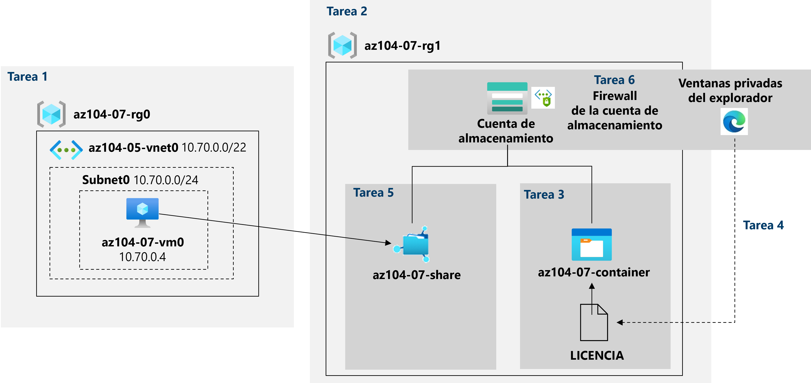

---
lab:
  title: "Laboratorio\_07: Administración de Azure\_Storage"
  module: Administer Azure Storage
---

# Laboratorio 07: Administración de Azure Storage
# Manual de laboratorio para alumnos

## Escenario del laboratorio

Debe evaluar el uso de Azure Storage para almacenar archivos que residen actualmente en almacenes de datos locales. Si bien el acceso a la mayoría de estos archivos no es frecuente, hay algunas excepciones. Para minimizar el costo de almacenamiento, le gustaría colocar los archivos a los que se accede con menos frecuencia en niveles de almacenamiento de menor precio. También tiene previsto explorar los diferentes mecanismos de protección que ofrece Azure Storage, incluido el acceso a la red, la autenticación, la autorización y la replicación. Por último, quiere determinar en qué medida el servicio Azure Files podría ser adecuado para hospedar los recursos compartidos de archivos locales.

                **Nota:** Hay disponible una **[simulación de laboratorio interactiva](https://mslabs.cloudguides.com/guides/AZ-104%20Exam%20Guide%20-%20Microsoft%20Azure%20Administrator%20Exercise%2011)** que le permite realizar sus propias selecciones a su entera discreción. Es posible que encuentre pequeñas diferencias entre la simulación interactiva y el laboratorio hospedado, pero las ideas y los conceptos básicos que se muestran son los mismos. 

## Objetivos

En este laboratorio, aprenderá a:

+ Tarea 1: Aprovisionar el entorno de laboratorio
+ Tarea 2: Crear y configurar cuentas de Azure Storage
+ Tarea 3: Administrar el almacenamiento de blobs
+ Tarea 4: Administrar la autenticación y autorización para Azure Storage
+ Tarea 5: Crear y configurar un recurso compartido de archivos de Azure Files
+ Tarea 6: Administrar el acceso a la red para Azure Storage

## Tiempo estimado: 40 minutos

## Diagrama de la arquitectura




### Instrucciones

## Ejercicio 1

## Tarea 1: Aprovisionar el entorno de laboratorio

En esta tarea, implementará una máquina virtual de Azure que usará más adelante en el laboratorio.

1. Inicie sesión en **[Azure Portal](https://portal.azure.com)**.

1. Haga clic en el icono de la esquina superior derecha de Azure Portal para abrir **Azure Cloud Shell**.

1. Si se le pide que seleccione **Bash** o **PowerShell**, seleccione **PowerShell**.

    >**Nota**: Si es la primera vez que inicia **Cloud Shell** y aparece el mensaje **No tiene ningún almacenamiento montado**, seleccione la suscripción que utiliza en este laboratorio y haga clic en **Crear almacenamiento**.

1. En la barra de herramientas del panel de Cloud Shell, haga clic en el icono **Cargar/Descargar archivos**, haga clic en **Cargar** en el menú desplegable y cargue los archivos **\\Allfiles\\Labs\\07\\az104-07-vm-template.json** y **\\Allfiles\\Labs\\07\\az104-07-vm-parameters.json** en el directorio principal de Cloud Shell.

1. En el panel de Cloud Shell, ejecute lo siguiente para crear el grupo de recursos que hospedará la máquina virtual (reemplace el marcador de posición “[Azure_region]” por el nombre de una región de Azure donde tiene pensado implementar la máquina virtual de Azure).

    >**Nota**: Para enumerar los nombres de las regiones de Azure, ejecute `(Get-AzLocation).Location`
    >**Nota**: Cada comando siguiente debe escribirse por separado.

    ```powershell
    $location = '[Azure_region]'
    ```
  
    ```powershell
     $rgName = 'az104-07-rg0'
    ```

    ```powershell
    New-AzResourceGroup -Name $rgName -Location $location
    ```
    
1. En el panel de Cloud Shell, ejecute lo siguiente para implementar la máquina virtual mediante los archivos de parámetros y plantillas cargados:

    >**Nota**: Se le pedirá que proporcione una contraseña de administrador.

   ```powershell
   New-AzResourceGroupDeployment `
      -ResourceGroupName $rgName `
      -TemplateFile $HOME/az104-07-vm-template.json `
      -TemplateParameterFile $HOME/az104-07-vm-parameters.json `
      -AsJob
   ```

    >**Nota**: No espere a que se completen las implementaciones, sino que avance a la siguiente tarea.

    >**Nota**: Si tiene un error que indica que el tamaño de la máquina virtual no está disponible, pida al instructor ayuda y pruebe estos pasos.
    > 1. Haga clic en el botón `{}` de CloudShell, seleccione **az104-07-vm-parameters.json** en la barra de la izquierda y anote el valor del parámetro `vmSize`.
    > 1. Compruebe la ubicación en la que se implementa el grupo de recursos “az104-04-rg1”. Puede ejecutar `az group show -n az104-04-rg1 --query location` en CloudShell para obtenerlo.
    > 1. Ejecute `az vm list-skus --location <Replace with your location> -o table --query "[? contains(name,'Standard_D2s')].name"` en CloudShell.
    > 1. Reemplace el valor del parámetro `vmSize` por uno de los valores devueltos por el comando que acaba de ejecutar.
    > 1. Ahora vuelva a ejecutar el comando `New-AzResourceGroupDeployment` para implementar de nuevo las plantillas. Puede presionar el botón de flecha arriba varias veces para ver el último comando ejecutado.

1. Cierre el panel de Cloud Shell.

## Tarea 2: Crear y configurar cuentas de Azure Storage

En esta tarea, creará y configurará una cuenta Azure Storage.

1. En Azure Portal, busque y seleccione **Cuentas de almacenamiento** y luego haga clic en **+ Crear**.

1. En la pestaña **Aspectos básicos** de la hoja **Crear cuenta de almacenamiento**, configure las siguientes opciones (deje las demás con los valores predeterminados):

    | Configuración | Value |
    | --- | --- |
    | Subscription | nombre de la suscripción de Azure que usa en este laboratorio |
    | Resource group | Nombre de un **nuevo** grupo de recursos **az104-07-rg1** |
    | Nombre de la cuenta de almacenamiento | Cualquier nombre globalmente único con una longitud de 3 a 24 caracteres, que consta de letras y dígitos |
    | Region | Nombre de una región de Azure en la que puede crear una cuenta de Azure Storage  |
    | Rendimiento | **Estándar** |
    | Redundancia | **Almacenamiento con redundancia geográfica (GRS)** |

1. Haga clic en **Siguiente: Opciones avanzadas >** , en la pestaña **Opciones avanzadas** de la hoja **Crear cuenta de almacenamiento**, revise las opciones disponibles, acepte los valores predeterminados y haga clic en **Siguiente: Redes >** .

1. En la pestaña **Redes** de la hoja **Crear cuenta de almacenamiento**, revise las opciones disponibles, acepte la opción predeterminada **Habilitar el acceso público desde todas las redes** y haga clic en **Siguiente: Protección de datos >** .

1. En la pestaña **Protección de datos** de la hoja **Crear cuenta de almacenamiento**, revise las opciones disponibles, acepte los valores predeterminados, haga clic en **Revisar y crear**, espere a que se complete el proceso de validación y haga clic en **Crear**.

    >**Nota**: Espere a que se cree la cuenta de almacenamiento. Este proceso tardará alrededor de 2 minutos.

1. En la hoja de implementación, haga clic en **Ir al recurso** para mostrar la hoja de la cuenta de Azure Storage.

1. En el panel Cuenta de almacenamiento, en la sección **Administración de datos**, haga clic en **Redundancia** y anote la ubicación secundaria. 

1. En la lista desplegable **Redundancia**, seleccione **Almacenamiento con redundancia local (LRS)** y guarde el cambio. Observe que, por ahora, la cuenta de almacenamiento solo tiene la ubicación primaria.

1. En la hoja Cuenta de almacenamiento, en la sección **Configuración**, seleccione **Configuración**. Establezca **Nivel de acceso de blob (predeterminado)** en **Esporádico** y guarde el cambio.

    > **Nota**: El nivel de acceso esporádico es óptimo para los datos a los que no se accede con frecuencia.

## Tarea 3: Administrar el almacenamiento de blobs

En esta tarea, creará un contenedor de blobs y cargará un blob en él.

1. En la hoja Cuenta de almacenamiento, en la sección **Almacenamiento de datos**, haga clic en **Contenedores**.

1. Haga clic en **+ Contenedor** y cree un contenedor con la configuración siguiente:

    | Configuración | Value |
    | --- | --- |
    | Nombre | **az104-07-container**  |
    | Nivel de acceso público | **Privado (sin acceso anónimo)** |

1. En la lista de contenedores, haga clic en **az104-07-container** y luego haga clic en **Cargar**.

1. Vaya a **\\Allfiles\\Labs\\07\\LICENSE** en el equipo de laboratorio y haga clic en **Abrir**.

1. En la hoja **Cargar blob**, expanda la sección **Avanzado** y configure las siguientes opciones (deje las demás con los valores predeterminados):

    | Configuración | Valor |
    | --- | --- |
    | Tipo de blob | **Blob en bloques** |
    | Tamaño de bloque | **4 MB** |
    | Nivel de acceso | **Acceso frecuente** |
    | Cargar en carpeta | **licencias** |

    > **Nota**: El nivel de acceso se puede establecer para blobs individuales.

1. Haga clic en **Cargar**.

    > **Nota**: Tenga en cuenta que la carga creó automáticamente una subcarpeta denominada **licenses**.

1. De nuevo en la hoja **az104-07-container**, haga clic en **licenses** y luego en **LICENSE**.

1. En la hoja **licenses/LICENSE**, revise las opciones disponibles.

    > **Nota:** Tiene la opción de descargar el blob, cambiar su nivel de acceso (actualmente está establecido en **Frecuente**), adquirir una concesión, que cambiaría su estado de concesión a **Bloqueado** (actualmente está establecido en **Desbloqueado**), y proteger el blob frente a modificaciones o eliminaciones, así como asignar metadatos personalizados (mediante la especificación de pares arbitrarios de clave y valor). También puede **Editar** el archivo directamente dentro de la interfaz de Azure Portal, sin descargarlo antes. También puede crear instantáneas, así como generar un token de SAS (explorará esta opción en la siguiente tarea).

## Tarea 4: Administrar la autenticación y autorización para Azure Storage

En esta tarea, configurará la autenticación y la autorización para Azure Storage.

1. En la hoja **licenses/LICENSE**, en la pestaña **Información general**, haga clic en el botón **Copiar en el Portapapeles** situado junto a la entrada **URL**.

1. Abra otra ventana del explorador en el modo InPrivate y vaya a la dirección URL que copió en el paso anterior.

1. Debería presentarse un mensaje con formato XML que indique **ResourceNotFound** o **PublicAccessNotPermitted**.

    > **Nota**: Esto es lo esperado, ya que el contenedor que creó tiene el nivel de acceso público establecido en **Privado (sin acceso anónimo)** .

1. Cierre la ventana del explorador en modo InPrivate, vuelva a la ventana del explorador que muestra la hoja **licenses/LICENSE** del contenedor de Azure Storage y cambie a la pestaña **Generar SAS**.

1. En la pestaña **Generar SAS** de la hoja **licenses/LICENSE**, configure las siguientes opciones (deje las demás con los valores predeterminados):

    | Configuración | Value |
    | --- | --- |
    | Clave de firma | **Clave 1** |
    | Permisos | **Lectura** |
    | Fecha de inicio | fecha de ayer |
    | Hora de inicio | hora actual |
    | Fecha de vencimiento | fecha de mañana |
    | Hora de expiración | hora actual |
    | Direcciones IP permitidas | déjelo en blanco |
    

1. Haga clic en **Generar URL y token de SAS**.

1. Haga clic en el botón **Copiar al Portapapeles** junto a la entrada **URL de SAS de Blob**.

1. Abra otra ventana del explorador en el modo InPrivate y vaya a la dirección URL que copió en el paso anterior.

    > **Nota**: Debe poder ver el contenido del archivo tras descargarlo y abrirlo con el Bloc de notas.

    > **Nota**: Esto es lo esperado, ya que ahora el acceso está autorizado en función del token de SAS recién generado.

    > **Nota**: Guarde la dirección URL de SAS del blob. La necesitará más adelante en este laboratorio.

1. Cierre la ventana del explorador en modo InPrivate, vuelva a la ventana del explorador que muestra la hoja **licenses/LICENSE** del contenedor de Azure Storage y, desde allí, vuelva a la hoja **az104-07-container**.

1. Haga clic en el vínculo **Cambiar a la cuenta de usuario de Azure AD** junto a la etiqueta **Método de autenticación**.

    > **Nota**: Puede ver un error al cambiar el método de autenticación (el error es *"No tiene permisos para enumerar los datos con su cuenta de usuario con Azure AD"* ). Este es el comportamiento esperado.  

    > **Nota**: En este momento, no tiene permisos para cambiar el método de autenticación.

1. En la hoja **az104-07-container**, haga clic en **Control de acceso (IAM)** .

1. En la pestaña **Comprobar acceso**, haga clic en **Agregar asignación de roles**.

1. En la hoja **Agregar asignación de roles**, especifique la configuración siguiente:

    | Configuración | Valor |
    | --- | --- |
    | Role | **Propietario de datos de blobs de almacenamiento** |
    | Asignar acceso a | **Usuario, grupo o entidad de servicio** |
    | Miembros | Nombre de la cuenta de usuario |

1. Haga clic en **Revisar y asignar** y, después, en **Revisar y asignar**. Vuelva a la hoja **Información general** del contenedor **az104-07-container** y compruebe que puede cambiar el método de autenticación a (Cambiar a la cuenta de usuario de Azure AD).

    > **Nota**: El cambio puede tardar unos 5 minutos en surtir efecto.

## Tarea 5: Crear y configurar un recurso compartido de archivos de Azure Files

En esta tarea, creará y configurará recursos compartidos de Azure Files.

> **Nota**: Antes de iniciar esta tarea, compruebe que la máquina virtual que aprovisionó en la primera tarea de este laboratorio esté en ejecución.

1. En Azure Portal, vuelva a la hoja de la cuenta de almacenamiento que creó en la primera tarea de este laboratorio y, en la sección **Almacenamiento de datos**, haga clic en **Recursos compartidos de archivos**.

1. Haga clic en **+ Recurso compartido de archivos** y, en la pestaña **Aspectos básicos**, asigne un nombre al recurso compartido de archivos, **az104-07-share**. Revise la otra configuración de esta pestaña. 

1. Vaya a la pestaña **Copia de seguridad** y asegúrese de que **Habilitar copia de seguridad** **no** está activada.

1. Haga clic en **Revisar y crear** y, a continuación, en **Crear**. Espere a que el recurso compartido de archivos se implemente. 

1. Haga clic en el recurso compartido de archivos recién creado y anote la información disponible en la hoja **az104-07-share**.

1. Haga clic en **Examinar** y tenga en cuenta que no hay archivos o carpetas en el nuevo recurso compartido de archivos. Haga clic en **Conectar**.

1. En la hoja **Conectar**, asegúrese de que la pestaña **Windows** esté seleccionada. Debajo encontrará un botón con la etiqueta **Mostrar script**. Haga clic en el botón y encontrará un cuadro de texto gris con un script; en la esquina inferior derecha de ese cuadro mantenga el puntero sobre el icono de páginas y haga clic en **Copiar en el Portapapeles**.

1. En Azure Portal, busque y seleccione **Máquinas virtuales** y, en la lista de máquinas virtuales, haga clic en **az104-07-vm0**.

1. En la hoja **az104-07-vm0**, en la sección **Operaciones**, haga clic en **Ejecutar comando**.

1. En la hoja **az104-07-vm0 - Run command**, haga clic en **RunPowerShellScript**.

1. En la hoja **Ejecutar script de comando**, pegue el script que copió anteriormente en esta tarea en el panel **Script de PowerShell** y haga clic en **Ejecutar**.

1. Compruebe que el script se haya completado correctamente.

1. Reemplace el contenido del panel **Script de PowerShell** por el siguiente script y haga clic en **Ejecutar**:

   ```powershell
   New-Item -Type Directory -Path 'Z:\az104-07-folder'

   New-Item -Type File -Path 'Z:\az104-07-folder\az-104-07-file.txt'
   ```

1. Compruebe que el script se haya completado correctamente.

1. Vuelva a la hoja del recurso compartido de archivos **az104-07-share \| Examinar**, haga clic en **Actualizar** y compruebe que **az104-07-folder** aparezca en la lista de carpetas.

1. Haga clic en la carpeta **az104-07-share** y compruebe que **az104-07-file.txt** aparezca en la lista de archivos.

## Tarea 6: Administrar el acceso a la red para Azure Storage

En esta tarea, configurará el acceso a la red para Azure Storage.

1. En Azure Portal, vuelva a la hoja de la cuenta de almacenamiento que creó en la primera tarea de este laboratorio y, en la sección **Seguridad y redes**, haga clic en **Redes** y, luego, haga clic en **Firewalls y redes virtuales**.

1. Haga clic en la opción **Enabled from selected virtual networks and IP addresses** (Habilitado desde las redes virtuales y las direcciones IP seleccionadas) y revise las opciones de configuración que aparecen disponibles cuando se habilita esta opción.

    > **Nota**: Puede usar estos valores para configurar la conectividad directa entre las máquinas virtuales de Azure en las subredes designadas de redes virtuales y la cuenta de almacenamiento mediante puntos de conexión de servicio.

1. Haga clic en la casilla **Agregar la dirección IP del cliente** y guarde el cambio.

1. Abra otra ventana del explorador en el modo InPrivate y vaya a la dirección URL de SAS del blob que generó en la tarea anterior.

    > **Nota**: Si no registró la dirección URL de SAS de la tarea 4, debe generar una nueva con la misma configuración. Use los pasos 4-6 de la tarea 4 como guía para generar una nueva dirección URL de SAS de blob. 

1. Debería presentársele el contenido de la página **The MIT License (MIT)** .

    > **Nota**: Esto es lo esperado, ya que se está conectando desde la dirección IP del cliente.

1. Cierre la ventana del explorador en modo InPrivate, vuelva a la ventana del explorador que muestra la hoja **Redes** de la cuenta de Azure Storage.

1. Haga clic en el icono de la esquina superior derecha de Azure Portal para abrir **Azure Cloud Shell**.

1. Si se le pide que seleccione **Bash** o **PowerShell**, seleccione **PowerShell**.

1. En el panel de Cloud Shell, ejecute lo siguiente para intentar descargar el blob LICENSE desde el contenedor **az104-07-container** de la cuenta de almacenamiento (reemplace el marcador de posición `[blob SAS URL]` por la dirección URL de SAS del blob que generó en la tarea anterior):

   ```powershell
   Invoke-WebRequest -URI '[blob SAS URL]'
   ```
1. Compruebe que no puede descargarlo.

    > **Nota**: Debe recibir el mensaje que indica **AuthorizationFailure: Esta solicitud no está autorizada para realizar esta operación**. Esto es lo esperado, ya que se está conectando desde la dirección IP asignada a una VM de Azure que hospeda la instancia de Cloud Shell.

1. Cierre el panel de Cloud Shell.

## Limpieza de recursos

>**Nota**: No olvide quitar los recursos de Azure recién creados que ya no use. La eliminación de los recursos sin usar garantiza que no verá cargos inesperados.

>**Nota:** No se preocupe si los recursos del laboratorio no se pueden quitar inmediatamente. A veces, los recursos tienen dependencias y se tarda más tiempo en eliminarlos. Supervisar el uso de los recursos es una tarea habitual del administrador, así que solo tiene que revisar periódicamente los recursos en el portal para ver cómo va la limpieza. También puede intentar eliminar el grupo de recursos donde residen los recursos. Se trata de un acceso directo rápido de administrador. Si tiene dudas, hable con el instructor.

1. En Azure Portal, abra la sesión de **PowerShell** en el panel **Cloud Shell**.

1. Ejecute el comando siguiente para enumerar todos los grupos de recursos que se han creado en los laboratorios de este módulo:

   ```powershell
   Get-AzResourceGroup -Name 'az104-07*'
   ```

1. Ejecute el comando siguiente para eliminar todos los grupos de recursos que ha creado en los laboratorios de este módulo:

   ```powershell
   Get-AzResourceGroup -Name 'az104-07*' | Remove-AzResourceGroup -Force -AsJob
   ```

    >**Nota**: El comando se ejecuta de forma asincrónica (según determina el parámetro -AsJob). Aunque podrá ejecutar otro comando de PowerShell inmediatamente después en la misma sesión de PowerShell, los grupos de recursos tardarán unos minutos en eliminarse.

## Revisar

En este laboratorio, ha:

- Aprovisionado el entorno de laboratorio
- Creado y configurado cuentas de Azure Storage
- Administrado el almacenamiento de blobs
- Administrado la autenticación y autorización para Azure Storage
- Creado y configurado un recurso compartido de Azure Files
- Administrado el acceso a la red para Azure Storage
