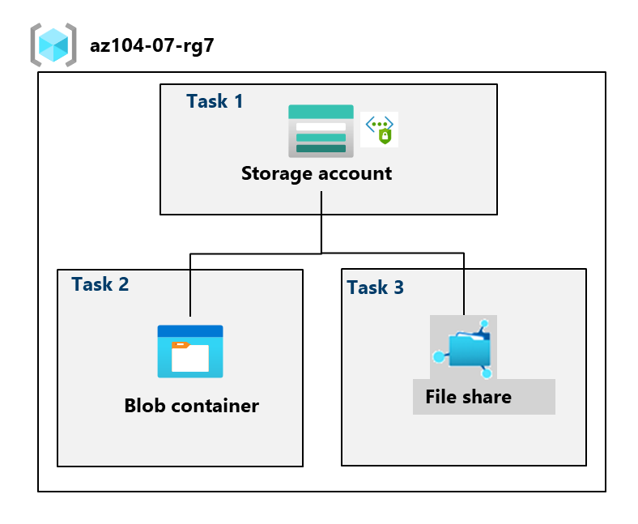

---
lab:
  title: 'Laboratorio 07: Administración de Azure Storage'
  module: Administer Azure Storage
---

# Laboratorio 07: Administración de Azure Storage

## Introducción al laboratorio

En este laboratorio aprenderá a crear cuentas de almacenamiento para blobs y archivos de Azure. Aprenderá a configurar y proteger contenedores de blobs. También aprenderá a usar el explorador de almacenamiento para configurar y proteger recursos compartidos de archivos de Azure. 

Para este laboratorio se necesita una suscripción de Azure. El tipo de suscripción puede afectar a la disponibilidad de las características de este laboratorio. Puede cambiar la región, pero para escribir los pasos se ha usado **Este de EE. UU.**

## Tiempo estimado: 50 minutos

## Escenario del laboratorio

La organización almacena actualmente datos en almacenes de datos locales. A la mayoría de estos archivos no se accede con frecuencia. Para minimizar el coste de almacenamiento, quisiera colocar los archivos a los que se acceda con poca frecuencia en niveles de almacenamiento de menor precio. También tiene previsto explorar los diferentes mecanismos de protección que ofrece Azure Storage, incluido el acceso a la red, la autenticación, la autorización y la replicación. Por último, quisiera determinar en qué medida el servicio Azure Files sería adecuado para hospedar los recursos compartidos de archivos locales.

## Simulaciones interactivas de laboratorio

Hay simulaciones de laboratorio interactivas que podrían resultar útiles para este tema. La simulación le permite hacer clic en un escenario similar a su propio ritmo. Hay ciertas diferencias entre la simulación interactiva y este laboratorio, pero muchos de los conceptos básicos son los mismos. No se necesita una suscripción de Azure. 

+ [Creación del almacenamiento de blobs](https://mslearn.cloudguides.com/en-us/guides/AZ-900%20Exam%20Guide%20-%20Azure%20Fundamentals%20Exercise%205). Cree una cuenta de almacenamiento, administre el almacenamiento de blogs y supervise las actividades de almacenamiento. 
  
+ [Administración del almacenamiento de Azure](https://mslabs.cloudguides.com/guides/AZ-104%20Exam%20Guide%20-%20Microsoft%20Azure%20Administrator%20Exercise%2011). Cree una cuenta de almacenamiento y revise la configuración. Administrar contenedores de Blob Storage. Configuración de conexiones en red de almacenamiento. 

## Diagrama de la arquitectura

## Aptitudes de trabajo

+ Tarea 1: Crear y configurar una cuenta de almacenamiento. 
+ Tarea 2: Creación y configuración del almacenamiento de blobs seguro.
+ Tarea 3: Creación y configuración del almacenamiento seguro de archivos de Azure.

## Tarea 1: Crear y configurar una cuenta de almacenamiento. 

En esta tarea, creará y configurará una cuenta de almacenamiento. La cuenta de almacenamiento usará almacenamiento con redundancia geográfica y no tendrá acceso público. 

1. Inicie sesión en **Azure Portal** - `https://portal.azure.com`.

1. Busque y seleccione `Storage accounts` y, a continuación, haga clic en **+ Crear**.

1. En la pestaña **Aspectos básicos** del panel **Crear cuenta de almacenamiento**, configure las siguientes opciones (deje las demás con los valores predeterminados):

    | Configuración | Valor |
    | --- | --- |
    | Suscripción          | el nombre de la suscripción de Azure  |
    | Resource group        | **az104-rg7** (crear nueva) |
    | Nombre de la cuenta de almacenamiento  | Cualquier nombre globalmente único con una longitud de 3 a 24 caracteres, que consta de letras y dígitos |
    | Región                | **(EE. UU.) Este de EE. UU.**  |
    | Rendimiento           | **Estándar** (observa la opción Premium) |
    | Redundancia            | **Almacenamiento con redundancia geográfica** (observe las otras opciones)|
    | Habilitar el acceso de lectura a los datos en caso de disponibilidad regional | Activa la casilla. |

    >**¿Sabías que...?** Se debería usar el nivel de rendimiento Estándar para la mayoría de las aplicaciones. Usa el nivel de rendimiento Premium para aplicaciones empresariales o de alto rendimiento. 

1. En la pestaña **Opciones avanzadas**, usa los iconos informativos para obtener más información sobre las opciones. Usa los valores predeterminados. 

1. En la pestaña **Redes**, en la sección **Acceso a red pública** selecciona **Deshabilitar**. Esto restringirá el acceso entrante al permitir el acceso saliente. 

1. Revisa la pestaña **Protección de datos**. Recuerda que la directiva de retención de eliminación temporal predeterminada es de 7 días. Observa que es posible habilitar el control de versiones de blobs. Acepta los valores predeterminados.

1. Revisa la pestaña **Cifrado**. Observa las opciones de seguridad adicionales. Acepta los valores predeterminados.

1. Selecciona **Revisar y crear**, espera a que se complete el proceso de validación y, a continuación, haz clic en **Crear**.

1. Una vez implementada la cuenta de almacenamiento, selecciona **Ir al recurso**.

1. Revisa la hoja **Información general** y las configuraciones adicionales que se pueden cambiar. Se trata de una configuración global para la cuenta de almacenamiento. Observa que la cuenta de almacenamiento se puede usar para contenedores de blobs, recursos compartidos de archivos, colas y tablas.

1. Selecciona **Redes** en la hoja **Seguridad y redes**. Observa que el **acceso a la red pública** está deshabilitado.

    + Selecciona **Administrar** el **Acceso a la red pública**.
    + Cambia el **Acceso a la red pública** a **Habilitar**.
    + Cambia la **Acción predeterminada** a **Habilitar desde redes seleccionadas**.
    + En la sección **Direcciones IP**, selecciona **Agregar la dirección IP del cliente**.
    + Guarde los cambios mediante **Guardar**.
  
1. En la hoja **Administración de datos**, selecciona **Redundancia**. Observa la información sobre las ubicaciones del centro de datos principal y secundario.

1. En la hoja **Administración de datos**, selecciona **Administración del ciclo de vida** y, a continuación, selecciona **Agregar una regla**.

    + **Asigna un nombre** a la regla `Movetocool`. Observa las opciones para limitar el ámbito de la regla.
    
    + En la pestaña **Blobs de base**, *si* los blobs de base se modificaron por última vez más de hace más de `30 days`, *entonces* **mueva a almacenamiento esporádico**. Observa las otras opciones. 
    
    + Observa que se pueden configurar otras condiciones. Selecciona **Agregar** cuando hayas terminado de explorar.

    

## Tarea 2: Creación y configuración del almacenamiento de blobs seguro

En esta tarea, crearás un contenedor de blobs y cargarás una imagen. Los contenedores de blobs son estructuras de tipo directorio que almacenan datos no estructurados.

### Creación de contenedores de blobs y directivas de retención basadas en el tiempo

1. Continúa en Azure Portal, trabajando con la cuenta de almacenamiento.

1. En la hoja **Almacenamiento de datos**, selecciona **Contenedores**. 

1. Haz clic en **+ Agregar contenedor** y selecciona **Crear** para crear un contenedor con la configuración siguiente:

    | Configuración | Valor |
    | --- | --- |
    | Nombre | `data`  |
    | Nivel de acceso público | Observa que el nivel de acceso esté establecido en privado |

    

1. En el contenedor, desplázate hasta los puntos suspensivos (...) del lado extremo derecho y selecciona **Directiva de acceso**.

1. En la sección **Almacenamiento de blobs inmutable**, selecciona **Agregar directiva**.

    | Configuración | Valor |
    | --- | --- |
    | Tipo de directiva | **Retención con duración definida**  |
    | Establecer el período de retención para | `180` días |

1. Selecciona **Guardar**.

### Administración de cargas de blobs

1. Vuelva a la página contenedores, selecciona el contenedor de **datos** y haz clic en **Cargar**.

1. En la hoja **Actualizar blob**, expande la sección **Avanzado**.

    >**Nota**: busca el archivo que se vaya a cargar. Puede ser cualquier tipo de archivo, pero un archivo pequeño resultará mejor. Se puede descargar un archivo de ejemplo del directorio AllFiles. 

    | Configuración | Valor |
    | --- | --- |
    | Buscar archivos | agrega el archivo que hayas seleccionado para cargar |
    | Selecciona **Avanzado**. | |
    | Tipo de blob | **Blob en bloques** |
    | Tamaño de bloque | **4 MiB** |
    | Nivel de acceso | **Frecuente** (observa las otras opciones) |
    | Cargar en carpeta | `securitytest` |
    | Ámbito de cifrado | Usar el ámbito del contenedor predeterminado existente |

1. Haz clic en **Cargar**.

1. Confirma que tienes una nueva carpeta y que el archivo se cargó. 

1. Selecciona el archivo de carga y revisa las opciones, como **Descargar**, **Eliminar**, **Cambiar de nivel** y **Adquirir concesión**.

1. Copia la **dirección URL** del archivo (hoja Propiedades) y pégala en una nueva ventana de exploración de **Inprivate**.

1. Debería presentarse un mensaje con formato XML que indique **ResourceNotFound** o **PublicAccessNotPermitted**.

    > **Nota**: esto es lo esperado, ya que el contenedor que creaste tiene el nivel de acceso público establecido en **Privado (sin acceso anónimo)**.

### Configuración del acceso limitado al almacenamiento de blobs

1. Selecciona el archivo cargado y la pestaña **Generar SAS**. También es posible usar los puntos suspensivos (...) del lado extremo derecho. Especifica las opciones de configuración siguientes (deja las demás con los valores predeterminados):

    | Configuración | Value |
    | --- | --- |
    | Clave de firma | **Clave 1** |
    | Permisos | **Leer** (observa las otras opciones) |
    | Fecha de inicio | fecha de ayer |
    | Hora de inicio | hora actual |
    | Fecha de vencimiento | fecha de mañana |
    | Hora de expiración | hora actual |
    | Direcciones IP permitidas | déjalo en blanco |

1. Haz clic en **Generar URL y token de SAS**.

1. Copia la entrada **dirección URL de SAS de blob** en el Portapapeles.

1. Abre otra ventana del explorador en InPrivate y ve a la dirección URL de SAS de blob que copiaste en el paso anterior.

    >**Nota**: deberías poder ver el contenido del archivo. 

## Tarea 3: Creación y configuración del almacenamiento de archivos de Azure

En esta tarea, crearás y configurarás recursos compartidos de Azure. Usarás el explorador de almacenamiento para administrar el recurso compartido de archivos. 

### Creación del recurso compartido y carga de un archivo

1. En Azure Portal, vuelve a la cuenta de almacenamiento, en la hoja **Almacenamiento de datos**, haz clic en **Recursos compartidos de archivos**.

1. Haz clic en **+ Recurso compartido de archivos** y, en la pestaña **Datos básicos**, asigna un nombre al recurso compartido de archivos, `share1`. 

1. Observa las opciones de **Nivel de acceso**. Mantén la opción predeterminada **Optimizado para transacciones**.
   
1. Ve a la pestaña **Copia de seguridad** y asegúrate de que la opción **Habilitar copia de seguridad****no** esté activada. Estamos deshabilitando la copia de seguridad para simplificar la configuración del laboratorio.

1. Haz clic en **Revisar y crear** y, a continuación, en **Crear**. Espera a que el recurso compartido de archivos se implemente.

    

### Exploración del explorador de almacenamiento y carga de un archivo

1. Vuelve a la cuenta de almacenamiento y selecciona **Explorador de almacenamiento**. El explorador de almacenamiento de Azure es una herramienta del portal que permite ver rápidamente todos los servicios de almacenamiento de la cuenta.

1. Selecciona **Recursos compartidos** y comprueba que el directorio **share1** esté presente.

1. Selecciona el directorio **share1** y observa que pueda **+ Agregar directorio**. Esto te permitirá crear una estructura de carpetas.

1. Selecciona **Cargar**. Ve a un archivo de su elección y, a continuación, haz clic en **Cargar**.

    >**Nota**: es posible ver los recursos compartidos de archivos y administrarlos en el explorador de almacenamiento. En este momento no hay restricciones.

### Restricción del acceso de red a la cuenta de almacenamiento

1. En el portal, busca y selecciona **Redes virtuales**.

1. Selecciona **+ Create** (+ Crear). Selecciona el grupo de recursos. y asigna a la red virtual un **nombre**, `vnet1`.

1. Toma los valores predeterminados para otros parámetros, selecciona **Revisar y crear** y, a continuación, **Crear**.

1. Espera a que se implemente la red virtual y selecciona **Ir al recurso**.

1. En la sección **Configuración**, selecciona la hoja **Puntos de conexión de servicio**.
    + Selecciona **Agregar**. 
    + En la lista desplegable **Servicios**, selecciona **Microsoft.Storage**.
    + En la lista desplegable **Subredes**, activa la subred **Predeterminada**.
    + Haz clic en **Agregar** para guardar los cambios.  

1. Vuelve a la cuenta de almacenamiento.

1. En la hoja **Seguridad y redes**, selecciona **Redes**.

1. Selecciona **Agregar red virtual existente**, así como **vnet1** y subred **predeterminada**. Selecciona **Agregar**.

1. En la sección **Firewall**, **Elimina** la dirección IP de la máquina. El tráfico permitido solo debería provenir de la red virtual. 

1. Asegúrese de **Guardar** los cambios.

    >**Nota:** Ahora solo se debería acceder a la cuenta de almacenamiento desde la red virtual que acaba de crear. 

1. Seleccione el **Explorador de almacenamiento** y **Actualice** la página. Vaya al recurso compartido o al contenido del blob.  

    >**Nota:** Debería recibir un mensaje *No autorizado para realizar esta operación*. No se está conectando desde la red virtual. Esto podría tardar un par de minutos en surtir efecto.

## Limpieza de los recursos

Si utilizas **tu propia suscripción**, dedica un minuto a eliminar los recursos del laboratorio. De esta forma estarás seguro de que los recursos se liberan y de que se minimiza el coste. La forma más fácil de eliminar los recursos de laboratorio es eliminar el grupo de recursos del laboratorio. 

+ En Azure Portal, selecciona el grupo de recursos, selecciona **Eliminar el grupo de recursos**, **Escribir el nombre del grupo de recursos** y, después, haz clic en **Eliminar**.
+ Mediante Azure PowerShell, `Remove-AzResourceGroup -Name resourceGroupName`.
+ Mediante la CLI, `az group delete --name resourceGroupName`.

## Ampliar el aprendizaje con Copilot
Copilot puede ayudarte a aprender a usar las herramientas de scripting de Azure. Copilot también puede ayudar en áreas no cubiertas en el laboratorio o donde necesitas más información. Abre un explorador Edge y elige Copilot (superior derecha) o ve a *copilot.microsoft.com*. Dedique unos minutos a probar estas indicaciones.

+ Proporcione un script de Azure PowerShell para crear una cuenta de almacenamiento con un contenedor de blobs. 
+ Proporcione una lista de comprobación que pueda usar para asegurarse de que mi cuenta de almacenamiento de Azure sea segura.
+ Cree una tabla para comparar los modelos de redundancia de Azure Storage.

## Más información con el aprendizaje autodirigido

+ [Optimice los costes con Azure Blob Storage.](https://learn.microsoft.com/training/modules/optimize-your-cost-azure-blob-storage/). Aprenda a optimizar los costes con Azure Blob Storage.
+ [Control de acceso a Azure Storage con firmas de acceso compartido](https://learn.microsoft.com/training/modules/control-access-to-azure-storage-with-sas/). Conceda acceso de forma segura a los datos almacenados en las cuentas de Azure Storage mediante firmas de acceso compartido.

## Puntos clave

Enhorabuena por completar el laboratorio. Estas son las principales conclusiones de este laboratorio. 

+ Una cuenta de almacenamiento de Azure contiene todos los objetos de datos de Azure Storage: blobs, archivos, colas y tablas. La cuenta de almacenamiento proporciona un espacio de nombres único para los datos de Azure Storage que es accesible desde cualquier lugar del mundo a través de HTTP o HTTPS.
+ El almacenamiento de Azure proporciona varios modelos de redundancia, incluyendo el almacenamiento con redundancia local (LRS), el almacenamiento con redundancia de zona (ZRS) y el almacenamiento con redundancia geográfica (GRS). 
+ Azure Blob Storage permite almacenar grandes cantidades de datos no estructurados en la plataforma de almacenamiento de datos de Microsoft. Blob significa "Binary Large Object" (objeto binario grande), lo cual incluye objetos como imágenes y archivos multimedia.
+ Azure File Storage proporciona almacenamiento compartido para datos estructurados. Los datos se pueden organizar en carpetas.
+ El almacenamiento inmutable permite almacenar datos con el estado WORM (una escritura, múltiples lecturas). Las directivas de almacenamiento inmutable pueden basarse en tiempo o en retención legal.
