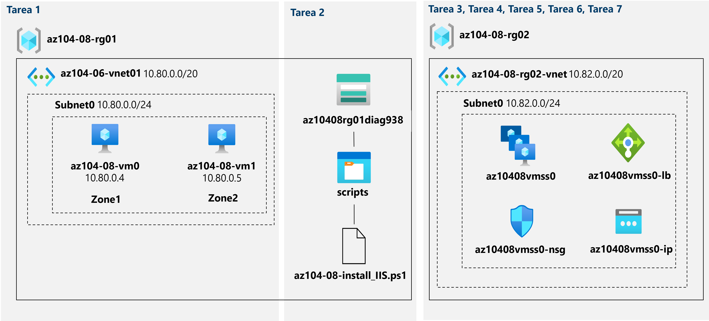

---
lab:
  title: "Laboratorio\_08: Administración de máquinas virtuales"
  module: Administer Virtual Machines
---

# Laboratorio 08: Administración de máquinas virtuales
# Manual de laboratorio para alumnos

## Escenario del laboratorio

Se le ha encargado la tarea de identificar diferentes opciones para implementar y configurar máquinas virtuales de Azure. En primer lugar, debe determinar diferentes opciones de escalabilidad y resistencia del proceso y el almacenamiento que puede implementar al usar máquinas virtuales de Azure. A continuación, debe investigar las opciones de escalabilidad y resistencia del proceso y el almacenamiento que están disponibles al usar conjuntos de escalado de máquinas virtuales de Azure. También quiere explorar la capacidad de configurar automáticamente máquinas virtuales y conjuntos de escalado de máquinas virtuales mediante la extensión de script personalizado de máquina virtual de Azure.

**Nota:** Hay disponible una **[simulación de laboratorio interactiva](https://mslabs.cloudguides.com/guides/AZ-104%20Exam%20Guide%20-%20Microsoft%20Azure%20Administrator%20Exercise%2012)** que le permite realizar sus propias selecciones a su entera discreción. Es posible que encuentre pequeñas diferencias entre la simulación interactiva y el laboratorio hospedado, pero las ideas y los conceptos básicos que se muestran son los mismos. 

## Objetivos

En este laboratorio, aprenderá a:

+ Tarea 1: Implementación de máquinas virtuales de Azure resistentes a zona mediante Azure Portal y una plantilla de Azure Resource Manager
+ Tarea 2: Configuración de máquinas virtuales de Azure mediante extensiones de máquina virtual
+ Tarea 3: Escalado de proceso y almacenamiento para máquinas virtuales de Azure
+ Tarea 4: Registro de proveedores de recursos de Microsoft.Insghts y Microsoft.AlertsManagement
+ Tarea 5: Implementación de conjuntos de escalado de máquinas virtuales de Azure resistentes a zona mediante Azure Portal
+ Tarea 6: Configuración de conjuntos de escalado de máquinas virtuales de Azure mediante extensiones de máquina virtual
+ Tarea 7: Escalado de proceso y almacenamiento para conjuntos de escalado de máquinas virtuales de Azure (opcional)

## Tiempo estimado: 50 minutos

## Diagrama de la arquitectura




### Instrucciones

## Ejercicio 1

## Tarea 1: Implementación de máquinas virtuales de Azure resistentes a zona mediante Azure Portal y una plantilla de Azure Resource Manager

En esta tarea, implementará máquinas virtuales de Azure en diferentes zonas de disponibilidad mediante Azure Portal y una plantilla de Azure Resource Manager.

1. Inicie sesión en [Azure Portal](http://portal.azure.com).

1. En Azure Portal, busque y seleccione **Máquinas virtuales** y, en la hoja **Máquinas virtuales**, haga clic en **+ Crear** y seleccione **+ Máquina virtual de Azure**.

1. En la pestaña **Aspectos básicos** de la hoja **Crear una máquina virtual**, especifique las siguientes opciones de configuración (deje las demás con los valores predeterminados):

    | Configuración | Value |
    | --- | --- |
    | Subscription | nombre de la suscripción de Azure que usará en este laboratorio |
    | Resource group | nombre de un nuevo grupo de recursos **az104-08-rg01** |
    | Nombre de la máquina virtual | **az104-08-vm0** |
    | Region | seleccione una de las regiones que admiten zonas de disponibilidad y donde puede aprovisionar máquinas virtuales de Azure. |
    | Opciones de disponibilidad | **Zona de disponibilidad** |
    | Zona de disponibilidad | **Zona 1** |
    | Imagen | **Windows Server 2019 Datacenter Gen1/Gen2** |
    | Instancia de Azure Spot | **No** |
    | Size | **Estándar D2s v3** |
    | Nombre de usuario | **Estudiante** |
    | Contraseña | **Proporcione una contraseña segura** |
    | Puertos de entrada públicos | **None** |
    | ¿Quiere usar una licencia de Windows Server existente? | **Desactivado** |

1. Haga clic en **Siguiente: Discos >** y, en la pestaña **Discos** de la hoja **Crear una máquina virtual**, especifique las siguientes opciones de configuración (deje las demás con los valores predeterminados):

    | Configuración | Valor |
    | --- | --- |
    | Tipo de disco del sistema operativo | **SSD Premium** |
    | Habilitar compatibilidad con Disco Ultra | **Desactivado** |

1. Haga clic en **Siguiente: Redes >** y, en la pestaña **Redes** de la hoja **Crear una máquina virtual**,haga clic en **Crear nueva** debajo del cuadro de texto **Red virtual**.

1. En la hoja **Crear red virtual**, especifique las opciones de configuración siguientes (deje las demás con los valores predeterminados):

    | Configuración | Value |
    | --- | --- |
    | Nombre | **az104-08-vnet01** |
    | Intervalo de direcciones | **10.80.0.0/20** |
    | Nombre de subred | **subnet0** |
    | Rango de subred | **10.80.0.0/24** |

1. Haga clic en **Aceptar** y, de nuevo en la pestaña **Redes** de la hoja **Crear una máquina virtual**, especifique las siguientes opciones de configuración (deje las demás con los valores predeterminados):

    | Configuración | Value |
    | --- | --- |
    | Subnet | **subnet0** |
    | Dirección IP pública | **default** |
    | Grupo de seguridad de red de NIC | **basic** |
    | Puertos de entrada públicos | **None** |
    | Redes aceleradas | **Desactivado**
    | ¿Quiere colocar esta máquina virtual como subyacente respecto a una solución de equilibrio de carga existente? | **Desactivado** |

1. Pulse en **Siguiente: Administración >** y, en la pestaña **Administración** de la hoja **Crear una máquina virtual**, especifique las siguientes opciones de configuración (deje las demás con los valores predeterminados):

    | Configuración | Value |
    | --- | --- |
    | Opciones de orquestación de revisiones | **Actualizaciones manuales** |  

1. Haga clic en **Siguiente: Supervisión >** y, en la pestaña **Supervisión** del panel **Crear una máquina virtual**, especifique los valores siguientes (deje los demás con los valores predeterminados):

    | Configuración | Value |
    | --- | --- |
    | Diagnósticos de arranque | **Habilitar con la cuenta de almacenamiento personalizada** |
    | Cuenta de almacenamiento de diagnóstico | **acepte el valor predeterminado** |

    >**Nota**: Si es necesario, seleccione una cuenta de almacenamiento existente en la lista desplegable para crear una nueva. Anote el nombre de la cuenta de almacenamiento. Lo usará en la tarea siguiente.

1. Haga clic en **Siguiente: Opciones avanzadas >**, en la pestaña **Opciones avanzadas** de la hoja **Crear una máquina virtual**, revise las opciones disponibles sin modificar ninguna de ellas, y haga clic en **Revisar y crear**.

1. En la hoja **Revisar y crear**, haga clic en **Crear**.

1. En la hoja de implementación, haga clic en **Plantilla**.

1. Revise la plantilla que representa la implementación en curso y haga clic en **Implementar**.

    >**Nota**: Usará esta opción para implementar la segunda máquina virtual con la configuración coincidente, excepto para la zona de disponibilidad.

1. En la hoja **Implementación personalizada**, especifique las opciones de configuración siguientes (deje las demás con los valores predeterminados):

    | Configuración | Value |
    | --- | --- |
    | Grupo de recursos | **az104-08-rg01** |
    | Nombre de la interfaz de red | **az104-08-vm1-nic1** |
    | Nombre de dirección IP pública | **az104-08-vm1-ip** |
    | Nombre de máquina virtual, Nombre de máquina virtual 1, Nombre de equipo de la máquina virtual   | **az104-08-vm1** |
    | Grupo de recursos de la máquina virtual | **az104-08-rg01** |    
    | Nombre de usuario administrador | **Estudiante** |
    | Contraseña de administrador | **Proporcione una contraseña segura**  |
    | Habilitación de la revisión en caliente | **false** |
    | Zona | **2** |

    >**Nota**: Debe modificar los parámetros correspondientes a las propiedades de los distintos recursos que va a implementar mediante la plantilla, incluida la máquina virtual y su interfaz de red.

1. Haga clic en **Revisar y crear**, en la hoja **Revisar y crear**, haga clic en **Crear**.

    >**Nota**: Espere a que ambas implementaciones se completen antes de continuar con la siguiente tarea. Esto puede tardar unos cinco minutos.

## Tarea 2: Configuración de máquinas virtuales de Azure mediante extensiones de máquina virtual

En esta tarea, instalará el rol del servidor web de Windows Server en las dos máquinas virtuales de Azure que implementó en la tarea anterior mediante la extensión de máquina virtual de script personalizado.

1. En Azure Portal, busque y seleccione **Cuentas de almacenamiento** y, en la hoja **Cuentas de almacenamiento**, haga clic en la entrada que representa la cuenta de almacenamiento de diagnóstico que creó en la tarea anterior.

1. En la hoja de la cuenta de almacenamiento, en la sección **Almacenamiento de datos**, haga clic en **Contenedores** y luego en **+ Contenedor**.

1. En la hoja **Nuevo contenedor**, especifique las opciones de configuración siguientes (deje las demás con los valores predeterminados) y haga clic en **Crear**:

    | Configuración | Value |
    | --- | --- |
    | Nombre | **scripts** |
    | Nivel de acceso público | **Privado (sin acceso anónimo**) |

1. De nuevo en la hoja de la cuenta de almacenamiento que muestra la lista de contenedores, haga clic en **scripts**.

1. En la hoja **scripts**, haga clic en **Cargar**.

1. En la hoja **Cargar blob**, haga clic en el icono de carpeta, en el cuadro de diálogo **Abrir**, vaya a la carpeta **\\Allfiles\\Labs\\08**, seleccione **az104-08-install_IIS.ps1**, haga clic en **Abrir** y, de nuevo en la hoja **Cargar blob**, haga clic en **Cargar**.

1. En Azure Portal, busque y seleccione **Máquinas virtuales** y, en la hoja **Máquinas virtuales**, haga clic en **az104-08-vm0**.

1. En la hoja de la máquina virtual **az104-08-vm0**, en la sección **Configuración**, haga clic en **Extensiones + aplicaciones**, y después en **+ Agregar**.

1. En la hoja **Instalar extensión**, seleccione **Extensión de script personalizado** y haga clic en **Siguiente**.

1. En la hoja **Configure Custom Script Extension Extension** (Configurar la extensión Extensión de script personalizado), haga clic en **Examinar**.

1. En la hoja **Cuentas de almacenamiento**, haga clic en el nombre de la cuenta de almacenamiento en la que ha cargado el script **az104-08-install_IIS.ps1**, en la hoja **Contenedores**, haga clic en **scripts**, en la hoja **scripts**, haga clic en **az104-08-install_IIS.ps1** y luego en **Seleccionar**.

1. De nuevo en la hoja **Instalar extensión**, haga clic en **Revisar y crear** y, en la hoja **Revisar y crear**, haga clic en **Crear**.

1. En Azure Portal, busque y seleccione **Máquinas virtuales** y, en la hoja **Máquinas virtuales**, haga clic en **az104-08-vm1**.

1. En la hoja **az104-08-vm1**, en la sección **Automatización**, haga clic en **Exportar plantilla**.

1. En la hoja **az104-08-vm1: Exportar plantilla**, haga clic en **Implementar**.

1. En la hoja **Implementación personalizada**, haga clic en **Editar plantilla**.

    >**Nota**: Pase por alto el mensaje que dice **El grupo de recursos está en una ubicación que no es compatible con uno o más recursos de la plantilla. Elija otro grupo de recursos**. Es previsible y se puede omitir.

1. En la hoja **Editar plantilla**, en la sección que muestra el contenido de la plantilla, inserte el código siguiente a partir de la línea **20** (directamente debajo de la línea `"resources": [`):

   >**Nota**: Si usa una herramienta que pega el código línea a línea, IntelliSense puede agregar corchetes adicionales que causen errores de validación. Puede pegar el código en el Bloc de notas primero y, a continuación, en la línea 20.

   ```json
        {
            "type": "Microsoft.Compute/virtualMachines/extensions",
            "name": "az104-08-vm1/customScriptExtension",
            "apiVersion": "2018-06-01",
            "location": "[resourceGroup().location]",
            "dependsOn": [
                "az104-08-vm1"
            ],
            "properties": {
                "publisher": "Microsoft.Compute",
                "type": "CustomScriptExtension",
                "typeHandlerVersion": "1.7",
                "autoUpgradeMinorVersion": true,
                "settings": {
                    "commandToExecute": "powershell.exe Install-WindowsFeature -name Web-Server -IncludeManagementTools && powershell.exe remove-item 'C:\\inetpub\\wwwroot\\iisstart.htm' && powershell.exe Add-Content -Path 'C:\\inetpub\\wwwroot\\iisstart.htm' -Value $('Hello World from ' + $env:computername)"
              }
            }
        },

   ```

   >**Nota**: Esta sección de la plantilla define la misma extensión de script personalizado de máquina virtual de Azure que implementó anteriormente en la primera máquina virtual a través de Azure PowerShell.

1. Haga clic en **Guardar** y, de nuevo en la hoja **Plantilla personalizada**, haga clic en **Revisar y crear** y, en la hoja **Revisar y crear**, haga clic en **Crear**.

    >**Nota**: Espere a que la implementación de la plantilla se complete. Puede supervisar su progreso desde la hoja **Extensiones** de las máquinas virtuales **az104-08-vm0** y **az104-08-vm1**. No debería tardar más de 3 minutos.

1. Para comprobar que la configuración basada en la extensión de script personalizado se ha realizado correctamente, vuelva a la hoja **az104-08-vm1**, en la sección **Operaciones**, haga clic en **Ejecutar comando** y, en la lista de comandos, haga clic en **RunPowerShellScript**.

1. En la hoja **Ejecutar script de comando**, escriba lo siguiente y haga clic en **Ejecutar** para acceder al sitio web hospedado en **az104-08-vm1**:

   ```powershell
   Invoke-WebRequest -URI http://10.80.0.4 -UseBasicParsing
   ```

    >**Nota**: El parámetro **-UseBasicParsing** es necesario para eliminar la dependencia de Internet Explorer para completar la ejecución del cmdlet.

    >**Nota**: El parámetro **-URI** es la **dirección IP privada** de la máquina virtual. Vaya a la hoja **az104-08-vm1**, en la sección **Redes** y haga clic en **Configuración de red**

    >**Nota**: También puede conectarse a **az104-08-vm0** y ejecutar `Invoke-WebRequest -URI http://10.80.0.5 -UseBasicParsing` para acceder al sitio web hospedado en **az104-08-vm1**.

## Tarea 3: Escalado de proceso y almacenamiento para máquinas virtuales de Azure

En esta tarea, escalará el proceso de las máquinas virtuales de Azure cambiando su tamaño y escalará su almacenamiento mediante la conexión y configuración de sus discos de datos.

1. En Azure Portal, busque y seleccione **Máquinas virtuales** y, en la hoja **Máquinas virtuales**, haga clic en **az104-08-vm0**.

1. En la hoja de la máquina virtual **az104-08-vm0**, haga clic en **Tamaño** y establezca el tamaño de la máquina virtual en **Estándar DS1_v2** y haga clic en **Cambiar tamaño**

    >**Nota**: Elija otro tamaño si **Estándar DS1_v2** no está disponible.

1. En la hoja de la máquina virtual **az104-08-vm0**, haga clic en **Discos** y, en **Discos de datos**, haga clic en **+ Crear y adjuntar un nuevo disco**.

1. Cree un disco administrado con las siguientes opciones de configuración (deje las demás con los predeterminados):

    | Configuración | Value |
    | --- | --- |
    | Nombre del disco | **az104-08-vm0-datadisk-0** |
    | Tipo de almacenamiento | **SSD Premium** |
    | Tamaño (GiB| **1024** |

1. De nuevo en la hoja **az104-08-vm0: Discos**, en **Discos de datos**, haga clic en **+ Crear y adjuntar un nuevo disco**.

1. Cree un disco administrado con las siguientes opciones de configuración (deje las demás con los predeterminados) y guarde los cambios:

    | Configuración | Value |
    | --- | --- |
    | Nombre del disco | **az104-08-vm0-datadisk-1** |
    | Tipo de almacenamiento | **SSD Premium** |
    | Tamaño (GiB)| **1024 GiB** |

1. De nuevo en la hoja **az104-08-vm0: Discos**, haga clic en **Guardar**.

1. En la hoja **az104-08-vm0**, en la sección **Operaciones**, haga clic en **Ejecutar comando** y, en la lista de comandos, haga clic en **RunPowerShellScript**.

1. En la hoja **Ejecutar comando script**, escriba lo siguiente y haga clic en **Ejecutar** para crear una unidad Z: que consta de los dos discos conectados recientemente con el diseño simple y el aprovisionamiento fijo:

   ```powershell
   New-StoragePool -FriendlyName storagepool1 -StorageSubsystemFriendlyName "Windows Storage*" -PhysicalDisks (Get-PhysicalDisk -CanPool $true)

   New-VirtualDisk -StoragePoolFriendlyName storagepool1 -FriendlyName virtualdisk1 -Size 64GB -ResiliencySettingName Simple -ProvisioningType Fixed

   Initialize-Disk -VirtualDisk (Get-VirtualDisk -FriendlyName virtualdisk1)

   New-Partition -DiskNumber 4 -UseMaximumSize -DriveLetter Z
   ```

    > **Nota**: Espere a que se confirme que los comandos se completaron correctamente.

1. En Azure Portal, busque y seleccione **Máquinas virtuales** y, en la hoja **Máquinas virtuales**, haga clic en **az104-08-vm1**.

1. En la hoja **az104-08-vm1**, en la sección **Automatización**, haga clic en **Exportar plantilla**.

1. En la hoja **az104-08-vm1: Exportar plantilla**, haga clic en **Implementar**.

1. En la hoja **Implementación personalizada**, haga clic en **Editar plantilla**.

    >**Nota**: Pase por alto el mensaje que dice **El grupo de recursos está en una ubicación que no es compatible con uno o más recursos de la plantilla. Elija otro grupo de recursos**. Es previsible y se puede omitir.

1. En la hoja **Editar plantilla**, en la sección que muestra el contenido de la plantilla, reemplace la línea **30** `"vmSize": "Standard_D2s_v3"` por la línea siguiente:

   ```json
                    "vmSize": "Standard_DS1_v2"

   ```

    >**Nota**: Esta sección de la plantilla define el mismo tamaño de máquina virtual de Azure que el que especificó para la primera máquina virtual a través de Azure Portal.

1. En la hoja **Editar plantilla**, en la sección que muestra el contenido de la plantilla, reemplaza la línea **51** (`"dataDisks": [ ],`) por el código siguiente:

   ```json
                    "dataDisks": [
                      {
                        "lun": 0,
                        "name": "az104-08-vm1-datadisk0",
                        "diskSizeGB": "1024",
                        "caching": "ReadOnly",
                        "createOption": "Empty"
                      },
                      {
                        "lun": 1,
                        "name": "az104-08-vm1-datadisk1",
                        "diskSizeGB": "1024",
                        "caching": "ReadOnly",
                        "createOption": "Empty"
                      }
                    ],
   ```

    >**Nota**: Si usa una herramienta que pega el código línea a línea, IntelliSense puede agregar corchetes adicionales que causen errores de validación. Puede pegar el código en el Bloc de notas primero y, a continuación, en la línea 49.

    >**Nota**: Esta sección de la plantilla crea dos discos administrados y los asocia a **az104-08-vm1**, de forma similar a la configuración de almacenamiento de la primera máquina virtual a través de Azure Portal.


1. Haga clic en **Guardar** y, de nuevo en la hoja **Implementación personalizada**, haga clic en **Revisar y crear** y, en la hoja **Revisar y crear**, haga clic en **Crear**.

    >**Nota**: Espere a que la implementación de la plantilla se complete. Puede supervisar su progreso desde la hoja **Discos** de la máquina virtual **az104-08-vm1**. No debería tardar más de 3 minutos.

1. De nuevo en la hoja **az104-08-vm1**, en la sección **Operaciones**, haga clic en **Ejecutar comando** y, en la lista de comandos, haga clic en **RunPowerShellScript**.

1. En la hoja **Ejecutar comando script**, escriba lo siguiente y haga clic en **Ejecutar** para crear una unidad Z: que consta de los dos discos conectados recientemente con el diseño simple y el aprovisionamiento fijo:

   ```powershell
   New-StoragePool -FriendlyName storagepool1 -StorageSubsystemFriendlyName "Windows Storage*" -PhysicalDisks (Get-PhysicalDisk -CanPool $true)

   New-VirtualDisk -StoragePoolFriendlyName storagepool1 -FriendlyName virtualdisk1 -Size 2046GB -ResiliencySettingName Simple -ProvisioningType Fixed

   Initialize-Disk -VirtualDisk (Get-VirtualDisk -FriendlyName virtualdisk1)

   New-Partition -DiskNumber 4 -UseMaximumSize -DriveLetter Z
   ```

    > **Nota**: Espere a que se confirme que los comandos se completaron correctamente.

## Tarea 4: Registro de proveedores de recursos de Microsoft.Insghts y Microsoft.AlertsManagement

1. Haga clic en el icono de la esquina superior derecha de Azure Portal para abrir **Azure Cloud Shell**.

1. Si se le pide que seleccione **Bash** o **PowerShell**, seleccione **PowerShell**.

    >**Nota**: Si es la primera vez que inicia **Cloud Shell** y aparece el mensaje **No tiene ningún almacenamiento montado**, seleccione la suscripción que utiliza en este laboratorio y haga clic en **Crear almacenamiento**.

1. En el panel de Cloud Shell, ejecute lo siguiente para registrar los proveedores de recursos de Microsoft.Insights y Microsoft.AlertsManagement.

   ```powershell
   Register-AzResourceProvider -ProviderNamespace Microsoft.Insights

   Register-AzResourceProvider -ProviderNamespace Microsoft.AlertsManagement
   ```

## Tarea 5: Implementación de conjuntos de escalado de máquinas virtuales de Azure resistentes a zona mediante Azure Portal

En esta tarea, implementará el conjunto de escalado de máquinas virtuales de Azure entre zonas de disponibilidad mediante Azure Portal.

1. En Azure Portal, busque y seleccione **Conjuntos de escalado de máquinas virtuales** y en la hoja **Conjuntos de escalado de máquinas virtuales**, haga clic en **+ Agregar**  (o en **+ Crear**).

1. En la pestaña **Aspectos básicos** de la hoja **Crear un conjunto de escalado de máquinas virtuales**, especifique las siguientes opciones de configuración (deje las demás con los valores predeterminados) y haga clic en **Siguiente: Discos >** :

    | Configuración | Value |
    | --- | --- |
    | Subscription | nombre de la suscripción de Azure que usa en este laboratorio |
    | Resource group | nombre de un nuevo grupo de recursos **az104-08-rg02** |
    | Nombre del conjunto de escalado de máquinas virtuales | **az10408vmss0** |
    | Region | seleccione una de las regiones que admiten zonas de disponibilidad y donde puede aprovisionar máquinas virtuales de Azure diferentes de las que usó para implementar máquinas virtuales anteriormente en este laboratorio. |
    | Zona de disponibilidad | **Zonas 1, 2, 3** |
    | Modo de orquestación | **Uniforme** |
    | Imagen | **Windows Server 2019 Datacenter - Gen2** |
    | Ejecución de Azure Spot con descuento | **No** |
    | Size | **Estándar D2s_v3** |
    | Nombre de usuario | **Estudiante** |
    | Contraseña | **Proporcione una contraseña segura**  |
    | ¿Ya tiene una licencia de Windows Server? | **Desactivado** |

    >**Nota**: Para obtener la lista de regiones de Azure que admiten la implementación de máquinas virtuales de Windows en zonas de disponibilidad, consulte [¿Qué son las zonas de disponibilidad en Azure?](https://docs.microsoft.com/en-us/azure/availability-zones/az-overview)

1. En la pestaña **Discos** de la hoja **Crear un conjunto de escalado de máquinas virtuales**, acepte los valores predeterminados y haga clic en **Siguiente: Redes >**.

1. En la pestaña **Redes** de la hoja **Crear un conjunto de escalado de máquinas virtuales**, haga clic en el vínculo **Crear red virtual** debajo del cuadro de texto **Red virtual** y cree una nueva red virtual con las siguientes opciones de configuración (deje las demás con sus valores predeterminados). 

    | Configuración | Value |
    | --- | --- |
    | Nombre | **az104-08-rg02-vnet** |
    | Intervalo de direcciones | **10.82.0.0/20** |
    | Nombre de subred | **subnet0** |
    | Rango de subred | **10.82.0.0/24** |

    >**Nota**: Una vez que cree una nueva red virtual y vuelva a la pestaña **Redes** de la hoja **Crear un conjunto de escalado de máquinas virtuales**, el valor de **Red virtual** se establecerá automáticamente en **az104-08-rg02-vnet**.

1. De nuevo en la pestaña **Redes** de la hoja **Crear un conjunto de escalado de máquinas virtuales**, haga clic en el icono **Editar interfaz de red** a la derecha de la entrada de la interfaz de red.

1. En la hoja **Editar interfaz de red**, en la sección **Grupo de seguridad de red de NIC**, haga clic en **Opciones avanzadas** y haga clic en **Crear nuevo** en la lista desplegable **Configurar grupo de seguridad de red**.

1. En la hoja **Crear grupo de seguridad de red**, especifique las opciones de configuración siguientes (deje las demás con los valores predeterminados):

    | Configuración | Value |
    | --- | --- |
    | Nombre | **az10408vmss0-nsg** |

1. Haga clic en **Agregar una regla de entrada** y agregue una regla de seguridad de entrada con las siguientes opciones de configuración (deje las demás con sus valores predeterminados):

    | Configuración | Valor |
    | --- | --- |
    | Source | **Cualquiera** |
    | Source port ranges | **\*** |
    | Destination | **Cualquiera** |
    | Intervalos de puertos de destino | **80** |
    | Protocolo | **TCP** |
    | Acción | **Permitir** |
    | Priority | **1010** |
    | Name | **custom-allow-http** |

1. Haga clic en **Agregar** y, de nuevo en la hoja **Crear grupo de seguridad de red**, haga clic en **Aceptar**.

1. De nuevo en la hoja **Editar la interfaz de red**, en la sección **Dirección IP pública**, haga clic en **Habilitada** y en **Aceptar**.

1. De nuevo en la pestaña **Redes** de la hoja **Crear un conjunto de escalado de máquinas virtuales**, en la sección **Equilibrio de carga**, especifique lo siguiente (deje a otros con sus valores predeterminados).

    | Configuración | Valor |
    | --- | --- |
    | Opciones de equilibrio de carga | **Azure Load Balancer** |
    | Seleccionar un equilibrador de carga | **Creación de un equilibrador de carga** |
    
1.  En la página **Crear un equilibrador de carga**, especifique el nombre del equilibrador de carga y tome los valores predeterminados. Haga clic en **Crear** cuando haya terminado y, después, haga clic en **Siguiente: Escalado >** .
    
    | Configuración | Valor |
    | --- | --- |
    | Nombre del equilibrador de carga | **az10408vmss0-lb** |

1. En la pestaña **Escalado** de la hoja **Crear un conjunto de escalado de máquinas virtuales**, especifique las siguientes opciones de configuración (deje las demás con los valores predeterminados) y haga clic en **Siguiente: Administración >** :

    | Configuración | Value |
    | --- | --- |
    | Recuento de instancias inicial | **2** |
    | Directiva de escalado | **Manual** |

1. En la pestaña **Administración** de la hoja **Crear un conjunto de escalado de máquinas virtuales**, especifique las siguientes opciones de configuración (deje las demás con los valores predeterminados):

    | Configuración | Value |
    | --- | --- |
    | Diagnósticos de arranque | **Habilitar con la cuenta de almacenamiento personalizada** |
    | Cuenta de almacenamiento de diagnóstico | acepte el valor predeterminado |

    >**Nota**: Necesitará el nombre de esta cuenta de almacenamiento en la siguiente tarea.

   Haga clic en **Siguiente > Estado >** :

1. En la pestaña **Estado** de la hoja **Crear un conjunto de escalado de máquinas virtuales**, revise las opciones de configuración predeterminadas sin realizar ningún cambio y haga clic en **Siguiente: Opciones avanzadas >**.

1. En la pestaña **Opciones avanzadas** de la hoja **Crear un conjunto de escalado de máquinas virtuales**, especifique las siguientes opciones de configuración (deje las demás con los valores predeterminados) y haga clic en **Revisar y crear**.

    | Configuración | Value |
    | --- | --- |
    | Algoritmo de propagación | **Propagación fija (no recomendada con zonas)** |

    >**Nota**: La opción de configuración **Propagación máxima** no funciona actualmente.

1. En la pestaña **Revisar y crear** de la hoja **Crear un conjunto de escalado de máquinas virtuales**, asegúrese de que ha superado la validación y haga clic en **Crear**.

    >**Nota**: Espere a que se complete la implementación del conjunto de escalado de máquinas virtuales. Este proceso tardará alrededor de 5 minutos.

## Tarea 6: Configuración de conjuntos de escalado de máquinas virtuales de Azure mediante extensiones de máquina virtual

En esta tarea, instalará el rol del servidor web de Windows Server en las instancias del conjunto de escalado de máquinas virtuales de Azure que implementó en la tarea anterior mediante la extensión de máquina virtual de script personalizado.

1. En Azure Portal, busque y seleccione **Cuentas de almacenamiento** y, en la hoja **Cuentas de almacenamiento**, haga clic en la entrada que representa la cuenta de almacenamiento de diagnóstico que creó en la tarea anterior.

1. En la hoja de la cuenta de almacenamiento, en la sección **Almacenamiento de datos**, haga clic en **Contenedores** y luego en **+ Contenedor**.

1. En la hoja **Nuevo contenedor**, especifique las opciones de configuración siguientes (deje las demás con los valores predeterminados) y haga clic en **Crear**:

    | Configuración | Value |
    | --- | --- |
    | Nombre | **scripts** |
    | Nivel de acceso público | **Privado (sin acceso anónimo**) |

1. De nuevo en la hoja de la cuenta de almacenamiento que muestra la lista de contenedores, haga clic en **scripts**.

1. En la hoja **scripts**, haga clic en **Cargar**.

1. En la hoja **Cargar blob**, haga clic en el icono de carpeta, en el cuadro de diálogo **Abrir**, vaya a la carpeta **\\Allfiles\\Labs\\08**, seleccione **az104-08-install_IIS.ps1**, haga clic en **Abrir** y, de nuevo en la hoja **Cargar blob**, haga clic en **Cargar**.

1. En Azure Portal, vuelva a la hoja **Conjuntos de escalado de máquinas virtuales** y haga clic en **az10408vmss0**.

1. En el panel **az10408vmss0**, en la sección **Configuración**, haga clic en **Extensiones y aplicaciones** y luego en **+ Agregar**.

1. En la hoja **Nuevo recurso**, haga clic en **Custom Script Extension** (Extensión de script personalizado) y luego en **Siguiente**.

1. En la hoja **Instalar extensión**, **busque** y **seleccione** el script **az104-08-install_IIS.ps1** que se cargó en el contenedor de **scripts** de la cuenta de almacenamiento antes en esta tarea y, a continuación, haga clic en **Crear**.

    >**Nota**: Espere a que se complete la instalación de la extensión antes de continuar con el paso siguiente.

1. En la sección **Configuración** de la hoja **az10408vmss0**, haga clic en **Instancias**, active las casillas situadas junto a las dos instancias del conjunto de escalado de máquinas virtuales, haga clic en **Actualizar** y, cuando se le pida confirmación, haga clic en **Sí**.

    >**Nota**: Espere a que la actualización se complete antes de continuar con el paso siguiente.

1. En Azure Portal, busque y seleccione **Equilibradores de carga** y, en la lista de equilibradores de carga, haga clic en **az10408vmss0-lb**.

1. En la hoja **az10408vmss0-lb**, anote el valor de **Dirección IP pública** asignado al front-end del equilibrador de carga, abra una nueva pestaña del explorador y vaya a esa dirección IP.

    >**Nota**: Compruebe que la página del explorador muestra el nombre de una de las instancias del conjunto de escalado de máquinas virtuales de Azure **az10408vmss0**.

## Tarea 7: Escalado de proceso y almacenamiento para conjuntos de escalado de máquinas virtuales de Azure

En esta tarea, cambiará el tamaño de las instancias del conjunto de escalado de máquinas virtuales, configurará sus opciones de escalado automático y les conectará discos.

1. En Azure Portal, busque y seleccione **Conjuntos de escalado de máquinas virtuales** y seleccione el conjunto de escalado **az10408vmss0**.

1. En la hoja **az10408vmss0**, en la sección **Configuración**, haga clic en **Tamaño**.

1. En la lista de tamaños disponibles y, después, seleccione **Estándar DS1_v2** y haga clic en **Cambiar tamaño**.

1. En la sección **Configuración**, haga clic en **Instancias**, seleccione las casillas situadas junto a las dos instancias del conjunto de escalado de máquinas virtuales, haga clic en **Actualizar** y, cuando se le pida confirmación, haga clic en **Sí**.

1. En la lista de instancias, haga clic en la entrada que representa la primera instancia y, en la hoja de la instancia del conjunto de escalado, anote su **Ubicación** (debe ser una de las zonas de la región de Azure de destino en la que implementó el conjunto de escalado de máquinas virtuales de Azure).

1. Vuelva a la hoja **az10408vmss0: Instancias**, haga clic en la entrada que representa la segunda instancia y, en la hoja de la instancia del conjunto de escalado, anote su **Ubicación** (debe ser una de las otras dos zonas de la región de Azure de destino en la que implementó el conjunto de escalado de máquinas virtuales de Azure).

1. Vuelva a la hoja **az10408vmss0: Instancias** y, en la sección **Configuración**, haga clic en **Escalado**.

1. En la hoja **az10408vmss0: Escalado**, seleccione la opción **Escalabilidad automática personalizada** y configure la escalabilidad automática con las siguientes opciones de configuración (deje las demás con sus valores predeterminados):

    | Configuración | Value |
    | --- |--- |
    | Modo de escalado | **Escalado basado en una métrica** |

1. Haga clic en el vínculo **+ Agregar una regla**, en la hoja **Escalar regla**, especifique las siguientes opciones de configuración (deje las demás con los valores predeterminados):

    | Configuración | Valor |
    | --- |--- |
    | Origen de métricas | **Recurso actual (az10480vmss0)** |
    | Agregación de tiempo | **Average** |
    | Espacio de nombres de métricas | **Host de máquina virtual** |
    | Nombre de métrica | **Red entrante total** |
    | Operador | **Mayor que** |
    | Umbral de la métrica para desencadenar la acción de escalado | **10** |
    | Duración (en minutos) | **1** |
    | Estadísticas de intervalo de agregación | **Average** |
    | Operación | **Aumentar recuento en** |
    | Recuento de instancias | **1** |
    | Tiempo de finalización (minutos) | **5** |

    >**Nota**: Obviamente, estos valores no representan una configuración realista, ya que su propósito es desencadenar el escalado automático lo antes posible, sin un período de espera extendido.

1. Haga clic en **Agregar**, de nuevo en la hoja **az10408vmss0: Escalado**, especifique las siguientes opciones de configuración (deje las demás con los valores predeterminados):

    | Configuración | Value |
    | --- |--- |
    | Límites mínimos de la instancia | **1** |
    | Límites máximos de la instancia | **3** |
    | Límites predeterminados de la instancia | **1** |

1. Haga clic en **Save**(Guardar).

1. Haga clic en el icono de la esquina superior derecha de Azure Portal para abrir **Azure Cloud Shell**.

1. Si se le pide que seleccione **Bash** o **PowerShell**, seleccione **PowerShell**.

1. En el panel de Cloud Shell, ejecute lo siguiente para identificar la dirección IP pública del equilibrador de carga delante del conjunto de escalado de máquinas virtuales de Azure **az10408vmss0**.

   ```powershell
   $rgName = 'az104-08-rg02'

   $lbpipName = 'az10408vmss0-lb-publicip'

   $pip = (Get-AzPublicIpAddress -ResourceGroupName $rgName -Name $lbpipName).IpAddress
   ```

1. En el panel de Cloud Shell, ejecute lo siguiente para iniciar un bucle infinito que envíe las solicitudes HTTP a los sitios web hospedados en las instancias del conjunto de escalado de máquinas virtuales de Azure **az10408vmss0**.

   ```powershell
   while ($true) { Invoke-WebRequest -Uri "http://$pip" }
   ```

1. Minimice el panel de Cloud Shell, pero no lo cierre, vuelva a la hoja **az10408vmss0: Instancias** y supervise el número de instancias.

    >**Nota**: Es posible que tenga que esperar un par de minutos y hacer clic en **Actualizar**.

1. Una vez aprovisionada la tercera instancia, vaya a su hoja para determinar su **Ubicación** (debe ser diferente de las dos primeras zonas que identificó anteriormente en esta tarea).

1. Cierre el panel de Cloud Shell.

1. En la hoja **az10408vmss0**, en la sección **Configuración**, haga clic en **Discos**, haga clic en **+ Crear y adjuntar un nuevo disco** y conecte un nuevo disco administrado con las siguientes opciones de configuración (deje las demás con sus valores predeterminados):

    | Configuración | Value |
    | --- | --- |
    | LUN | **0** |
    | Tipo de almacenamiento | **HDD estándar** |
    | Tamaño (GiB) | **32** |

1. Guarde el cambio, en la sección **Configuración** de la hoja **az10408vmss0**, haga clic en **Instancias**, active las casillas situadas junto a las instancias del conjunto de escalado de máquinas virtuales, haga clic en **Actualizar** y, cuando se le pida confirmación, haga clic en **Sí**.

    >**Nota**: El disco conectado en el paso anterior es un disco sin procesar. Antes de poder usarse, es necesario crear una partición, crear un sistema de archivos y montarlo. Para ello, usará la extensión de script personalizado de máquina virtual de Azure. En primer lugar, deberá quitar la extensión de script personalizado existente.

1. En la sección **Configuración** del panel **az10408vmss0**, haga clic en **Extensiones y aplicaciones**, en **CustomScriptExtension** y luego en **Desinstalar**.

    >**Nota**: Espere a que termine la desinstalación.

1. Haga clic en el icono de la esquina superior derecha de Azure Portal para abrir **Azure Cloud Shell**.

1. Si se le pide que seleccione **Bash** o **PowerShell**, seleccione **PowerShell**.

1. En la barra de herramientas del panel de Cloud Shell, haga clic en el icono **Cargar/Descargar archivos**, haga clic en **Cargar** en el menú desplegable y cargue el archivo **\\Allfiles\\Labs\\08\\az104-08-configure_VMSS_disks.ps1** en el directorio principal de Cloud Shell.

1. En el panel de Cloud Shell, ejecute lo siguiente para mostrar el contenido del script:

   ```powershell
   Set-Location -Path $HOME

   Get-Content -Path ./az104-08-configure_VMSS_disks.ps1
   ```

    >**Nota**: El script instala una extensión de script personalizado que configura el disco conectado.

1. En el panel de Cloud Shell, ejecute lo siguiente para ejecutar el script y configurar los discos del conjunto de escalado de máquinas virtuales de Azure:

   ```powershell
   ./az104-08-configure_VMSS_disks.ps1
   ```

1. Cierre el panel de Cloud Shell.

1. En la sección **Configuración** de la hoja **az10408vmss0**, haga clic en **Instancias**, active las casillas situadas junto a las instancias del conjunto de escalado de máquinas virtuales, haga clic en **Actualizar** y, cuando se le pida confirmación, haga clic en **Sí**.

## Limpieza de recursos

>**Nota**: No olvide quitar los recursos de Azure recién creados que ya no use. La eliminación de los recursos sin usar garantiza que no verá cargos inesperados.

>**Nota:** No se preocupe si los recursos del laboratorio no se pueden quitar inmediatamente. A veces, los recursos tienen dependencias y se tarda más tiempo en eliminarlos. Supervisar el uso de los recursos es una tarea habitual del administrador, así que solo tiene que revisar periódicamente los recursos en el portal para ver cómo va la limpieza. 
1. En Azure Portal, abra la sesión de **PowerShell** en el panel **Cloud Shell**.

1. Quite az104-08-configure_VMSS_disks.ps1 mediante la ejecución del comando siguiente:

   ```powershell
   rm ~\az104-08*
   ```

1. Ejecute el comando siguiente para enumerar todos los grupos de recursos que se han creado en los laboratorios de este módulo:

   ```powershell
   Get-AzResourceGroup -Name 'az104-08*'
   ```

1. Ejecute el comando siguiente para eliminar todos los grupos de recursos que ha creado en los laboratorios de este módulo:

   ```powershell
   Get-AzResourceGroup -Name 'az104-08*' | Remove-AzResourceGroup -Force -AsJob
   ```

    >**Nota**: El comando se ejecuta de forma asincrónica (según determina el parámetro -AsJob). Aunque podrá ejecutar otro comando de PowerShell inmediatamente después en la misma sesión de PowerShell, los grupos de recursos tardarán unos minutos en eliminarse.

## Revisar

En este laboratorio, ha:

+ Implementado máquinas virtuales de Azure resistentes a zona mediante Azure Portal y una plantilla de Azure Resource Manager
+ Configurado máquinas virtuales de Azure mediante extensiones de máquina virtual
+ Escalado el proceso y almacenamiento para máquinas virtuales de Azure
+ Implementado conjuntos de escalado de máquinas virtuales de Azure resistentes a zona mediante Azure Portal
+ Configurado conjuntos de escalado de máquinas virtuales de Azure mediante extensiones de máquina virtual
+ Escalado el proceso y almacenamiento para conjuntos de escalado de máquinas virtuales de Azure
