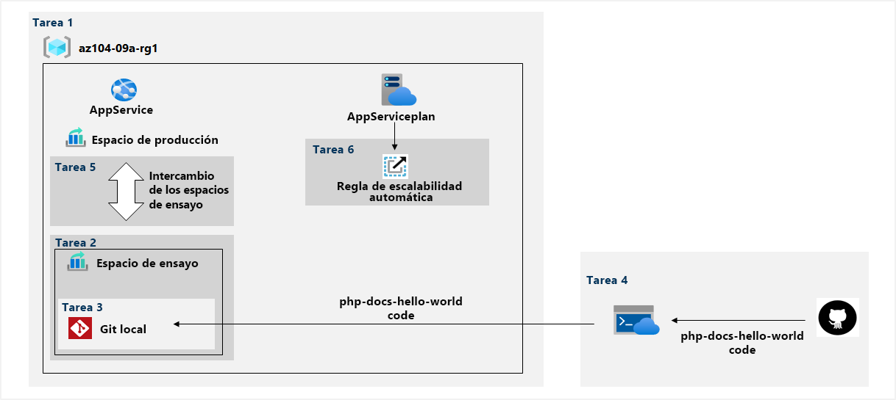

---
lab:
  title: "Laboratorio\_09a: Implementación de aplicaciones web"
  module: Administer PaaS Compute Options
---

# Laboratorio 09a: Implementación de Web Apps
# Manual de laboratorio para alumnos

## Escenario del laboratorio

Tiene que evaluar el uso de aplicaciones web de Azure para hospedar sitios web de Contoso, hospedados actualmente en los centros de datos locales de la empresa. Los sitios web se ejecutan en servidores Windows mediante la pila en tiempo de ejecución de PHP. También tiene que decidir cómo puede implementar prácticas de DevOps al usar ranuras de implementación de aplicaciones web de Azure.

                **Nota:** Hay disponible una **[simulación de laboratorio interactiva](https://mslabs.cloudguides.com/guides/AZ-104%20Exam%20Guide%20-%20Microsoft%20Azure%20Administrator%20Exercise%2013)** que le permite realizar sus propias selecciones a su entera discreción. Es posible que encuentre pequeñas diferencias entre la simulación interactiva y el laboratorio hospedado, pero las ideas y los conceptos básicos que se muestran son los mismos. 

## Objetivos

En este laboratorio, aprenderá a:

+ Tarea 1: Crear una aplicación web de Azure
+ Tarea 2: Crear una ranura de implementación de ensayo
+ Tarea 3: Configurar las opciones de implementación de la aplicación web
+ Tarea 4: Implementar código en la ranura de implementación de ensayo
+ Tarea 5: Intercambiar los espacios de ensayo
+ Tarea 6: Configurar y probar el escalado automático de la aplicación web de Azure

## Tiempo estimado: 30 minutos

## Diagrama de la arquitectura



### Instructions

## Ejercicio 1

## Tarea 1: Crear una aplicación web de Azure

En esta tarea, creará una aplicación web de Azure.

1. Inicie sesión en [**Azure Portal**](http://portal.azure.com).

1. En Azure Portal, busque y seleccione **App Services** y, en la hoja **App Services**, haga clic en **+ Crear**.

1. En la pestaña **Aspectos básicos** de la hoja **Crear aplicación web**, especifique las siguientes opciones de configuración (deje las demás con los valores predeterminados):

    | Configuración | Value |
    | --- | ---|
    | Subscription | nombre de la suscripción de Azure que usa en este laboratorio |
    | Resource group | Nombre de un nuevo grupo de recursos **az104-09a-rg1** |
    | Nombre de aplicación web | Cualquier nombre globalmente único |
    | Publicar | **Código** |
    | Pila en tiempo de ejecución | **PHP 8.2** |
    | Sistema operativo | **Linux** |
    | Region | Nombre de una región de Azure donde puede aprovisionar aplicaciones web de Azure |
    | Plan de App Service | Acepte la configuración predeterminada |

1. Haga clic en **Revisar y crear**. En la pestaña **Revisar y crear** de la hoja **Crear aplicación web**, asegúrese de que ha superado la validación y haga clic en **Crear**.

    >**Nota**: Espere hasta que se cree la aplicación web antes de continuar con la siguiente tarea. Este proceso tardará aproximadamente un minuto.

1. En la hoja de implementación, haga clic en **Ir al recurso**.

## Tarea 2: Crear una ranura de implementación de ensayo

En esta tarea, creará una ranura de implementación de ensayo.

1. En la hoja de la aplicación web recién implementada, haga clic en el vínculo **URL** para mostrar la página web predeterminada en una nueva pestaña del explorador.

1. Cierre la nueva pestaña del explorador y, de vuelta en Azure Portal, en la sección **Implementación** de la hoja de la aplicación web, haga clic en **Espacios de implementación**.

    >**Nota**: La aplicación web, en este momento, tiene una sola ranura de implementación con la etiqueta **PRODUCTION**.

1. Haga clic en **+ Agregar ranura** y agregue una nueva ranura con la siguiente configuración:

    | Configuración | Value |
    | --- | ---|
    | Nombre | **staging** |
    | Clonar la configuración de | **No clonar la configuración**|

1. De nuevo en la hoja **Ranuras de implementación** de la aplicación web, haga clic en la entrada que representa el espacio de ensayo recién creado.

    >**Nota**: Se abrirá la hoja que muestra las propiedades del espacio de ensayo.

1. Revise la hoja del espacio de ensayo y tenga en cuenta que su dirección URL difiere de la asignada al espacio de producción.

## Tarea 3: Configurar las opciones de implementación de la aplicación web

En esta tarea, configurará las opciones de implementación de la aplicación web.

1. En la hoja de la ranura de implementación de ensayo, en la sección **Implementación**, haga clic en **Centro de implementación** y, a continuación, seleccione la pestaña **Configuración**.

    >**Nota**: Asegúrese de que está en la hoja del espacio de ensayo (en lugar del espacio de producción).
    
1. En la pestaña **Configuración**, en la lista desplegable **Origen**, seleccione **GIT local** y haga clic en el botón **Guardar**.

1. En la hoja **Centro de implementación**, copie la entrada **URI de git clone** en el Bloc de notas.

    >**Nota**: necesitará el valor de URI de git clone en la siguiente tarea de este laboratorio.

1. En la hoja **Centro de implementación**, seleccione la pestaña **Credenciales de GIT o FTPS locales**, en la sección **Ámbito de usuario**, configure las opciones siguientes y haga clic en **Guardar**.

    | Configuración | Valor |
    | --- | ---|
    | Nombre de usuario | cualquier nombre único global (consulte la nota)  |
    | Contraseña | cualquier contraseña que cumpla los requisitos de complejidad (consulte la nota) |

    >**Nota:** Copie estas credenciales en el Bloc de notas. Las necesitará más adelante.
    
    >**Nota:** Estas credenciales se pasarán a través del URI. No incluya caracteres especiales que afecten a la interpretación del URI. Por ejemplo: @, $, or #. Un signo asterisco o de más (en medio de la cadena) funcionaría.
    
## Tarea 4: Implementar código en la ranura de implementación de ensayo

En esta tarea, implementará código en la ranura de implementación de ensayo.

1. Haga clic en el icono de la esquina superior derecha de Azure Portal para abrir **Azure Cloud Shell**.

1. Si se le pide que seleccione **Bash** o **PowerShell**, seleccione **PowerShell**.

    >**Nota**: Si es la primera vez que inicia **Cloud Shell** y aparece el mensaje **No tiene ningún almacenamiento montado**, seleccione la suscripción que utiliza en este laboratorio y haga clic en **Crear almacenamiento**.

1. En el panel de Cloud Shell, ejecute lo siguiente para clonar el repositorio remoto que contiene el código de la aplicación web.

   ```powershell
   git clone https://github.com/Azure-Samples/php-docs-hello-world
   ```

1. En el panel de Cloud Shell, ejecute lo siguiente para establecer la ubicación actual en el clon recién creado del repositorio local que contiene el código de la aplicación web de ejemplo.

   ```powershell
   Set-Location -Path $HOME/php-docs-hello-world/
   ```

1. En el panel de Cloud Shell, ejecute lo siguiente para agregar el GIT remoto (asegúrese de reemplazar los marcadores de posición `[deployment_user_name]` y `[git_clone_uri]` por el valor del nombre de usuario de **Credenciales de implementación** y la **URI de git clone**, respectivamente, que identificó en la tarea anterior):

   ```powershell
   git remote add [deployment_user_name] [git_clone_uri]
   ```

    >**Nota**: El valor siguiente `git remote add` no tiene que coincidir con el nombre de usuario de **Credenciales de implementación**, pero debe ser único.

1. En el panel de Cloud Shell, ejecute lo siguiente para insertar el código de la aplicación web de ejemplo del repositorio local en la ranura de implementación de ensayo de la aplicación web de Azure (asegúrese de reemplazar el marcador de posición `[deployment_user_name]` por el valor del nombre de usuario de **Credenciales de implementación**, que identificó en la tarea anterior):

   ```powershell
    git push https://<deployment-username>:<deployment-password>@<app-name>.scm.azurewebsites.net/<app-name>.git master
   ```

1. Cierre el panel de Cloud Shell.

1. En la hoja del espacio de ensayo, haga clic en **Información general** y, luego, en el vínculo **URL** para mostrar la página web predeterminada en una nueva pestaña del explorador.

1. Compruebe que en la página del explorador aparezca el mensaje **Hola mundo** y cierre la nueva pestaña.

## Tarea 5: Intercambiar los espacios de ensayo

En esta tarea, intercambiará el espacio de ensayo por el espacio de producción.

1. Vuelva a la hoja que muestra el espacio de producción de la aplicación web.

1. En la sección **Implementación**, haga clic en **Ranuras de implementación** y luego en el icono **Intercambiar** de la barra de herramientas.

1. Haga clic en la hoja **Intercambiar**, revise la configuración predeterminada y haga clic en **Intercambiar**.

1. Haga clic en **Información general** en la hoja del espacio de producción de la aplicación web y, luego, en el vínculo **URL** para mostrar la página principal del sitio web en una nueva pestaña del explorador.

1. Compruebe que la página web predeterminada se ha reemplazado por la página **Hola mundo** página.

## Tarea 6: Configurar y probar el escalado automático de la aplicación web de Azure

En esta tarea, configurará y probará el escalado automático de la aplicación web de Azure.

1. En la hoja que muestra el espacio de producción de la aplicación web, en la sección **Configuración**, haga clic en **Escalar horizontalmente (plan de App Service)**.

1. En la sección **Escalado**, seleccione la opción **Basado en reglas** y, a continuación, haga clic en el vínculo **Administrar el escalado basado en reglas**.

1. Haga clic en **Escalabilidad automática personalizada**.

    >**Nota**: También tiene la opción de escalar manualmente la aplicación web.

1. Seleccione **Escala basada en una métrica** y haga clic en **+ Añadir una regla**

1. En la hoja **Escalar regla**, configure las opciones siguientes (deje las demás con los valores predeterminados):

    | Configuración | Valor |
    | --- |--- |
    | Origen de métricas | **Recurso actual** |
    | Espacio de nombres de métricas | **métricas estándar** |
    | Nombre de métrica | **Porcentaje de CPU** |
    | Operador | **Mayor que** |
    | Umbral de la métrica para desencadenar la acción de escalado | **10** |
    | Duración (en minutos) | **1** |
    | Estadísticas de intervalo de agregación | **Máximo** |
    | Agregación de tiempo | **Máximo** |
    | Operación | **Aumentar recuento en** |
    | Recuento de instancias | **1** |
    | Tiempo de finalización (minutos) | **5** |

    >**Nota**: Estos valores no representan una configuración realista, ya que su propósito es desencadenar el escalado automático lo antes posible, sin un período de espera extendido.

1. Haga clic en **Agregar** y, de nuevo en la hoja de escalado del plan de App Service, configure las siguientes opciones (deje las demás con los valores predeterminados):

    | Configuración | Value |
    | --- |--- |
    | Límites mínimos de la instancia | **1** |
    | Límites de instancia, máximo | **2** |
    | Límites de instancia, predeterminado | **1** |

1. Haga clic en **Save**(Guardar).

    >**Nota:** Si se produce un error que indica que el proveedor de recursos “microsoft.insights” no está registrado, ejecute `az provider register --namespace 'Microsoft.Insights'` en Cloud Shell y vuelva a intentar guardar las reglas de escalado automático.

1. Haga clic en el icono de la esquina superior derecha de Azure Portal para abrir **Azure Cloud Shell**.

1. Si se le pide que seleccione **Bash** o **PowerShell**, seleccione **PowerShell**.

1. En el panel de Cloud Shell, ejecute lo siguiente para identificar la dirección URL de la aplicación web de Azure.

   ```powershell
   $rgName = 'az104-09a-rg1'

   $webapp = Get-AzWebApp -ResourceGroupName $rgName
   ```

1. En el panel de Cloud Shell, ejecute lo siguiente para iniciar un bucle infinito que envía las solicitudes HTTP a la aplicación web:

   ```powershell
   while ($true) { Invoke-WebRequest -Uri $webapp.DefaultHostName }
   ```

1. Minimice el panel de Cloud Shell (pero no lo cierre) y, en la hoja de la aplicación web, en la sección Configuración, haga clic en **Escalabilidad horizontal (plan de App Service)**.

1. Seleccione **Configuración de escalado automático**, elija la pestaña **Historial de ejecución** y compruebe el **Recuento de instancias de recursos observado**.

1. Supervise el uso y el número de instancias durante unos minutos. 

    >**Nota**: Es posible que tenga que **actualizar** la página.

1. Una vez que observe que el número de instancias ha aumentado a 2, vuelva a abrir el panel de Cloud Shell y presione **CTRL+C** para finalizar el script.

1. Cierre el panel de Cloud Shell.

## Limpieza de recursos

>**Nota**: No olvide quitar los recursos de Azure recién creados que ya no use. La eliminación de los recursos sin usar garantiza que no verá cargos inesperados.

>**Nota:** No se preocupe si los recursos del laboratorio no se pueden quitar inmediatamente. A veces, los recursos tienen dependencias y se tarda más tiempo en eliminarlos. Supervisar el uso de los recursos es una tarea habitual del administrador, así que solo tiene que revisar periódicamente los recursos en el portal para ver cómo va la limpieza. 

1. En Azure Portal, abra la sesión de **PowerShell** en el panel **Cloud Shell**.

1. Ejecute el comando siguiente para enumerar todos los grupos de recursos que se han creado en los laboratorios de este módulo:

   ```powershell
   Get-AzResourceGroup -Name 'az104-09a*'
   ```

1. Ejecute el comando siguiente para eliminar todos los grupos de recursos que ha creado en los laboratorios de este módulo:

   ```powershell
   Get-AzResourceGroup -Name 'az104-09a*' | Remove-AzResourceGroup -Force -AsJob
   ```

    >**Nota**: El comando se ejecuta de forma asincrónica (según determina el parámetro -AsJob). Aunque podrá ejecutar otro comando de PowerShell inmediatamente después en la misma sesión de PowerShell, los grupos de recursos tardarán unos minutos en eliminarse.

## Revisar

En este laboratorio, ha:

+ Creado una aplicación web de Azure
+ Creado una ranura de implementación de ensayo
+ Configurado las opciones de implementación de la aplicación web
+ Implementado código en la ranura de implementación de ensayo
+ Intercambiado las ranuras de ensayo
+ Configurado y probado el escalado automático de la aplicación web de Azure
