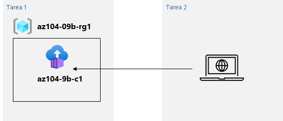

---
lab:
  title: '09b: Implementación de Azure Container Instances'
  module: Module 09 - Serverless Computing
ms.openlocfilehash: 2783bb606e0536ec7ef53d4966d07064392c6421
ms.sourcegitcommit: 8a0ced6338608682366fb357c69321ba1aee4ab8
ms.translationtype: HT
ms.contentlocale: es-ES
ms.lasthandoff: 11/08/2021
ms.locfileid: "132625550"
---
# <a name="lab-09b---implement-azure-container-instances"></a>Laboratorio 09b: Implementación de Azure Container Instances
# <a name="student-lab-manual"></a>Manual de laboratorio para alumnos

## <a name="lab-scenario"></a>Escenario del laboratorio

Contoso quiere encontrar una nueva plataforma para sus cargas de trabajo virtualizadas. Se han detectado varias imágenes de contenedor que se pueden aprovechar para lograr este objetivo. Dado que quiere minimizar la administración de contenedores, tiene previsto evaluar el uso de Azure Container Instances para la implementación de imágenes de Docker.

## <a name="objectives"></a>Objetivos

En este laboratorio, aprenderá a:

- Tarea 1: Implementar una imagen de Docker mediante Azure Container Instances
- Tarea 2: Revisar la funcionalidad de Azure Container Instances

## <a name="estimated-timing-20-minutes"></a>Tiempo estimado: 20 minutos

## <a name="architecture-diagram"></a>Diagrama de la arquitectura



## <a name="instructions"></a>Instructions

### <a name="exercise-1"></a>Ejercicio 1

#### <a name="task-1-deploy-a-docker-image-by-using-the-azure-container-instance"></a>Tarea 1: Implementar una imagen de Docker mediante Azure Container Instances

En esta tarea, creará una nueva instancia de contenedor para la aplicación web.

1. Inicie sesión en [Azure Portal](https://portal.azure.com).

1. En Azure Portal, busque **Instancias de contenedor** y luego, en la hoja **Instancias de contenedor**, haga clic en **+ Crear**.

1. En la pestaña **Aspectos básicos** de la hoja **Crear instancia de contenedor**, configure las siguientes opciones (deje las demás con los valores predeterminados):

    | Configuración | Value |
    | ---- | ---- |
    | Subscription | Nombre de la suscripción de Azure que está usando en este laboratorio |
    | Resource group | Nombre de un nuevo grupo de recursos **az104-09b-rg1** |
    | Nombre del contenedor | **az104-9b-c1** |
    | Region | Nombre de una región donde puede aprovisionar Azure Container Instances |
    | Origen de la imagen | **Imágenes de inicio rápido** |
    | Imagen | **mcr.microsoft.com/azuredocs/aci-helloworld:latest (Linux)** |

1. Haga clic en **Siguiente: Redes >** y, en la pestaña **Redes** de la hoja **Crear instancia de contenedor**, configure las siguientes opciones (deje las demás con los valores predeterminados):

    | Configuración | Value |
    | --- | --- |
    | Etiqueta de nombre DNS | Cualquier nombre de host DNS válido y único globalmente |

    >**Nota**: El contenedor será accesible públicamente en dns-name-label.region.azurecontainer.io. Si recibe un mensaje de error **La etiqueta de nombre DNS no está disponible**, pruebe otro valor.

1. Haga clic en **Siguiente: Opciones avanzadas >** , revise la configuración en la pestaña **Opciones avanzadas** de la hoja **Crear instancia de contenedor** sin realizar ningún cambio, haga clic en **Revisar y crear**, asegúrese de que se supere la validación y haga clic en **Crear**.

    >**Nota**: Espere a que la implementación se complete. Este proceso tardará aproximadamente 3 minutos.

    >**Nota**: Mientras espera, puede que esté interesado en ver el [código que subyace a esta aplicación de ejemplo](https://github.com/Azure-Samples/aci-helloworld). Para verlo, vaya a la carpeta \\app.

#### <a name="task-2-review-the-functionality-of-the-azure-container-instance"></a>Tarea 2: Revisar la funcionalidad de Azure Container Instances

En esta tarea, revisará la implementación de la instancia de contenedor.

1. En la hoja de implementación, seleccione el vínculo **Ir al recurso**.

1. En la hoja **Información general** de la instancia de contenedor, compruebe que el **Estado** sea **En ejecución**.

1. Copie el valor de **FQDN** de la instancia de contenedor, abra una nueva pestaña del explorador y vaya a la dirección URL correspondiente.

1. Compruebe que aparezca la página **Le damos la bienvenida a Azure Container Instances**.

1. Cierre la nueva pestaña del explorador, de nuevo en Azure Portal, en la sección **Configuración** de la hoja de la instancia de contenedor, haga clic en **Contenedores** y, a continuación, haga clic en **Registros**.

1. Muestre la aplicación en el explorador para comprobar que se ven las entradas de registro que representan la solicitud HTTP GET generada.

#### <a name="clean-up-resources"></a>Limpieza de recursos

   >**Nota**: No olvide quitar los recursos de Azure recién creados que ya no use. La eliminación de los recursos sin usar garantiza que no verá cargos inesperados.

1. En Azure Portal, abra la sesión de **PowerShell** en el panel **Cloud Shell**.

1. Ejecute el comando siguiente para enumerar todos los grupos de recursos que se han creado en los laboratorios de este módulo:

   ```powershell
   Get-AzResourceGroup -Name 'az104-09b*'
   ```

1. Ejecute el comando siguiente para eliminar todos los grupos de recursos que ha creado en los laboratorios de este módulo:

   ```powershell
   Get-AzResourceGroup -Name 'az104-09b*' | Remove-AzResourceGroup -Force -AsJob
   ```

    >**Nota**: El comando se ejecuta de forma asincrónica (según determina el parámetro -AsJob). Aunque podrá ejecutar otro comando de PowerShell inmediatamente después en la misma sesión de PowerShell, los grupos de recursos tardarán unos minutos en eliminarse.

#### <a name="review"></a>Revisar

En este laboratorio, ha:

- Implementado una imagen de Docker mediante Azure Container Instances
- Revisado la funcionalidad de Azure Container Instances
