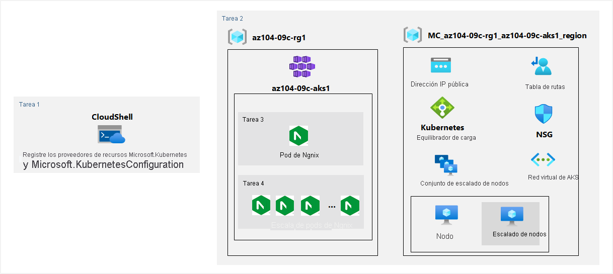

---
lab:
  title: "Laboratorio\_09c: Implementación de Azure Kubernetes Service"
  module: Administer PaaS Compute Options
---

# Laboratorio 09c:-Implementación de Azure Kubernetes Service
# Manual de laboratorio para alumnos

## Escenario del laboratorio

Contoso tiene muchas aplicaciones de varios niveles que no son adecuadas para ejecutarse mediante Azure Container Instances. Para decidir si se pueden ejecutar como cargas de trabajo en contenedores, se quiere evaluar el uso de Kubernetes como orquestador de contenedores. Para minimizar aún más la sobrecarga de administración, se quiere probar Azure Kubernetes Service, incluida su experiencia de implementación simplificada y las funcionalidades de escalado.

**Nota:** Hay disponible una **[simulación de laboratorio interactiva](https://mslabs.cloudguides.com/guides/AZ-104%20Exam%20Guide%20-%20Microsoft%20Azure%20Administrator%20Exercise%2015)** que le permite realizar sus propias selecciones a su entera discreción. Es posible que encuentre pequeñas diferencias entre la simulación interactiva y el laboratorio hospedado, pero las ideas y los conceptos básicos que se muestran son los mismos. 

## Objetivos

En este laboratorio, aprenderá a:

+ Tarea 1: Registrar los proveedores de recursos Microsoft.Kubernetes y Microsoft.KubernetesConfiguration.
+ Tarea 2: Implementar un clúster de Azure Kubernetes Service
+ Tarea 3: Implementar pods en el clúster de Azure Kubernetes Service
+ Tarea 4: Escalar las cargas de trabajo en contenedores en el clúster de Azure Kubernetes Service

## Tiempo estimado: 40 minutos

## Diagrama de la arquitectura



### Instrucciones

## Ejercicio 1

## Tarea 1: Registrar los proveedores de recursos Microsoft.Kubernetes y Microsoft.KubernetesConfiguration.

En esta tarea, registrará los proveedores de recursos necesarios para implementar un clúster de Azure Kubernetes Services.

1. Inicie sesión en [Azure Portal](https://portal.azure.com).

1. Haga clic en el icono de la esquina superior derecha de Azure Portal para abrir **Azure Cloud Shell**.

1. Si se le pide que seleccione **Bash** o **PowerShell**, seleccione **PowerShell**.

    >**Nota**: Si es la primera vez que inicia **Cloud Shell** y aparece el mensaje **No tiene ningún almacenamiento montado**, seleccione la suscripción que utiliza en este laboratorio y haga clic en **Crear almacenamiento**.

1. Desde el panel de Cloud Shell, ejecute lo siguiente para registrar los proveedores de recursos Microsoft.Kubernetes y Microsoft.KubernetesConfiguration.

   ```powershell
   Register-AzResourceProvider -ProviderNamespace Microsoft.Kubernetes

   Register-AzResourceProvider -ProviderNamespace Microsoft.KubernetesConfiguration
   ```

1. Cierre el panel de Cloud Shell.

## Tarea 2: Implementar un clúster de Azure Kubernetes Service

En esta tarea, implementará un clúster de Azure Kubernetes Services mediante Azure Portal.

1. En Azure Portal, busque los **servicios de Kubernetes** y, a continuación, en la hoja **Servicios de Kubernetes**, haga clic en **+ Crear** y, a continuación, haga clic en **+ Crear un clúster de Kubernetes**.

1. En la pestaña **Aspectos básicos** de la hoja **Crear un clúster de Kubernetes**, configure las siguientes opciones (deje las demás con los valores predeterminados):

    | Configuración | Value |
    | ---- | ---- |
    | Subscription | nombre de la suscripción de Azure que usa en este laboratorio |
    | Resource group | Nombre de un nuevo grupo de recursos **az104-09c-rg1** |
    | Configuración preestablecida de clúster | **Desarrollo/pruebas (USD)** |
    | Nombre del clúster de Kubernetes | **az104-9c-aks1** |
    | Region | Nombre de una región donde puede aprovisionar un clúster de Kubernetes |
    | Zonas de disponibilidad | **Ninguna** (desactive todas las casillas) |
    | Versión de Kubernetes | Acepte el valor predeterminado |
    | Disponibilidad del servidor de API | Acepte el valor predeterminado |
    | Tamaño del nodo | Acepte el valor predeterminado |
    | Método de escala | **Manual** |
    | Recuento de nodos | **1** |

1. Haga clic en **Siguiente: Grupos de nodos >** y, en la pestaña **Grupos de nodos** de la hoja **Crear un clúster de Kubernetes**, configure las siguientes opciones (deje las demás con los valores predeterminados):

    | Configuración | Value |
    | ---- | ---- |
    | Habilitar nodos virtuales | **Deshabilitado** (predeterminado) |

1. Haga clic en **Siguiente: Acceso >** y, en la pestaña **Acceso** de la hoja **Crear un clúster de Kubernetes**, deje las opciones de configuración con los valores predeterminados:

    | Configuración | Value |
    | ---- | ---- |
    | Identidad del recurso | **Identidad administrada asignada por el sistema** |
    | Método de autenticación | **Cuentas locales con RBAC de Kubernetes** |

1. Haga clic en **Siguiente: Redes >** y, en la pestaña **Redes** de la hoja **Crear un clúster de Kubernetes**, configure las siguientes opciones (deje las demás con los valores predeterminados):

    | Configuración | Value |
    | ---- | ---- |
    | Configuración de red | **kubenet** |
    | Prefijo del nombre DNS | **Cualquier prefijo de DNS válido y único globalmente** |

1. Haga clic en **Siguiente: Integraciones** en la pestaña **Integraciones** de la hoja **Crear un clúster de Kubernetes** y especifique la siguiente configuración (deje las demás opciones en sus valores predeterminados):

    | Configuración | Value |
    | ---- | ---- |
    | Supervisión de contenedores | **Deshabilitar** |
    | Habilitación de reglas de alerta recomendadas | **Desactivar** |
    
1.  Haga clic en **Revisar y crear**, asegúrese de que se haya superado la validación y haga clic en **Crear**.

    >**Nota**: En escenarios de producción, le gustaría habilitar la supervisión. La supervisión está deshabilitada en este caso, ya que no se trata en el laboratorio.

    >**Nota**: Espere a que la implementación se complete. Esto tardará aproximadamente 10 minutos.

## Tarea 3: Implementar pods en el clúster de Azure Kubernetes Service

En esta tarea, implementará un pod en el clúster de Azure Kubernetes Service.

1. En la hoja de implementación, seleccione el vínculo **Ir al recurso**.

1. En la hoja del servicio de Kubernetes **az104-9c-aks1**, en la sección **Configuración**, haga clic en **Grupos de nodos**.

1. En la hoja **az104-9c-aks1 - Grupos de nodos**, compruebe que el clúster conste de un único grupo con un nodo.

1. Haga clic en el icono de la esquina superior derecha de Azure Portal para abrir **Azure Cloud Shell**.

1. Cambie de **Azure Cloud Shell** a **Bash** (fondo negro).

1. En el panel de Cloud Shell, ejecute lo siguiente para recuperar las credenciales para acceder al clúster de AKS:

    ```sh
    RESOURCE_GROUP='az104-09c-rg1'

    AKS_CLUSTER='az104-9c-aks1'

    az aks get-credentials --resource-group $RESOURCE_GROUP --name $AKS_CLUSTER
    ```

1. En el panel de **Cloud Shell**, ejecute lo siguiente para comprobar la conectividad al clúster de AKS:

    ```sh
    kubectl get nodes
    ```

1. En el panel de **Cloud Shell**, revise la salida y compruebe que el nodo único que conforma el clúster en este momento informe del estado **Listo**.

1. En el panel de **Cloud Shell**, ejecute lo siguiente para implementar la imagen **nginx** desde Docker Hub:

    ```sh
    kubectl create deployment nginx-deployment --image=nginx
    ```

    > **Nota**: Asegúrese de usar letras minúsculas al escribir el nombre de la implementación (nginx-deployment).

1. En el panel de **Cloud Shell**, ejecute lo siguiente para comprobar que se ha creado un pod de Kubernetes:

    ```sh
    kubectl get pods
    ```

1. En el panel de **Cloud Shell**, ejecute lo siguiente para identificar el estado de la implementación:

    ```sh
    kubectl get deployment
    ```

1. En el panel de **Cloud Shell**, ejecute lo siguiente para que el pod esté disponible desde Internet:

    ```sh
    kubectl expose deployment nginx-deployment --port=80 --type=LoadBalancer
    ```

1. En el panel de **Cloud Shell**, ejecute lo siguiente para conocer si la dirección IP pública se ha aprovisionado:

    ```sh
    kubectl get service
    ```

1. Vuelva a ejecutar el comando hasta que el valor de la columna **EXTERNAL-IP** de la entrada **nginx-deployment** cambie de **\<pending\>** a una dirección IP pública. Anote la dirección IP pública de la columna **EXTERNAL-IP** para **nginx-deployment**.

1. Abra una ventana del explorador y vaya a la dirección IP que obtuvo en el paso anterior. Compruebe que en la página del explorador aparezca el mensaje **Welcome to nginx!** "Hola mundo".

## Tarea 4: Escalar las cargas de trabajo en contenedores en el clúster de Azure Kubernetes Service

En esta tarea, escalará horizontalmente el número de pods y, luego, el número de nodos de clúster.

1. En el panel de **Cloud Shell**, ejecute lo siguiente para escalar la implementación aumentando el número de pods a 2:

    ```sh
    kubectl scale --replicas=2 deployment/nginx-deployment
    ```

1. En el panel de **Cloud Shell**, ejecute lo siguiente para comprobar la salida del escalado de la implementación:

    ```sh
    kubectl get pods
    ```

    > **Nota**: Revise la salida del comando y compruebe que el número de pods ha aumentado a 2.

1. En el panel de **Cloud Shell**, ejecute lo siguiente para escalar horizontalmente el clúster al aumentar el número de nodos a 2:

    ```sh
    RESOURCE_GROUP='az104-09c-rg1'

    AKS_CLUSTER='az104-9c-aks1'

    az aks scale --resource-group $RESOURCE_GROUP --name $AKS_CLUSTER --node-count 2
    ```

    > **Nota**: Espere a que se complete el aprovisionamiento del nodo adicional. Esto puede tardar unos 3 minutos. Si se produce un error, vuelva a ejecutar el comando `az aks scale`.

1. En el panel de **Cloud Shell**, ejecute lo siguiente para comprobar la salida del escalado del clúster:

    ```sh
    kubectl get nodes
    ```

    > **Nota**: Revise la salida del comando y compruebe que el número de nodos ha aumentado a 2.

1. En el panel de **Cloud Shell**, ejecute lo siguiente para escalar la implementación:

    ```sh
    kubectl scale --replicas=10 deployment/nginx-deployment
    ```

1. En el panel de **Cloud Shell**, ejecute lo siguiente para comprobar la salida del escalado de la implementación:

    ```sh
    kubectl get pods
    ```

    > **Nota**: Revise la salida del comando y compruebe que el número de pods ha aumentado a 10.

1. En el panel de **Cloud Shell**, ejecute lo siguiente para revisar la distribución de pods entre los nodos de clúster:

    ```sh
    kubectl get pod -o=custom-columns=NODE:.spec.nodeName,POD:.metadata.name
    ```

    > **Nota**: Revise la salida del comando y compruebe que los pods se hayan distribuido entre ambos nodos.

1. En el panel de **Cloud Shell**, ejecute lo siguiente para eliminar la implementación:

    ```sh
    kubectl delete deployment nginx-deployment
    ```

1. Cierre el panel de **Cloud Shell**.

## Limpieza de recursos

>**Nota**: No olvide quitar los recursos de Azure recién creados que ya no use. La eliminación de los recursos sin usar garantiza que no verá cargos inesperados.

>**Nota:** No se preocupe si los recursos del laboratorio no se pueden quitar inmediatamente. A veces, los recursos tienen dependencias y se tarda más tiempo en eliminarlos. Supervisar el uso de los recursos es una tarea habitual del administrador, así que solo tiene que revisar periódicamente los recursos en el portal para ver cómo va la limpieza. 

1. En Azure Portal, abra la sesión de shell de **Bash** en el panel **Cloud Shell**.

1. Ejecute el comando siguiente para enumerar todos los grupos de recursos que se han creado en los laboratorios de este módulo:

   ```sh
   az group list --query "[?starts_with(name,'az104-09c')].name" --output tsv
   ```

1. Ejecute el comando siguiente para eliminar todos los grupos de recursos que ha creado en los laboratorios de este módulo:

   ```sh
   az group list --query "[?starts_with(name,'az104-09c')].[name]" --output tsv | xargs -L1 bash -c 'az group delete --name $0 --no-wait --yes'
   ```

    >**Nota**: El comando se ejecuta de forma asincrónica (según determina el parámetro --nowait). Aunque podrá ejecutar otro comando de la CLI de Azure inmediatamente después en la misma sesión de Bash, los grupos de recursos tardarán unos minutos en quitarse.

## Revisar

En este laboratorio, ha:

+ Implementado un clúster de Azure Kubernetes Service
+ Implementado pods en el clúster de Azure Kubernetes Service
+ Escalado las cargas de trabajo en contenedores en el clúster de Azure Kubernetes Service
