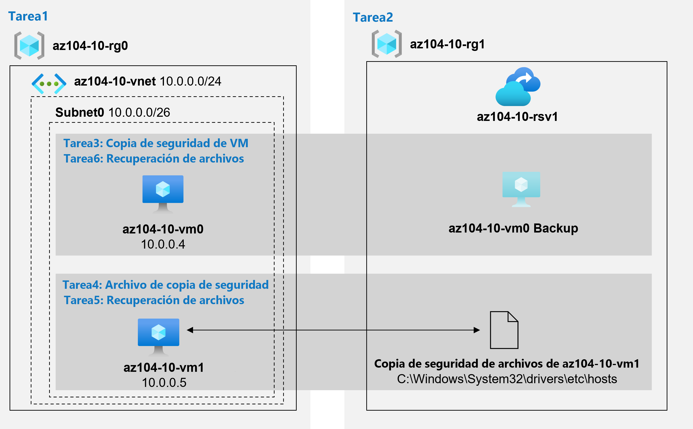

---
lab:
  title: "Laboratorio\_10: Implementación de la protección de datos"
  module: Administer Data Protection
---

# Laboratorio 10: Copia de seguridad de máquinas virtuales
# Manual de laboratorio para alumnos

## Escenario del laboratorio

Se le ha encargado la tarea de evaluar el uso de Azure Recovery Services para la copia de seguridad y la restauración de archivos hospedados en máquinas virtuales de Azure y equipos locales. Además, quiere identificar los métodos de protección de los datos almacenados en el almacén de Recovery Services frente a pérdidas de datos accidentales o malintencionadas.

                **Nota:** Hay disponible una **[simulación de laboratorio interactiva](https://mslabs.cloudguides.com/guides/AZ-104%20Exam%20Guide%20-%20Microsoft%20Azure%20Administrator%20Exercise%2016)** que le permite realizar sus propias selecciones a su entera discreción. Es posible que encuentre pequeñas diferencias entre la simulación interactiva y el laboratorio hospedado, pero las ideas y los conceptos básicos que se muestran son los mismos. 

## Objetivos

En este laboratorio, aprenderá a:

+ Tarea 1: Aprovisionar el entorno de laboratorio
+ Tarea 2: Crear un almacén de Recovery Services
+ Tarea 3: Implementar la copia de seguridad a nivel de máquina virtual de Azure
+ Tarea 4: Implementar la copia de seguridad de archivos y carpetas
+ Tarea 5: Realizar la recuperación de archivos mediante el agente de Azure Recovery Services
+ Tarea 6: Realizar la recuperación de archivos mediante instantáneas de máquinas virtuales de Azure (opcional)
+ Tarea 7: Revisar la funcionalidad de eliminación temporal de Azure Recovery Services (opcional)

## Tiempo estimado: 50 minutos

## Diagrama de la arquitectura



### Instrucciones

## Ejercicio 1

## Tarea 1: Aprovisionar el entorno de laboratorio

En esta tarea, implementará dos máquinas virtuales que se usarán para probar diferentes escenarios de copia de seguridad.

1. Inicie sesión en [Azure Portal](https://portal.azure.com).

1. Haga clic en el icono de la esquina superior derecha de Azure Portal para abrir **Azure Cloud Shell**.

1. Si se le pide que seleccione **Bash** o **PowerShell**, seleccione **PowerShell**.

    >**Nota**: Si es la primera vez que inicia **Cloud Shell** y aparece el mensaje **No tiene ningún almacenamiento montado**, seleccione la suscripción que utiliza en este laboratorio y haga clic en **Crear almacenamiento**.

1. En la barra de herramientas del panel de Cloud Shell, haga clic en el icono **Cargar/Descargar archivos**, haga clic en **Cargar** en el menú desplegable y cargue los archivos **\\Allfiles\\Labs\\10\\az104-10-vms-edge-template.json** y **\\Allfiles\\Labs\\10\\az104-10-vms-edge-parameters.json** en el directorio principal de Cloud Shell.

1. En el panel de Cloud Shell, ejecute lo siguiente para crear el grupo de recursos que hospedará las máquinas virtuales (reemplace el marcador de posición `[Azure_region]` por el nombre de una región de Azure donde tiene pensado implementar las máquinas virtuales de Azure). Escriba cada línea de comandos por separado y ejecútelas por separado:

   ```powershell
   $location = '[Azure_region]'
    ```
    
   ```powershell
   $rgName = 'az104-10-rg0'
    ```
    
   ```powershell
   New-AzResourceGroup -Name $rgName -Location $location
   ```

1. En el panel de Cloud Shell, ejecute lo siguiente para crear la primera red virtual e implementar una máquina virtual en ella mediante los archivos de parámetros y plantilla que cargó:
    >**Nota**: Se le pedirá que proporcione una contraseña de administrador.
    
   ```powershell
   New-AzResourceGroupDeployment `
      -ResourceGroupName $rgName `
      -TemplateFile $HOME/az104-10-vms-edge-template.json `
      -TemplateParameterFile $HOME/az104-10-vms-edge-parameters.json `
      -AsJob
   ```

1. Minimice el panel de Cloud Shell panel (pero no lo cierre).

    >**Nota**: No espere a que se completen las implementaciones, sino que avance a la siguiente tarea. La implementación tardará unos 5 minutos.

## Tarea 2: Crear un almacén de Recovery Services

En esta tarea, creará un almacén de Recovery Services.

1. En Azure Portal, busque y seleccione **Almacenes de Recovery Services** y, en la hoja **Almacenes de Recovery Services**, haga clic en **+ Crear**.

1. En la hoja **Create Recovery Services vault** (Crear almacén de Recovery Services), configure las opciones siguientes:

    | Configuración | Value |
    | --- | --- |
    | Subscription | nombre de la suscripción de Azure que usa en este laboratorio |
    | Resource group | Nombre de un nuevo grupo de recursos **az104-10-rg1** |
    | Nombre del almacén | **az104-10-rsv1** |
    | Region | Nombre de una región donde implementó las dos máquinas virtuales en la tarea anterior |

    >**Nota**: Asegúrese de especificar la misma región en la que implementó las máquinas virtuales en la tarea anterior.

1. Haga clic en **Revisar y crear**, asegúrese de que se haya superado la validación y haga clic en **Crear**.

    >**Nota**: Espere a que la implementación se complete. La implementación debería tardar menos de 1 minuto.

1. Cuando se haya completado la implementación, haga clic en **Ir al recurso**.

1. En la hoja del almacén de Recovery Services **az104-10-rsv1**, en la sección **Configuración**, haga clic en **Propiedades**.

1. En la hoja **az104-10-rsv1 - Propiedades**, haga clic en el vínculo **Actualizar** bajo la etiqueta **Configuración de copia de seguridad**.

1. En la hoja **Configuración de copia de seguridad**, revise las opciones del **tipo de replicación de almacenamiento**. Deje establecido el valor predeterminado de **Redundancia geográfica** y cierre la hoja.

    >**Nota**: Esta opción solo se puede configurar si no hay elementos de copia de seguridad existentes.

1. De nuevo en la hoja **az104-10-rsv1 - Propiedades**, haga clic en el vínculo **Actualizar** bajo la etiqueta **Configuración de seguridad**.

1. En la hoja **Configuración de seguridad**, tenga en cuenta que la opción **Eliminación temporal (para cargas de trabajo que se ejecutan en Azure)**  está **habilitada**.

1. Cierre la hoja **Configuración de seguridad** y, de nuevo en la hoja del almacén de Recovery Services **az104-10-rsv1**, haga clic en **Información general**.

## Tarea 3: Implementar la copia de seguridad a nivel de máquina virtual de Azure

En esta tarea, implementará la copia de seguridad a nivel de máquina virtual de Azure.

   >**Nota**: Antes de comenzar esta tarea, asegúrese de que la implementación que inició en la primera tarea de este laboratorio se haya completado correctamente.

1. En la hoja del almacén de Recovery Services **az104-10-rsv1**, haga clic en **Información general** y, luego, en **+ Copia de seguridad**.

1. En la hoja **Objetivo de Backup**, configure las opciones siguientes:

    | Configuración | Value |
    | --- | --- |
    | ¿Dónde se ejecuta su carga de trabajo? | **Azure** |
    | ¿De qué quiere hacer una copia de seguridad? | **Máquina virtual** |

1. En la hoja **Objetivo de Backup**, haga clic en **Copia de seguridad**.

1. En la **Directiva de copia de seguridad**, revise la configuración de **DefaultPolicy** y seleccione **Crear nueva directiva**.

1. Defina una nueva directiva de copia de seguridad con las siguientes opciones de configuración (deje las demás con los valores predeterminados):

    | Configuración | Value |
    | ---- | ---- |
    | Nombre de la directiva | **az104-10-backup-policy** |
    | Frecuencia | **A diario** |
    | Time | **12:00 a. m.** |
    | Zona horaria | Nombre de la zona horaria local |
    | Conservar las instantáneas de recuperación instantánea durante | **2** días |

1. Haga clic en **Aceptar** para crear la directiva y luego, en la sección **Máquinas virtuales**, seleccione **Añadir**.

1. En la hoja **Seleccionar máquinas virtuales**, seleccione **az104-10-vm0**, haga clic en **Aceptar** y, de nuevo en la hoja **Copia de seguridad**, haga clic en **Habilitar copia de seguridad**.

    >**Nota**: Espere a que se habilite la copia de seguridad. Este proceso tardará alrededor de 2 minutos.

1. Vuelva a la hoja del almacén de Recovery Services **az104-10-rsv1**; en la sección **Elementos protegidos**, haga clic en **Elementos de copia de seguridad** y, a continuación, haga clic en la entrada **Máquina virtual de Azure**.

1. En la hoja **Elementos de copia de seguridad (Máquina virtual de Azure)** , seleccione **Ver detalles** en **az104-10-vm0** y revise los valores de las entradas **Comprobación previa a la copia de seguridad** y **Estado de la última copia de seguridad**.

1. En la hoja del elemento de copia de seguridad **az104-10-vm0**, haga clic en **Hacer copia de seguridad ahora**, acepte el valor predeterminado en la lista desplegable **Conservar copia de seguridad hasta** y haga clic en **Aceptar**.

    >**Nota**: No espere a que se complete la copia de seguridad, sino que avance a la siguiente tarea.

## Tarea 4: Implementar la copia de seguridad de archivos y carpetas

En esta tarea, implementará la copia de seguridad de archivos y carpetas mediante Azure Recovery Services.

1. En Azure Portal, busque y seleccione **Máquinas virtuales** y, en la hoja **Máquinas virtuales**, haga clic en **az104-10-vm1**.

1. En la hoja **az104-10-vm1**, haga clic en **Conectar**, en el menú desplegable, haga clic en **RDP**, en la hoja **Conectar con RDP**, haga clic en **Descargar archivo RDP** y siga las indicaciones para iniciar la sesión de Escritorio remoto.

    >**Nota**: Este paso hace referencia a la conexión mediante Escritorio remoto desde un equipo Windows. En un equipo Mac, puede usar un cliente de Escritorio remoto de Mac App Store y, en un equipo Linux, puede usar un software cliente RDP de código abierto.

    >**Nota**: Puede omitir cualquier aviso de advertencia al conectarse a las máquinas virtuales de destino.

1. Cuando el sistema se lo indique, inicie sesión con el nombre de usuario **Student** y la contraseña del archivo de parámetros.

    >**Nota**: Dado que Azure Portal ya no admite IE11, tendrá que usar el explorador Microsoft Edge para esta tarea.

1. Dentro de la sesión de Escritorio remoto en la máquina virtual de Azure **az104-10-vm1**, inicie un explorador web Edge, vaya a [Azure Portal](https://portal.azure.com) e inicie sesión con sus credenciales.

1. En Azure Portal, busque y seleccione **Almacenes de Recovery Services** y, en la hoja **Almacenes de Recovery Services**, haga clic en **az104-10-rsv1**.

1. En la hoja del almacén de Recovery Services **az104-10-rsv1**, haga clic en **+ Copia de seguridad**.

1. En la hoja **Objetivo de Backup**, configure las opciones siguientes:

    | Configuración | Value |
    | --- | --- |
    | ¿Dónde se ejecuta su carga de trabajo? | **Configuración local** |
    | ¿De qué quiere hacer una copia de seguridad? | **Archivos y carpetas** |

    >**Nota**: Aunque la máquina virtual que usa en esta tarea se ejecuta en Azure, puede aprovecharla para evaluar las funcionalidades de copia de seguridad aplicables a cualquier equipo local que ejecute el sistema operativo Windows Server.

1. En la hoja **Objetivo de Backup**, haga clic en **Preparar infraestructura**.

1. En la hoja **Preparar infraestructura**, haga clic en el vínculo **Descargar agente para Windows Server o cliente de Windows**.

1. Cuando se le solicite, haga clic en **Ejecutar** para iniciar la instalación de **MARSAgentInstaller.exe** con la configuración predeterminada.

    >**Nota**: En la página **Participación en Microsoft Update** del **Asistente para la instalación de Agente de Microsoft Azure Recovery Services**, seleccione la opción de instalación **No deseo usar Microsoft Update**.

1. En la página **Instalación** del **Asistente para la instalación de Agente de Microsoft Azure Recovery Services**, haga clic en **Proceder al registro**. Con esto, se iniciará el **Asistente para registrar servidor**.

1. Cambie a la ventana del explorador web que muestra Azure Portal, en la hoja **Preparar infraestructura**, active la casilla **Ya se ha descargado o se usa la última instalación de Recovery Server** y haga clic en **Descargar**.

1. Cuando se le pregunte si desea abrir o guardar el archivo de credenciales del almacén, haga clic en **Guardar**. Con esto se guardará el archivo de credenciales del almacén en la carpeta Descargas local.

1. Vuelva a la ventana **Asistente para registrar servidor** y, en la página **Identificación del almacén**, haga clic en **Examinar**.

1. En el cuadro de diálogo **Seleccionar credenciales de almacén**, vaya a la carpeta **Descargas**, haga clic en el archivo de credenciales del almacén que descargó y haga clic en **Abrir**.

1. De nuevo en la página **Identificación del almacén**, haga clic en **Siguiente**.

1. Asegúrese de que no esté activada la opción **Guardar frase de contraseña de forma segura en Azure Key Vault**. 

1. En la página **Configuración de cifrado** del **Asistente para registrar servidor**, haga clic en **Generar frase de contraseña**.

1. En la página **Configuración de cifrado** del **Asistente para registrar servidor**, haga clic en el botón **Examinar** junto a **Escriba una ubicación para guardar la frase de contraseña**.

1. En el cuadro de diálogo **Buscar carpeta**, seleccione la carpeta **Documentos** y haga clic en **Aceptar**.

1. Haga clic en **Finalizar**, revise la advertencia de **Microsoft Azure Backup**, haga clic en **Sí** y espere a que se complete el registro.

    >**Nota**: En un entorno de producción, debe almacenar el archivo de frase de contraseña en una ubicación segura que no sea el servidor del que se va a hacer una copia de seguridad.

1. En la página **Registro del servidor** del **Asistente para registrar servidor**, revise la advertencia relativa a la ubicación del archivo de frase de contraseña, asegúrese de que la casilla **Inicio del agente de Microsoft Azure Recovery Services** esté activada y haga clic en **Cerrar**. Con esto se abrirá automáticamente la consola de **Microsoft Azure Backup**.

1. En la consola de **Microsoft Azure Backup**, en el panel **Acciones**, haga clic en **Programar copia de seguridad**.

1. En el **Asistente para programar copias de seguridad**, en la página **Introducción**, haga clic en **Siguiente**.

1. En la página **Seleccionar elementos de los que realizar copia de seguridad**, haga clic en **Agregar elementos**.

1. En el cuadro de diálogo **Seleccionar elementos**, expanda **C:\\Windows\\System32\\drivers\\etc\\** , seleccione **hosts** y, a continuación, haga clic en **Aceptar**:

1. En la página **Seleccionar elementos de los que realizar copia de seguridad**, haga clic en **Siguiente**.

1. En la página **Especifique la programación de copia de seguridad**, asegúrese de que la opción **Día** esté seleccionada, en el primer cuadro de lista desplegable debajo del cuadro **Las horas siguientes (el máximo permitido es tres veces al día)** , seleccione **4:30 a. m.** y, a continuación, haga clic en **Siguiente**.

1. En la página **Seleccionar directiva de retención**, acepte los valores predeterminados y haga clic en **Siguiente**.

1. En la página **Elija el tipo de copia de seguridad inicial**, acepte los valores predeterminados y haga clic en **Siguiente**.

1. En la página **Confirmación**, haga clic en **Finalizar**. Cuando se cree la programación de copia de seguridad, haga clic en **Cerrar**.

1. En la consola de **Microsoft Azure Backup**, en el panel Acciones, haga clic en **Hacer copia ahora**.

    >**Nota**: La opción para ejecutar la copia de seguridad a petición estará disponible una vez que se cree una copia de seguridad programada.

1. En el Asistente de hacer copia ahora, en la página **Seleccionar elemento de copia de seguridad**, asegúrese de que la opción **Archivos y carpetas** esté seleccionada y haga clic en **Siguiente**.

1. En la página **Conservar copia de seguridad hasta**, acepte la configuración predeterminada y haga clic en **Siguiente**.

1. En la página **Confirmación**, haga clic en **Copia de seguridad**.

1. Una vez que se complete la copia de seguridad, haga clic en **Cerrar** y, a continuación, cierre Microsoft Azure Backup.

1. Cambie a la ventana del explorador web donde aparece Azure Portal, vuelva a la hoja de **Almacén de Recovery Services**, en la sección **Elementos protegidos**, haga clic en **Elementos de copia de seguridad**.

1. En la hoja del **az104-10-rsv1 - Elementos de copia de seguridad**, haga clic en **Agente de copia de seguridad de Azure**.

1. En la hoja **Elementos de copia de seguridad (Agente de copia de seguridad de Azure)** , compruebe que haya una entrada que hace referencia a la unidad **C:\\** de **az104-10-vm1**.

## Tarea 5: Realizar la recuperación de archivos mediante el agente de Azure Recovery Services (opcional)

En esta tarea, realizará la restauración de archivos mediante el agente de Azure Recovery Services.

1. En la sesión de Escritorio remoto en **az104-10-vm1**, abra el Explorador de archivos, vaya a la carpeta **C:\\Windows\\System32\\drivers\\etc\\** y elimine el archivo **hosts**.

1. Abra Microsoft Azure Backup y haga clic en **Recuperar datos** en el panel **Acciones**. Con esto se iniciará el **Asistente de recuperación de datos**.

1. En la página **Introducción** del **Asistente de recuperación de datos**, asegúrese de que la opción **Este servidor (az104-10-vm1)** esté seleccionada y haga clic en **Siguiente**.

1. En la página **Seleccionar modo de recuperación**, asegúrese de que la opción **Archivos y carpetas individuales** esté seleccionada y haga clic en **siguiente**.

1. En la página **Seleccionar volumen y fecha**, en la lista desplegable **Seleccionar el volumen**, seleccione **C:\\** , acepte la selección predeterminada de la copia de seguridad disponible y haga clic en **Montar**.

    >**Nota**: Espere a que se complete la operación de montaje. Esto puede tardar unos 2 minutos.

1. En la página **Examinar y recuperar archivos**, anote la letra de unidad del volumen de recuperación y revise la sugerencia sobre el uso de robocopy.

1. Haga clic en **Inicio**, expanda la carpeta **Sistema de Windows** y haga clic en **Símbolo del sistema**.

1. En el Símbolo del sistema, ejecute lo siguiente para copiar el archivo **hosts** en la ubicación original (reemplace `[recovery_volume]` por la letra de unidad del volumen de recuperación que identificó anteriormente):

   ```sh
   robocopy [recovery_volume]:\Windows\System32\drivers\etc C:\Windows\system32\drivers\etc hosts /r:1 /w:1
   ```

1. Vuelva al **Asistente de recuperación de datos** y, en **Examinar y recuperar archivos**, haga clic en **Desmontar** y, cuando se le pida confirmación, haga clic en **Sí**.

1. Finalice la sesión de Escritorio remoto.

## Tarea 6: Realizar la recuperación de archivos mediante instantáneas de máquinas virtuales de Azure (opcional)

En esta tarea, restaurará un archivo a partir de la copia de seguridad basada en instantáneas a nivel de máquina virtual de Azure.

1. Cambie a la ventana del explorador que se ejecuta en el equipo del laboratorio y donde aparece Azure Portal.

1. En Azure Portal, busque y seleccione **Máquinas virtuales** y, en la hoja **Máquinas virtuales**, haga clic en **az104-10-vm0**.

1. En la hoja **az104-10-vm0**, haga clic en **Conectar**, en el menú desplegable, haga clic en **RDP**, en la hoja **Conectar con RDP**, haga clic en **Descargar archivo RDP** y siga las indicaciones para iniciar la sesión de Escritorio remoto.

    >**Nota**: Este paso hace referencia a la conexión mediante Escritorio remoto desde un equipo Windows. En un equipo Mac, puede usar un cliente de Escritorio remoto de Mac App Store y, en un equipo Linux, puede usar un software cliente RDP de código abierto.

    >**Nota**: Puede omitir cualquier aviso de advertencia al conectarse a las máquinas virtuales de destino.

1. Cuando el sistema se lo indique, inicie sesión con el nombre de usuario **Student** y la contraseña del archivo de parámetros.

   >**Nota**: Dado que Azure Portal ya no admite IE11, tendrá que usar el explorador Microsoft Edge para esta tarea.

1. En la sesión de Escritorio remoto de **az104-10-vm0**, haga clic en **Inicio**, expanda la carpeta **Sistema de Windows** y haga clic en **Símbolo del sistema**.

1. Desde el Símbolo del sistema, ejecute lo siguiente para eliminar el archivo **hosts**:

   ```sh
   del C:\Windows\system32\drivers\etc\hosts
   ```

   >**Nota**: Más adelante en esta tarea, restaurará este archivo a partir de la copia de seguridad basada en instantáneas a nivel de máquina virtual de Azure.

1. Dentro de la sesión de Escritorio remoto en la máquina virtual de Azure **az104-10-vm0**, inicie un explorador web Edge, vaya a [Azure Portal](https://portal.azure.com) e inicie sesión con sus credenciales.

1. En Azure Portal, busque y seleccione **Almacenes de Recovery Services** y, en la hoja **Almacenes de Recovery Services**, haga clic en **az104-10-rsv1**.

1. En la hoja del almacén de Recovery Services **az104-10-rsv1**, en la sección **Elementos protegidos**, haga clic en **Elementos de copia de seguridad**.

1. En la hoja **az104-10-rsv1 - Elementos de copia de seguridad**, haga clic en **Máquina virtual de Azure**.

1. En la hoja **Elementos de copia de seguridad (Máquina virtual de Azure),** seleccione **Ver detalles** para **az104-10-vm0**.

1. En la hoja del elemento de copia de seguridad **az104-10-vm0**, haga clic en **Recuperación de archivos**.

    >**Nota**: Tiene la opción de ejecutar la recuperación poco después de que se inicie la copia de seguridad en función de la instantánea coherente con la aplicación.

1. En la hoja **Recuperación de archivos**, acepte el punto de recuperación predeterminado y haga clic en **Descargar ejecutable**.

    >**Nota**: El script monta los discos desde el punto de recuperación seleccionado como unidades locales dentro del sistema operativo desde el que se ejecuta el script.

1. Haga clic en **Descargar** y, cuando se le pregunte si desea ejecutar o guardar **IaaSVMILRExeForWindows.exe**, haga clic en **Guardar**.

1. De nuevo en la ventana del Explorador de archivos, haga doble clic en el archivo recién descargado.

1. Cuando se le pida que escriba la contraseña del portal, copie la contraseña del cuadro de texto **Contraseña para ejecutar el script** en la hoja **Recuperación de archivos**, péguela en el Símbolo del sistema y presione **ENTRAR**.

    >**Nota**: Se abrirá una ventana de Windows PowerShell que muestra el progreso del montaje.

    >**Nota**: Si en este momento recibe un mensaje de error, actualice la ventana del explorador web y repita los tres últimos pasos.

1. Espere a que se complete el proceso de montaje, revise los mensajes informativos en la ventana de Windows PowerShell, anote la letra de unidad asignada al volumen que hospeda **Windows** e inicie el Explorador de archivos.

1. En el Explorador de archivos, vaya a la letra de unidad que hospeda la instantánea del volumen del sistema operativo que identificó en el paso anterior y revise el contenido.

1. Cambie a la ventana del **Símbolo del sistema**.

1. En el Símbolo del sistema, ejecute lo siguiente para copiar el archivo **hosts** en la ubicación original (reemplace `[os_volume]` por la letra de unidad del volumen del sistema operativo que identificó anteriormente):

   ```sh
   robocopy [os_volume]:\Windows\System32\drivers\etc C:\Windows\system32\drivers\etc hosts /r:1 /w:1
   ```

1. Cambie nuevamente a la hoja **Recuperación de archivos** de Azure Portal y haga clic en **Desmontar discos**.

1. Finalice la sesión de Escritorio remoto.

## Tarea 7: Revisar la funcionalidad de eliminación temporal de Azure Recovery Services

1. En el equipo del laboratorio, en Azure Portal, busque y seleccione **Almacenes de Recovery Services** y, en la hoja **Almacenes de Recovery Services**, haga clic en **az104-10-rsv1**.

1. En la hoja del almacén de Recovery Services **az104-10-rsv1**, en la sección **Elementos protegidos**, haga clic en **Elementos de copia de seguridad**.

1. En la hoja del **az104-10-rsv1 - Elementos de copia de seguridad**, haga clic en **Agente de copia de seguridad de Azure**.

1. En la hoja **Elementos de copia de seguridad (Agente de copia de seguridad de Azure)** , haga clic en la entrada que representa la copia de seguridad de **az104-10-vm1**.

1. En **C:\\ en la hoja az104-10-vm1.**, seleccione **Ver detalles** para **az104-10-vm1.** .

1. En la hoja Detalles, haga clic en **az104-10-vm1**.

1. En la hoja de servidores protegidos **az104-10-vm1.**, haga clic en **Eliminar**.

1. En la hoja **Eliminar**, configure las opciones siguientes.

    | Configuración | Value |
    | --- | --- |
    | ESCRIBA EL NOMBRE DEL SERVIDOR | **az104-10-vm1.** |
    | Motivo | **Reciclaje del servidor de desarrollo/pruebas** |
    | Comentarios | **az104 10 lab** |

    >**Nota**: Asegúrese de incluir el punto final al escribir el nombre del servidor.

1. Active la casilla situada junto a la etiqueta **Hay datos de copia de seguridad de 1 elementos de copia de seguridad asociados con este servidor. Entiendo que, al hacer clic en "Confirmar", se eliminarán permanentemente todos los datos de la copia de seguridad en la nube. Esta acción no se puede deshacer. Se puede enviar una alerta a los administradores de esta suscripción para notificar esta eliminación**, y haga clic en **Eliminar**.

    >**Nota**: Esto producirá un error porque la característica de **eliminación temporal** debe estar deshabilitada.

1. Vuelva a la hoja **az104-10-rsv1 - Elementos de copia de seguridad** y haga clic en **Máquinas virtuales de Azure**.

1. En la hoja **az104-10-rsv1 - Elementos de copia de seguridad**, haga clic en **Máquina virtual de Azure**.

1. En la hoja **Elementos de copia de seguridad (Máquina virtual de Azure),** seleccione **Ver detalles** para **az104-10-vm0**.

1. En la hoja del elemento de copia de seguridad **az104-10-vm0**, haga clic en **Detener copia de seguridad**.

1. En la hoja **Detener copia de seguridad**, seleccione **Eliminar datos de la copia de seguridad**, configure las opciones siguientes y haga clic en **Detener copia de seguridad**:

    | Configuración | Value |
    | --- | --- |
    | Escriba el nombre del elemento de copia de seguridad | **az104-10-vm0** |
    | Motivo | **Otros** |
    | Comentarios | **az104 10 lab** |

1. Vuelva a la hoja **az104-10-rsv1 - Elementos de copia de seguridad** y haga clic en **Actualizar**.

    >**Nota**: La entrada **Máquina virtual de Azure** aún enumera **1** elemento de copia de seguridad.

1. Haga clic en la entrada **Máquina virtual de Azure** y, en la hoja **Elementos de copia de seguridad (máquina virtual de Azure)** , haga clic en la entrada **az104-10-vm0**.

1. En la hoja del elemento de copia de seguridad **az104-10-vm0**, observe que tiene la opción de **Recuperar** la copia de seguridad eliminada.

    >**Nota**: Esta funcionalidad está a cargo de la característica de eliminación temporal, que está habilitada de manera predeterminada para las copias de seguridad de máquinas virtuales de Azure.

1. Vuelva a la hoja del almacén de Recovery Services **az104-10-rsv1** y, en la sección **Configuración**, haga clic en **Propiedades**.

1. En la hoja **az104-10-rsv1 - Propiedades**, haga clic en el vínculo **Actualizar** bajo la etiqueta **Configuración de seguridad**.

1. En la hoja **Configuración de seguridad**, deshabilite la opción **Eliminación temporal (para cargas de trabajo que se ejecutan en Azure)** y deshabilite también las **características de seguridad (para cargas de trabajo que se ejecutan en el entorno local)** y haga clic en **Guardar**.

    >**Nota**: Esto no afectará a los elementos que ya están en estado de eliminación temporal.

1. Cierre la hoja **Configuración de seguridad** y, de nuevo en la hoja del almacén de Recovery Services **az104-10-rsv1**, haga clic en **Información general**.

1. Vuelva a la hoja del elemento de copia de seguridad **az104-10-vm0** y haga clic en **Recuperar**.

1. En la hoja **Recuperar az104-10-vm0**, haga clic en **Recuperar**.

1. Espere a que se complete la operación de recuperación, actualice la página del explorador web, si es necesario, vuelva a la hoja del elemento de copia de seguridad **az104-10-vm0** y haga clic en **Eliminar datos de la copia de seguridad**.

1. En la hoja **Eliminar datos de la copia de seguridad**, configure las opciones siguientes y haga clic en **Eliminar**:

    | Configuración | Value |
    | --- | --- |
    | Escriba el nombre del elemento de copia de seguridad | **az104-10-vm0** |
    | Motivo | **Otros** |
    | Comentarios | **az104 10 lab** |

1. Repita los pasos al principio de esta tarea para eliminar los elementos de copia de seguridad de **az104-10-vm1**.

## Limpieza de recursos

>**Nota**: No olvide quitar los recursos de Azure recién creados que ya no use. La eliminación de los recursos sin usar garantiza que no verá cargos inesperados.

>**Nota:** No se preocupe si los recursos del laboratorio no se pueden quitar inmediatamente. A veces, los recursos tienen dependencias y se tarda más tiempo en eliminarlos. Supervisar el uso de los recursos es una tarea habitual del administrador, así que solo tiene que revisar periódicamente los recursos en el portal para ver cómo va la limpieza. 

1. En Azure Portal, abra la sesión de **PowerShell** en el panel **Cloud Shell**.

1. Ejecute el comando siguiente para enumerar todos los grupos de recursos que se han creado en los laboratorios de este módulo:

   ```powershell
   Get-AzResourceGroup -Name 'az104-10*'
   ```

1. Ejecute el comando siguiente para eliminar todos los grupos de recursos que ha creado en los laboratorios de este módulo:

   ```powershell
   Get-AzResourceGroup -Name 'az104-10*' | Remove-AzResourceGroup -Force -AsJob
   ```

   >**Nota**: De manera opcional, podría considerar la posibilidad de eliminar el grupo de recursos generado automáticamente con el prefijo **AzureBackupRG_** (no hay ningún cargo adicional asociado a su existencia).

    >**Nota**: El comando se ejecuta de forma asincrónica (según determina el parámetro -AsJob). Aunque podrá ejecutar otro comando de PowerShell inmediatamente después en la misma sesión de PowerShell, los grupos de recursos tardarán unos minutos en eliminarse.

## Revisar

En este laboratorio, ha:

+ Aprovisionado el entorno de laboratorio
+ Creado un almacén de Recovery Services
+ Implementado la copia de seguridad a nivel de máquina virtual de Azure
+ Implementado la copia de seguridad de archivos y carpetas
+ Realizado la recuperación de archivos mediante el agente de Azure Recovery Services
+ Realizado la recuperación de archivos mediante instantáneas de máquinas virtuales de Azure
+ Revisado la funcionalidad de eliminación temporal de Azure Recovery Services
