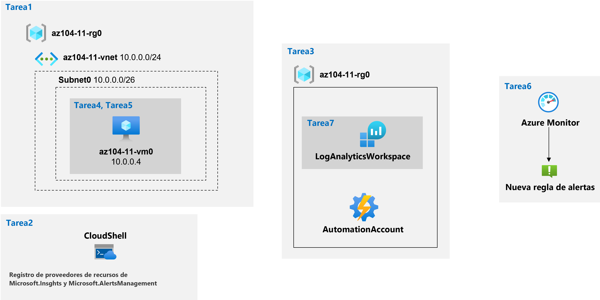

---
lab:
  title: '11: Implementación de la supervisión'
  module: Administer Monitoring
---

# <a name="lab-11---implement-monitoring"></a>Laboratorio 11: Implementación de la supervisión
# <a name="student-lab-manual"></a>Manual de laboratorio para alumnos

## <a name="lab-scenario"></a>Escenario del laboratorio

Tiene que evaluar la funcionalidad de Azure que proporcionaría información sobre el rendimiento y la configuración de los recursos de Azure, centrándose en particular en las máquinas virtuales de Azure. Para ello, tiene previsto examinar las funcionalidades de Azure Monitor, incluido Log Analytics.

                **Nota:** Hay disponible una **[simulación de laboratorio interactiva](https://mslabs.cloudguides.com/guides/AZ-104%20Exam%20Guide%20-%20Microsoft%20Azure%20Administrator%20Exercise%2017)** que le permite realizar sus propias selecciones a su entera discreción. Es posible que encuentre pequeñas diferencias entre la simulación interactiva y el laboratorio hospedado, pero las ideas y los conceptos básicos que se muestran son los mismos. 

## <a name="objectives"></a>Objetivos

En este laboratorio, aprenderá a:

+ Tarea 1: Aprovisionar el entorno de laboratorio
+ Tarea 2: Registrar los proveedores de recursos Microsoft.Insghts y Microsoft.AlertsManagement
+ Tarea 3: Crear y configurar un área de trabajo de Azure Log Analytics y soluciones basadas en Azure Automation
+ Tarea 4: Revisar la configuración de supervisión predeterminada de las máquinas virtuales de Azure
+ Tarea 5: Configurar las opciones de diagnóstico de máquinas virtuales de Azure
+ Tarea 6: Revisar las funcionalidad de Azure Monitor
+ Tarea 7: Revisar las funcionalidad de Azure Log Analytics

## <a name="estimated-timing-45-minutes"></a>Tiempo estimado: 45 minutos

## <a name="architecture-diagram"></a>Diagrama de la arquitectura



## <a name="instructions"></a>Instructions

### <a name="exercise-1"></a>Ejercicio 1

#### <a name="task-1-provision-the-lab-environment"></a>Tarea 1: Aprovisionar el entorno de laboratorio

En esta tarea, implementará una máquina virtual que se usará para probar escenarios de supervisión.

1. Inicie sesión en [Azure Portal](https://portal.azure.com).

1. Haga clic en el icono de la esquina superior derecha de Azure Portal para abrir **Azure Cloud Shell**.

1. Si se le pide que seleccione **Bash** o **PowerShell**, seleccione **PowerShell**.

    >**Nota**: Si es la primera vez que inicia **Cloud Shell** y aparece el mensaje **No tiene ningún almacenamiento montado**, seleccione la suscripción que utiliza en este laboratorio y haga clic en **Crear almacenamiento**.

1. En la barra de herramientas del panel de Cloud Shell, haga clic en el icono **Cargar/Descargar archivos**, haga clic en **Cargar** en el menú desplegable y cargue los archivos **\\Allfiles\\Labs\\11\\az104-11-vm-template.json** y **\\Allfiles\\Labs\\11\\az104-11-vm-parameters.json** en el directorio principal de Cloud Shell.

1. Edite el archivo de parámetros que acaba de cargar y cambie la contraseña. Si necesita ayuda para editar el archivo en el shell, pida ayuda al instructor. Como procedimiento recomendado, los secretos, como las contraseñas, deben almacenarse de una forma más segura en el almacén de claves. 

1. En el panel de Cloud Shell, ejecute lo siguiente para crear el grupo de recursos que hospedará las máquinas virtuales (reemplace el marcador de posición `[Azure_region]` por el nombre de una región de Azure donde tiene pensado implementar las máquinas virtuales de Azure):

    >**Nota**: Asegúrese de elegir una de las regiones enumeradas como **Región del área de trabajo de Log Analytics** a la que se hace referencia en la [documentación de asignaciones de áreas de trabajo](https://docs.microsoft.com/en-us/azure/automation/how-to/region-mappings).

   ```powershell
   $location = '[Azure_region]'

   $rgName = 'az104-11-rg0'

   New-AzResourceGroup -Name $rgName -Location $location
   ```

1. En el panel de Cloud Shell, ejecute lo siguiente para crear la primera red virtual e implementar una máquina virtual en ella mediante los archivos de parámetros y plantilla que cargó:

   ```powershell
   New-AzResourceGroupDeployment `
      -ResourceGroupName $rgName `
      -TemplateFile $HOME/az104-11-vm-template.json `
      -TemplateParameterFile $HOME/az104-11-vm-parameters.json `
      -AsJob
   ```

    >**Nota**: No espere a que se completen las implementaciones, sino que avance a la siguiente tarea. La implementación tardará unos 3 minutos.

#### <a name="task-2-register-the-microsoftinsights-and-microsoftalertsmanagement-resource-providers"></a>Tarea 2: Registrar los proveedores de recursos Microsoft.Insghts y Microsoft.AlertsManagement

1. En el panel de Cloud Shell, ejecute lo siguiente para registrar los proveedores de recursos Microsoft.Insights y Microsoft.AlertsManagement.

   ```powershell
   Register-AzResourceProvider -ProviderNamespace Microsoft.Insights

   Register-AzResourceProvider -ProviderNamespace Microsoft.AlertsManagement
   ```

1. Minimice el panel de Cloud Shell panel (pero no lo cierre).

#### <a name="task-3-create-and-configure-an-azure-log-analytics-workspace-and-azure-automation-based-solutions"></a>Tarea 3: Crear y configurar un área de trabajo de Azure Log Analytics y soluciones basadas en Azure Automation

En esta tarea, va a crear y configurar un área de trabajo de Azure Log Analytics y soluciones basadas en Azure Automation.

1. En Azure Portal, busque y seleccione **Áreas de trabajo de Log Analytics** y, en la hoja **Áreas de trabajo de Log Analytics**, haga clic en **+ Crear**.

1. En la pestaña **Aspectos básicos** de la hoja **Crear un área de trabajo de Log Analytics**, escriba la siguiente configuración, haga clic en **Revisar y crear** y, luego, haga clic en **Crear**:

    | Configuración | Value |
    | --- | --- |
    | Subscription | nombre de la suscripción de Azure que usa en este laboratorio |
    | Resource group | Nombre de un nuevo grupo de recursos **az104-11-rg1** |
    | Área de trabajo de Log Analytics | Cualquier nombre único |
    | Region | Nombre de la región de Azure en la que implementó la máquina virtual en la tarea anterior |

    >**Nota**: Asegúrese de especificar la misma región en la que implementó las máquinas virtuales en la tarea anterior.

    >**Nota**: Espere a que la implementación se complete. La implementación tardará aproximadamente 1 minuto.

1. En Azure Portal, busque y seleccione **Cuentas de Automation** y, en la hoja **Cuentas de Automation**, haga clic en **+ Crear**.

1. En la hoja **Crear una cuenta de Automation**, especifique la siguiente configuración y haga clic en **Revisar y crear**, tras la validación, haga clic en **Crear**:

    | Configuración | Value |
    | --- | --- |
    | Nombre de la cuenta de Automation | Cualquier nombre único |
    | Subscription | nombre de la suscripción de Azure que usa en este laboratorio |
    | Resource group | **az104-11-rg1** |
    | Region | Nombre de la región de Azure determinada en función de la [documentación de asignaciones de áreas de trabajo](https://docs.microsoft.com/en-us/azure/automation/how-to/region-mappings) |

    >**Nota**: Asegúrese de especificar la región de Azure en función de la [documentación de asignaciones de áreas de trabajo](https://docs.microsoft.com/en-us/azure/automation/how-to/region-mappings).

    >**Nota**: Espere a que la implementación se complete. La implementación puede tardar unos 3 minutos.

1. Haga clic en **Ir al recurso**.

1. En la hoja Cuenta de Automation, haga clic en la sección **Administración de configuración**, haga clic en **Inventario**.

1. En el panel **Inventario**, en la lista desplegable **Área de trabajo de Log Analytics**, seleccione el área de trabajo de Log Analytics que creó anteriormente en esta tarea y haga clic en **Habilitar**.

    >**Nota**: Espere a que se complete la instalación de la solución de Log Analytics correspondiente. Esto puede tardar unos 3 minutos.

    >**Nota**: Esto también instala automáticamente la solución de **Seguimiento de cambios**.

1. En la hoja Cuenta de Automation, en la sección **Administración de actualizaciones**, haga clic en **Administración de actualizaciones** y haga clic en **Actualizar**.

    >**Nota**: Espere a que termine la instalación. Esto puede tardar unos cinco minutos.

#### <a name="task-4-review-default-monitoring-settings-of-azure-virtual-machines"></a>Tarea 4: Revisar la configuración de supervisión predeterminada de las máquinas virtuales de Azure

En esta tarea, revisará la configuración de supervisión predeterminada de las máquinas virtuales de Azure.

1. En Azure Portal, busque y seleccione **Máquinas virtuales** y, en la hoja **Máquinas virtuales**, haga clic en **az104-11-vm0**.

1. En la hoja **az104-11-vm0**, en la sección **Supervisión**, haga clic en **Métricas**.

1. En la hoja **az104-11-vm0 \| Métricas**, en el gráfico predeterminado, tenga en cuenta que el único **Espacio de nombres de métricas** disponible es **Host de máquina virtual**.

    >**Nota**: Esto es lo esperado, ya que aún no se ha configurado ninguna opción de diagnóstico a nivel de invitado. Sin embargo, tiene la opción de habilitar las métricas de memoria de invitado directamente desde la lista desplegable **Espacio de nombres de métricas**. Las habilitará más adelante en este ejercicio.

1. En la lista desplegable **Métricas**, revise la lista de métricas disponibles.

    >**Nota**: La lista incluye un intervalo de métricas relacionadas con la CPU, el disco y la red, que se pueden recopilar del host de máquina virtual, sin tener acceso a las métricas a nivel de invitado.

1. En la lista desplegable **Métrica**, seleccione **Porcentaje de CPU**, en la lista desplegable **Agregación**, seleccione **Promedio** y revise el gráfico resultante.

#### <a name="task-5-configure-azure-virtual-machine-diagnostic-settings"></a>Tarea 5: Configurar las opciones de diagnóstico de máquinas virtuales de Azure

En esta tarea, configurará las opciones de diagnóstico de máquinas virtuales de Azure.

1. En la hoja **az104-11-vm0**, en la sección **Supervisión**, haga clic en **Configuración de diagnóstico**.

1. En la pestaña **Información general** de la hoja **az104-11-vm0 \| Configuración de diagnóstico**, haga clic en **Habilitar supervisión a nivel de invitado**.

    >**Nota**: Espere a que la operación surta efecto. Esto puede tardar unos 3 minutos.

1. Cambie a la pestaña **Contadores de rendimiento** de la hoja **az104-11-vm0 \| Configuración de diagnóstico** y revise los contadores disponibles.

    >**Nota**: De manera predeterminada, los contadores de CPU, memoria, disco y red están habilitados. Puede cambiar a la vista **Personalizado** para obtener una lista más detallada.

1. Cambie a la pestaña **Registros** de la hoja **az104-11-vm0 \| Configuración de diagnóstico** y revise las opciones de recopilación de registros de eventos disponibles.

    >**Nota**: De manera predeterminada, la recopilación de registros incluye entradas críticas, de error y de advertencia del registro de aplicaciones y del registro del sistema, así como entradas de error de auditoría del registro de seguridad. Aquí también puede cambiar a la vista **Personalizado** para obtener opciones de configuración más detalladas.

1. En la hoja **az104-11-vm0**, en la sección **Supervisión**, haga clic en **Agente de Log Analytics** y, luego, haga clic en **Habilitar**.

1. En la hoja **az104-11-vm0 - Registros**, asegúrese de que el área de trabajo de Log Analytics que creó anteriormente en este laboratorio esté seleccionada en la lista desplegable **Elija un área de trabajo de Log Analytics** y haga clic en **Habilitar**.

    >**Nota**: No espere a que se complete la operación, sino que avance al siguiente paso. La operación puede tardar unos 5 minutos.

1. En la hoja **az104-11-vm0 \| Registros**, en la sección **Supervisión**, haga clic en **Métricas**.

1. En la hoja **az104-11-vm0 \| Métricas**, en el gráfico predeterminado, tenga en cuenta que, en este momento, la lista desplegable **Espacio de nombres de métrica**, además de la entrada **Host de máquina virtual**, también incluye la entrada **Invitado (clásico)**.

    >**Nota**: Esto es lo esperado, ya que ha habilitado la configuración de diagnóstico a nivel de invitado. También tiene la opción **Habilitar nuevas métricas de memoria de invitado**.

1. En la lista desplegable **Espacio de nombres de métrica**, seleccione la entrada **Invitado (clásico)**.

1. En la lista desplegable **Métricas**, revise la lista de métricas disponibles.

    >**Nota**: La lista incluye métricas a nivel de invitado adicionales que no están disponibles cuando solo se basa en la supervisión a nivel de host.

1. En la lista desplegable **Métrica**, seleccione **Memoria\\Bytes disponibles**, en la lista desplegable **Agregación**, seleccione **Máx.** y revise el gráfico resultante.

#### <a name="task-6-review-azure-monitor-functionality"></a>Tarea 6: Revisar las funcionalidad de Azure Monitor

1. En Azure Portal, busque y seleccione **Monitor** y, en la hoja **Monitor \| Información general**, haga clic en **Métricas**.

1. En la hoja **Seleccionar un ámbito**, en la pestaña **Examinar**, vaya al grupo de recursos **az104-11-rg0**, expándalo, seleccione la casilla situada junto a la entrada de máquina virtual **az104-11-vm0** dentro de ese grupo de recursos y haga clic en **Aplicar**.

    >**Nota**: Esto le ofrece la misma vista y opciones que las disponibles en la hoja **az104-11-vm0 - Métricas**.

1. En la lista desplegable **Métrica**, seleccione **Porcentaje de CPU**, en la lista desplegable **Agregación**, seleccione **Promedio** y revise el gráfico resultante.

1. En la hoja **Monitor \| Métricas**, en el panel **Porcentaje promedio de CPU para az104-11-vm0**, haga clic en **Nueva regla de alertas**.

    >**Nota**: No se admite la creación de una regla de alertas a partir de Métricas para las métricas del espacio de nombres de métricas Invitado (clásico). Para esto, se pueden usar plantillas de Azure Resource Manager, como se describe en el documento [Enviar métricas de SO invitado al almacén de métricas de Azure Monitor con una plantilla de Azure Resource Manager para una máquina virtual Windows](https://docs.microsoft.com/en-us/azure/azure-monitor/platform/collect-custom-metrics-guestos-resource-manager-vm).

1. En la hoja **Crear regla de alertas**, en la sección **Condición**, haga clic en la entrada de condición existente.

1. En la hoja **Configurar lógica de señal**, en la lista de señales, en la sección **Lógica de alerta**, configure las siguientes opciones (deje las demás con los valores predeterminados) y haga clic en **Listo**:

    | Configuración | Value |
    | --- | --- |
    | Umbral | **Estática** |
    | Operador | **Mayor que** |
    | Tipo de agregación | **Average** |
    | Valor del umbral | **2** |
    | Granularidad de la agregación (período) | **1 minuto** |
    | Frecuencia de evaluación | **Cada 1 minuto** |

1. Haga clic en **Siguiente: Acciones >**. En la hoja **Crear una regla de alertas**, en la sección **Grupo de acciones**, haga clic en el botón **+Crear grupo de acciones**.

1. En la pestaña **Aspectos básicos** de la hoja **Crear grupo de acciones**, configure las siguientes opciones (deje las demás con los valores predeterminados) y seleccione **Siguiente: Notificaciones >** :

    | Configuración | Value |
    | --- | --- |
    | Subscription | nombre de la suscripción de Azure que usa en este laboratorio |
    | Resource group | **az104-11-rg1** |
    | Nombre del grupo de acciones | **az104-11-ag1** |
    | Nombre para mostrar | **az104-11-ag1** |

1. En la pestaña **Notificaciones** de la hoja **Crear un grupo de acciones**, en la lista desplegable **Tipo de notificación**, seleccione **Correo electrónico, mensaje SMS, inserción o voz**. En el cuadro de texto **Nombre**, escriba **Correo electrónico de admin.** Haga clic en el icono **Editar detalles** (lápiz).

1. En la hoja **Correo electrónico, mensaje SMS, inserción o voz**, seleccione la casilla **Correo electrónico**, escriba su dirección de correo electrónico en el cuadro de texto **Correo electrónico**, deje las demás opciones con los valores predeterminados, haga clic en **Aceptar**, vuelva a la pestaña **Notificaciones** de la hoja **Crear un grupo de acciones** y seleccione **Siguiente: Acciones >**.

1. En la pestaña **Acciones** de la hoja **Crear grupo de acciones**, revise los elementos disponibles en la lista desplegable **Tipo de acción** sin realizar ningún cambio y seleccione **Revisar y crear**.

1. En la pestaña **Revisar y crear** de la hoja **Crear grupo de acciones**, seleccione **Crear**.

1. De vuelta en la hoja **Crear regla de alertas**, haga clic en **Siguiente: Detalles >** y, en la sección **Detalles de la regla de alertas**, configure las siguientes opciones (deje las demás con los valores predeterminados):

    | Configuración | Value |
    | --- | --- |
    | Nombre de la regla de alertas | **Porcentaje de CPU por encima del umbral de prueba** |
    | Descripción de la regla de alertas | **Porcentaje de CPU por encima del umbral de prueba** |
    | severity | **Gravedad 3** |
    | Habilitar tras la creación | **Sí** |

1. Haga clic en **Revisar y crear**, y, en la hoja **Revisar y crear**, haga clic en **Crear**.

    >**Nota**: Las reglas de alertas de métricas pueden tardar hasta 10 minutos en activarse.

1. En Azure Portal, busque y seleccione **Máquinas virtuales** y, en la hoja **Máquinas virtuales**, haga clic en **az104-11-vm0**.

1. En la hoja **az104-11-vm0**, haga clic en **Conectar**, en el menú desplegable, haga clic en **RDP**, en la hoja **Conectar con RDP**, haga clic en **Descargar archivo RDP** y siga las indicaciones para iniciar la sesión de Escritorio remoto.

    >**Nota**: Este paso hace referencia a la conexión mediante Escritorio remoto desde un equipo Windows. En un equipo Mac, puede usar un cliente de Escritorio remoto de Mac App Store y, en un equipo Linux, puede usar un software cliente RDP de código abierto.

    >**Nota**: Puede omitir cualquier aviso de advertencia al conectarse a las máquinas virtuales de destino.

1. Cuando el sistema se lo indique, inicie sesión con el nombre de usuario **Student** y la contraseña del archivo de parámetros.

1. En la sesión de Escritorio remoto, haga clic en **Inicio**, expanda la carpeta **Sistema de Windows** y haga clic en **Símbolo del sistema**.

1. En el símbolo del sistema, ejecute lo siguiente para desencadenar un mayor uso de CPU en la VM de Azure **az104-11-vm0**:

   ```sh
   for /l %a in (0,0,1) do echo a
   ```

    >**Nota**: Esto iniciará el bucle infinito que debería aumentar el uso de CPU por encima del umbral de la regla de alertas recién creada.

1. Deje abierta la sesión de Escritorio remoto y vuelva a la ventana del explorador que muestra Azure Portal en el equipo de laboratorio.

1. En Azure Portal, vuelva a la hoja **Monitor** y haga clic en **Alertas**.

1. Anote el número de alertas de **Gravedad 3** y, a continuación, haga clic en la fila **Gravedad 3**.

    >**Nota**: Es posible que tenga que esperar unos minutos y hacer clic en **Actualizar**.

1. En la hoja **Todas las alertas**, revise las alertas generadas.

#### <a name="task-7-review-azure-log-analytics-functionality"></a>Tarea 7: Revisar las funcionalidad de Azure Log Analytics

1. En Azure Portal, vuelva a la hoja **Monitor** y haga clic en **Registros**.

    >**Nota**: Es posible que tenga que hacer clic en **Comenzar** si es la primera vez que accede a Log Analytics.

1. Si es necesario, haga clic en **Seleccionar ámbito**, en la hoja **Seleccionar un ámbito**, seleccione la pestaña **Reciente**, luego **az104-11-vm0** y haga clic en **Aplicar**.

1. En la ventana de consulta, pegue la consulta siguiente, haga clic en **Ejecutar** y revise el gráfico resultante:

   ```sh
   // Virtual Machine available memory
   // Chart the VM's available memory over the last hour.
   InsightsMetrics
   | where TimeGenerated > ago(1h)
   | where Name == "AvailableMB"
   | project TimeGenerated, Name, Val
   | render timechart
   ```

    > **Nota**: La consulta no debería tener errores (indicados con bloques rojos en la barra de desplazamiento derecha). Si la consulta no se pega sin errores directamente siguiendo las instrucciones, pegue el código de la consulta en un editor de texto, como el Bloc de notas, y cópielo y péguelo en la ventana de la consulta desde ahí.


1. Haga clic en **Consultas** en la barra de herramientas. En el panel **Consultas**, busque el icono **Track VM availability** (Seguir disponibilidad de VM) y haga doble clic en él para rellenar la ventana de consulta. Haga clic en el botón de comando **Ejecutar** en el icono y revise los resultados.

1. En la pestaña **Nueva consulta 1**, seleccione el encabezado **Tablas** y revise la lista de tablas en la sección **Máquinas virtuales**.

    >**Nota**: Los nombres de varias tablas corresponden a las soluciones que instaló anteriormente en este laboratorio.

1. Mantenga el mouse sobre la entrada **VMComputer** y haga clic en el icono **Ver datos de vista previa**.

1. Si hay algún dato disponible, en el panel **Actualizar**, haga clic en **Usar en el editor**.

    >**Nota**: Es posible que tenga que esperar unos minutos antes de que los datos de actualización estén disponibles.

#### <a name="clean-up-resources"></a>Limpieza de recursos

>**Nota**: No olvide quitar los recursos de Azure recién creados que ya no use. La eliminación de los recursos sin usar garantiza que no verá cargos inesperados.

>**Nota:** No se preocupe si los recursos del laboratorio no se pueden quitar inmediatamente. A veces, los recursos tienen dependencias y se tarda más tiempo en eliminarlos. Supervisar el uso de los recursos es una tarea habitual del administrador, así que solo tiene que revisar periódicamente los recursos en el portal para ver cómo va la limpieza. 

1. En Azure Portal, abra la sesión de **PowerShell** en el panel **Cloud Shell**.

1. Ejecute el comando siguiente para enumerar todos los grupos de recursos que se han creado en los laboratorios de este módulo:

   ```powershell
   Get-AzResourceGroup -Name 'az104-11*'
   ```

1. Ejecute el comando siguiente para eliminar todos los grupos de recursos que ha creado en los laboratorios de este módulo:

   ```powershell
   Get-AzResourceGroup -Name 'az104-11*' | Remove-AzResourceGroup -Force -AsJob
   ```

    >**Nota**: El comando se ejecuta de forma asincrónica (según determina el parámetro -AsJob). Aunque podrá ejecutar otro comando de PowerShell inmediatamente después en la misma sesión de PowerShell, los grupos de recursos tardarán unos minutos en eliminarse.

#### <a name="review"></a>Revisar

En este laboratorio, ha:

+ Aprovisionado el entorno de laboratorio
+ Creado y configurado un área de trabajo de Azure Log Analytics y soluciones basadas en Azure Automation
+ Revisado la configuración de supervisión predeterminada de las máquinas virtuales de Azure
+ Configurado las opciones de diagnóstico de máquinas virtuales de Azure
+ Revisado la funcionalidad de Azure Monitor
+ Revisado la funcionalidad de Azure Log Analytics
