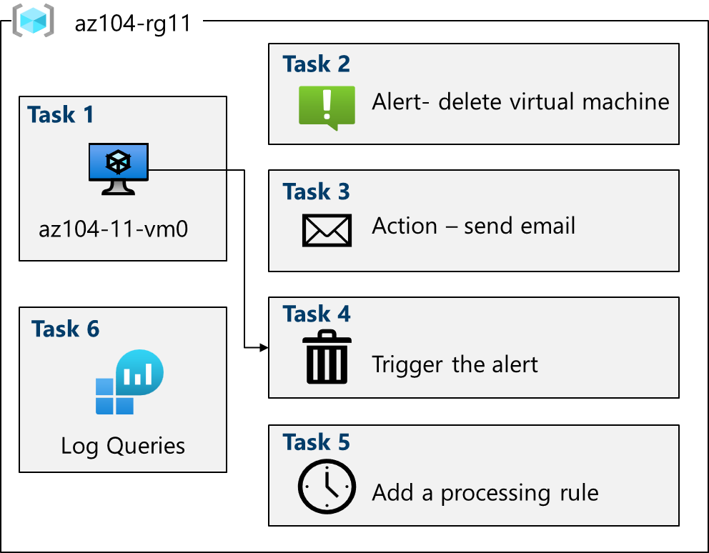

---
lab:
  title: "Laboratorio\_11: Implementación de la supervisión"
  module: Administer Monitoring
---

# Laboratorio 11: Implementación de la supervisión

## Introducción al laboratorio

En este laboratorio, obtendrá información sobre Azure Monitor. Aprenderá a crear alertas y a enviarlas a cualquier grupo de acciones. Desencadenará y probará la alerta y comprobará el registro de actividad.  

Este laboratorio requiere una suscripción de Azure. El tipo de suscripción puede afectar a la disponibilidad de las características de este laboratorio. Puede cambiar la región, pero para escribir los pasos se ha usado **Este de EE. UU.**

## Tiempo estimado: 40 minutos

## Escenario del laboratorio

Su organización ha migrado su infraestructura a Azure. Es importante notificar a los administradores todos los cambios significativos que se realicen en la infraestructura. Planee examinar las funcionalidades de Azure Monitor, entre las que se incluye Log Analytics.

## Simulación interactiva de laboratorio

Hay una simulación de laboratorio interactiva que puede resultar útil para este tema. La simulación permite hacer clic en un escenario similar a su propio ritmo. Hay ciertas diferencias entre la simulación interactiva y este laboratorio, pero muchos de los conceptos básicos son los mismos. No se necesita una suscripción de Azure.

+ [Implementar la supervisión.](https://mslabs.cloudguides.com/guides/AZ-104%20Exam%20Guide%20-%20Microsoft%20Azure%20Administrator%20Exercise%2017) Cree un área de trabajo de Log Analytics y soluciones de Azure Automation. Examine la configuración de la supervisión y diagnóstico de las máquinas virtuales. Examine de la funcionalidad de Azure Monitor y Log Analytics. 

## Diagrama de la arquitectura



## Aptitudes de trabajo

+ Tarea 1: Use una plantilla para aprovisionar una infraestructura.
+ Tarea 2: Crear una alerta.
+ Tarea 3: Configure las notificaciones del grupo de acciones.
+ Tarea 4: Desencadene una alerta y confirme que funciona.
+ Tarea 5: Configure una regla de procesamiento de alertas.
+ Tarea 6: Use consultas del registro de Azure Monitor.

## Tarea 1: Usar una plantilla para aprovisionar una infraestructura

En esta tarea, implementará una máquina virtual que se usará para probar escenarios de supervisión.

1. Descargue los archivos de laboratorio **\\Allfiles\\Lab11\\az104-11-vm-template.json** en el equipo.

1. Inicie sesión en **Azure Portal** - `https://portal.azure.com`.

1. En Azure Portal, busque `Deploy a custom template` y selecciónelo.

1. En la página de implementación personalizada, seleccione **Crear plantilla propia en el editor**.

1. En la página de edición de la plantilla, seleccione **Cargar archivo**.

1. Busque el archivo **\\Allfiles\\Labs11\\az104-11-vm-template.json**, selecciónelo y, después, seleccione **Abrir**.

1. Seleccione **Guardar**.

1. Use la siguiente información para completar los campos de implementación personalizados y deje los restantes con sus valores predeterminados:

    | Configuración       | Valor         | 
    | ---           | ---           |
    | Subscription  | Su suscripción de Azure |
    | Resource group| `az104-rg11` (si fuera necesario, seleccione **Crear nuevo**)
    | Region        | **Este de EE. UU.**   |
    | Nombre de usuario      | `localadmin`   |
    | Contraseña      | Especifique una contraseña compleja |
    
1. Seleccione **Revisar y crear** y, a continuación, seleccione **Crear**.

1. Cuando finalice la implementación, haga clic en **Ir al grupo de recursos**.

1. Examine qué recursos se han implementado. Debe haber una red virtual con una máquina virtual.

**Configuración de Azure Monitor en máquinas virtuales (se usará en la última tarea)**

1. En el portal, busque **Supervisar** y selecciónelo.

1. Dedique un minuto a examinar toda la información, la detección, la evaluación de prioridades y las herramientas de diagnóstico disponibles.

1. Seleccione **Ver** en el cuadro **Información de máquina virtual** y, después, seleccione **Configurar información**.

1. Seleccione la máquina virtual y, después, **Habilitar** (dos veces).

1. Utilice los valores predeterminados de las reglas de recopilación de datos y de la suscripción y seleccione **Configurar**. 

1. El agente de máquina virtual tardará unos minutos en instalarse y configurarse, y vaya al paso siguiente. 
   
## Tarea 2: Crear una alerta

En esta tarea, se crea una alerta que se debe desencadenar cuando se elimine una máquina virtual. 

1. Vaya a la página **Supervisar** y seleccione **Alertas**. 

1. Seleccione **Crear+** y, después, **Regla de alertas**. 

1. Seleccione el cuadro del grupo de recursos y, después, seleccione **Aplicar**. Esta alerta se aplicará a las máquinas virtuales del grupo de recursos. Si lo desea, puede especificar una máquina determinada. 

1. Seleccione la pestaña **Condición** y después seleccione el vínculo **Ver todas las señales**.

1. Busque la opción **Eliminar máquina virtual (máquinas virtuales)** y selecciónela. Observe las otras señales integradas. Seleccione **Aplicar**.

1. En el área **Lógica de alerta** (desplácese hacia abajo), examine las selecciones de **Nivel de evento**. Deje el valor predeterminado de **Todo seleccionado**.

1. Examine los elementos seleccionados en **Estado**. Deje el valor predeterminado de **Todo seleccionado**.

1. Deje abierto el panel **Crear regla de alerta**, ya que lo usará en la siguiente tarea.

## Tarea 3: Configurar notificaciones de grupo de acciones

En esta tarea, si la alerta se desencadena, envía una notificación por correo electrónico al equipo de operaciones. 

1. Siga trabajando en la alerta. Seleccione **Siguiente: Acciones**y, después, seleccione **Crear grupo de acciones**.

    >**¿Sabía que?** Puede agregar hasta cinco grupos de acciones a una regla de alertas. Los grupos de acciones se ejecutan simultáneamente y sin seguir ningún orden específico. Varias reglas de alerta pueden usar el mismo grupo de acciones. 

1. En la pestaña **Aspectos básicos**, escriba los valores siguientes para cada opción.

    | Configuración | Value |
    |---------|---------|
    | **Detalles del proyecto** |
    | Subscription | su suscripción |
    | Resource group | **az104-rg11** |
    | Region | **Global** (valor predeterminado) |
    | **Detalles de instancia** |
    | Nombre del grupo de acciones | `Alert the operations team` (debe ser único en el grupo de recursos) |
    | Nombre para mostrar | `AlertOpsTeam` |

1. Seleccione **Siguiente: Notificaciones** y escriba los siguientes valores.

    | Configuración | Value |
    |---------|---------|
    | Tipo de notificación | Seleccione **Email/SMS message/Push/Voice** (Correo electrónico/SMS/Inserción/Voz). |
    | Nombre | `VM was deleted` |

1. Seleccione **Dirección de correo electrónico** y, en el cuadro **Dirección de correo electrónico**, escriba su dirección y seleccione **Aceptar**. 

    >**Nota:** Debe recibir una notificación por correo electrónico en la que se le indica que se le ha agregado a un grupo de acciones. Puede haber un retraso de unos minutos, pero eso significa que la regla se ha implementado.

1. Una vez creado el grupo de acciones, vaya a **Siguiente: Detalles** y escriba los siguientes valores.

    | Configuración | Value |
    |---------|---------|
    | Nombre de la regla de alertas | `VM was deleted` |
    | Descripción de la regla de alertas | `A VM in your resource group was deleted` |

1. Seleccione **Revisar y crear** para validar la entrada y, luego, **Crear**.

## Tarea 4: Desencadenar una alerta y confirmar que funciona

En esta tarea, se desencadena la alerta y se confirma que se ha enviado una notificación. 

>**Nota:** Si elimina la máquina virtual antes de que se despliegue la regla de alerta, es posible que esta no se desencadene. 

1. En el portal, busque y seleccione **Máquinas virtuales**.

1. Active la casilla de la máquina virtual **az104-vm0**.

1. Seleccione **Eliminar** en la barra de menús.

1. Active la casilla **Aplicar eliminación forzada**. Escriba `delete` para confirmar que desea realizar la operación y seleccione **Eliminar**. 

1. En la barra de título, seleccione el icono **Notificaciones** y espere hasta que **vm0** se haya eliminado.

1. Debe recibir el siguiente correo electrónico de notificación, **Aviso importante: se ha eliminado la máquina virtual de alertas de Azure Monitor...** Si no lo recibe, abra el programa de correo electrónico y busque un correo electrónico de azure-noreply@microsoft.com.

    
   
1. En el menú de recursos de Azure Portal, seleccione **Supervisar** y, luego, **Alertas** en el menú de la izquierda.

1. La eliminación de **vm0** debería haber generado tres alertas.

   >**Nota:** Pueden transcurrir varios minutos hasta que se envíe el correo electrónico de alerta y las alertas se actualicen en el portal. Si no desea esperar, vaya a la siguiente tarea y, después, vuelva. 

1. Seleccione el nombre de una de las alertas (por ejemplo, **se eliminó la máquina virtual**). Aparece un panel **Detalles de alerta** que muestra más detalles sobre el evento.

## Tarea 5: Configurar una regla de procesamiento de alertas

En esta tarea, se crea una regla de alertas para suprimir las notificaciones durante el período de mantenimiento. 

1. Vaya a la hoja **Alertas**, seleccione **Reglas de procesamiento de alertas** y, después, **+ Crear**. 
   
1. Seleccione un **grupo de recursos** y, después, seleccione **Aplicar**.
   
1. Seleccione **Siguiente: Configuración de la regla** y, a continuación, seleccione **Suprimir notificaciones**.
   
1. Seleccione **Siguiente: Programación**.
   
1. De forma predeterminada, la regla funciona en todo momento, a menos que la deshabilite o configure una programación. Va a definir una regla para suprimir las notificaciones durante el mantenimiento nocturno.
Escriba esta configuración para la programación de la regla de procesamiento de alertas:

    | Valor | Value |
    |---------|---------|
    | Aplicación de la regla | En un momento específico |
    | Start | Escriba la fecha de hoy a las 10 p. m. |
    | Final | Escriba la fecha de mañana a las 7 a.m. |
    | Zona horaria | Seleccione la zona horaria local. |

    

1. Seleccione **Siguiente: Detalles** y escriba esta configuración:

    | Configuración | Value |
    |---------|---------|
    | Resource group | **az104-rg11** |
    | Nombre de la regla | `Planned Maintenance` |
    | Descripción | `Suppress notifications during planned maintenance.` |

1. Seleccione **Revisar y crear** para validar la entrada y, luego, **Crear**.

## Tarea 6: Usar consultas de registro de Azure Monitor

En esta tarea, usará Azure Monitor para consultar los datos capturados de la máquina virtual.

1. En Azure Portal, busque la hoja `Monitor` y selecciónela, y haga clic en **Registros**.

1. Si fuera necesario, cierre la pantalla de presentación. 

1. Seleccione un ámbito, su **grupo de recursos**. Seleccione **Aplicar**. 

1. En la pestaña **Consultas**, seleccione **Máquinas virtuales** (panel izquierdo). 

1. Examine las consultas disponibles. **Ejecute** (mantenga el puntero sobre la consulta) la consulta **Recuento de latidos**.

1. Debe recibir un recuento de latidos del momento en que se ejecutaba la máquina virtual.

1. Examine la consulta. Esta consulta usa la tabla de *latidos*. 

1. Reemplace la consulta por esta y, después, haga clic en **Ejecutar**. Vea el gráfico resultante. 

   ```
    InsightsMetrics
    | where TimeGenerated > ago(1h)
    | where Name == "UtilizationPercentage"
    | summarize avg(Val) by bin(TimeGenerated, 5m), Computer //split up by computer
    | render timechart
   ```

1. Como tiene tiempo, examine otras consultas y ejecútelas, si lo desea. 

    >**¿Sabía que...?**: si desea practicar con otras consultas, hay un [entorno de demostración de Log Analytics](https://learn.microsoft.com/azure/azure-monitor/logs/log-analytics-tutorial#open-log-analytics).
    
    >**¿Sabía que...?**: una vez que encuentre una consulta que le guste, puede crear una alerta a partir de ella. 

## Limpieza de los recursos

Si utiliza **su propia suscripción**, dedique un minuto a eliminar los recursos del laboratorio. De esta forma estará seguro de que los recursos se liberan y de que se minimiza el costo. La forma más fácil de eliminar los recursos de laboratorio es eliminar el grupo de recursos del laboratorio. 

+ En Azure Portal, seleccione el grupo de recursos, seleccione **Eliminar el grupo de recursos**, **Escribir el nombre del grupo de recursos** y, después, haga clic en **Eliminar**.
+ Mediante Azure PowerShell, `Remove-AzResourceGroup -Name resourceGroupName`.
+ Mediante la CLI, `az group delete --name resourceGroupName`.

## Ampliar el aprendizaje con Copilot
Copilot puede ayudarle a aprender a usar las herramientas de scripting de Azure. Copilot también puede ayudar en áreas no cubiertas en el laboratorio o donde necesita más información. Abra un explorador Edge y elija Copilot (superior derecha) o vaya a *copilot.microsoft.com*. Dedique unos minutos a probar estas indicaciones.

+ ¿Cuáles son los pasos de configuración básicos que se van a alertar en Azure cuando una máquina virtual está inactiva?
+ ¿Cómo se puede recibir una notificación cuando se desencadena una alerta de Azure?
+ Cree una consulta de Azure Monitor para proporcionar información de rendimiento de CPU de máquina virtual.

## Más información con el aprendizaje autodirigido

+ [Mejore la respuesta ante incidentes con la generación de alertas en Azure](https://learn.microsoft.com/en-us/training/modules/incident-response-with-alerting-on-azure/). Responda a incidentes y actividades en su infraestructura mediante funcionalidades de alerta de Azure Monitor.
+ [Supervise las máquinas virtuales de Azure con Azure Monitor](https://learn.microsoft.com/en-us/training/modules/monitor-azure-vm-using-diagnostic-data/). Supervise las máquinas virtuales de Azure y utilice Azure Monitor para recopilar y analizar métricas y registros de cliente y host de máquina virtual.

## Puntos clave

Enhorabuena por completar el laboratorio. Estas son las principales conclusiones del laboratorio. 

+ Las alertas le ayudan a detectar y solucionar problemas antes de que los usuarios observen que puede haber un problema con la infraestructura o la aplicación.
+ Puede alertar sobre cualquier métrica o fuente de datos de registro en la plataforma de datos de Azure Monitor.
+ Una regla de alerta supervisa los datos y captura una señal que indica que algo sucede en el recurso especificado.
+ Se desencadena una alerta si se cumplen las condiciones de la regla de alertas. Se pueden desencadenar varias acciones (correo electrónico, SMS, envío de cambios o voz).
+ Los grupos de acciones incluyen los individuos que deben recibir notificación de una alerta.
